  

    
  <strong>Universidad Peruana de Ciencias Aplicadas</strong> 
  Ingeniería de Software 
  <strong>Arquitecturas de Software Emergentes - 1ASI0728</strong> 
  Profesor: Christian Luis De Los Rios Fernandez 
  NCR:7322  
   Informe de Trabajo Final - 2025 - 20

#### Startup: <strong>WeMade</strong>

#### Product: <strong>EcoGuardian</strong>

# Team Members:

<table>
    <tr>
        <td><strong>Member</strong></td>
        <td><strong>Code</strong></td>
    </tr>
    <tr>
        <td>Huilca Chipana, Gustavo</td>
        <td>u202213983</td>
    </tr>
    <tr>
        <td>Jave Díaz, Mathias Alejandro</td>
        <td>u202212721</td>
    </tr>
    <tr>
        <td>Ramírez Hoffmann, Sebastián</td>
        <td>U202211894</td>
    </tr>
</table>

# Registro de Versiones del Informe

<table>
  <thead>
    <tr>
      <th>Versión</th>
      <th>Fecha</th>
      <th>Autor</th>
      <th>Descripción de modificación</th>
    </tr>
  </thead>
  <tbody>
    <!-- TB1 -->
    <tr>
    <td rowspan="7">0.1</td>
      <td>29/03/2025</td>
      <td>Gustavo Huilca Chipana</td>
      <td>
        <ul>
          <li>Lean UX Process</li>
          <li>Product Backlog</li>
        </ul>
      </td>
    </tr>
    <tr>
      <td>29/03/2025</td>
      <td>Sebastian Ramirez Hoffmann</td>
      <td>
        <ul>
          <li>Ubiquitous Language</li>
          <li>Definición de Métricas UX</li>
        </ul>
      </td>
    </tr>
    <tr>
      <td>29/03/2025</td>
      <td>Mathias Alejandro Jave Diaz</td>
      <td>
        <ul>
          <li>User Journey Mapping</li>
          <li>Impact Mapping</li>
        </ul>
      </td>
    </tr>
    </tbody>
</table>

# Project Report Collaboration Insights

Repositorios:

Proyecto: https://github.com/wemade-IoT/Documents_Repository | [Repositorio de documentos](https://github.com/wemade-IoT/Documents_Repository)

Landing Page: https://github.com/wemade-IoT/landing-page | [Landing Page Repository](https://github.com/wemade-IoT/landing-page)

Landing Page: https://inquisitive-taiyaki-8e3b96.netlify.app/ | [Landing Page](https://inquisitive-taiyaki-8e3b96.netlify.app/)

Front End Web App Repository: https://github.com/wemade-IoT/eco-guardian-frontend | [Front end Repository](https://github.com/wemade-IoT/eco-guardian-frontend)

Front End Web Application: https://ecoguardian-tf.vercel.app/ | [Front End Application](https://ecoguardian-tb2.vercel.app/)

| Usuario Github     | Nombre                              |
|--------------------|-------------------------------------|
| SEBRH              | Sebastian Ramirez Hoffmann          |
| LordMathi2741      | Mathias Alejandro Jave Diaz         |
| GustavoHuilca31    | Gustavo Huilca Chipana              |

### TB1

Para la entrega del TB1 se han realizado los procesos necesarios para lograr los objetivos propuestos de la entrega. Se toma en cuenta la importancia de la persistencia y como grupo nos dedicamos a mantener una frecuencia de commits y cambios proyectada a ser optima a futuro.

Se muestran evidencias de los commits realizados en la entrega de la TB1 en el informe.

[*Colaboraciones del repositorio*]
Se muestra evidencia del trabajo realizado en la TB1

[*Registro de los commits donde se realizaron la mayor cantidad*]

En ambos casos se puede observar el incremento de modificaciones y revisiones en los dias miercoles y una cantidad mayor de cambios que commits.

---

# Contenido

[Registro de Versiones del Informe](#registro-de-versiones-del-informe)

[Project Report Collaboration Insights](#project-report-collaboration-insights)

[Student Outcome](#student-outcome)

[Capítulo I: Introducción](#capítulo-i-introducción)

[1.1 Startup Profile](#11-startup-profile)  
[1.1.1. Descripción de la Startup](#111-descripción-de-la-startup)  
[1.1.2. Perfiles de integrantes del equipo](#112-perfiles-de-integrantes-del-equipo)

[1.2. Solution Profile](#12-solution-profile)  
[1.2.1 Antecedentes y problemática](#121-antecedentes-y-problemática)  
[1.2.2 Lean UX Process.](#122-lean-ux-process)  
[1.2.2.1. Lean UX Problem Statements.](#1221-lean-ux-problem-statements)  
[1.2.2.2. Lean UX Assumptions.](#1222-lean-ux-assumptions)  
[1.2.2.3. Lean UX Hypothesis Statements.](#1223-lean-ux-hypothesis-statements)  
[1.2.2.4. Lean UX Canvas.](#1224-lean-ux-canvas)

[1.3. Segmentos objetivo.](#13-segmentos-objetivo)

[Capítulo II: Requirements Elicitation & Analysis](#capítulo-ii-requirements-elicitation--analysis)

[2.1. Competidores](#21-competidores)  
[2.1.1. Análisis competitivo](#211-análisis-competitivo)  
[2.1.2. Estrategias y tácticas frente a competidores](#212-estrategias-y-tácticas-frente-a-competidores)

[2.2. Entrevistas](#22-entrevistas)  
[2.2.1. Diseño de entrevistas](#221-diseño-de-entrevistas)    
[2.2.3. Análisis de entrevistas](#223-análisis-de-entrevistas)

[2.3. Needfinding](#23-needfinding)  
[2.3.1. User Personas](#231-user-personas)  
[2.3.2. User Task Matrix](#232-user-task-matrix)  
[2.3.3. User Journey Mapping](#233-user-journey-mapping)  
[2.3.4. Empathy Mapping](#234-empathy-mapping)  
[2.3.5. As-is Scenario Mapping](#235-as-is-scenario-mapping)

[2.4. Ubiquitous Language](#24-ubiquitous-language)

[Capítulo III: Requirements Specifications](#capítulo-iii-requirements-specification)

[3.1. To-Be Scenario Mapping](#31-to-be-scenario-mapping)

[3.2. User Stories](#32-user-stories)

[3.3. Impact Mapping](#33-impact-mapping)

[3.4. Product Backlog](#34-product-backlog)

[Capítulo IV: Solution Software Design](#capítulo-iv-solution-software-design)

[4.1. Strategic-Level Domain-Driven Design](#41-strategic-level-domain-driven-design)   
[4.1.1. Event Storming](#411-event-storming)             
[4.1.1.1 Candidate Context Discovery](#4111-candidate-context-discovery)    
[4.1.1.2 Domain Message Flows Modeling](#4112-domain-message-flows-modeling)    
[4.1.1.3 Bounded Context Canvases](#4113-bounded-context-canvases)    
[4.1.2. Context Mapping](#412-context-mapping)    
[4.1.3. Software Architecture](#413-software-architecture)    
[4.1.3.1. Software Architecture System Landscape Diagram](#4131-software-architecture-system-landscape-diagram)        
[4.1.3.2. Software Architecture Context Level Diagrams](#4132-software-architecture-container-level-diagrams)      
[4.1.3.3. Software Architecture Deployment Diagrams](#4133-software-architecture-deployment-diagrams)      
[4.2. Tactical-Level Domain-Driven Design](#42-tactical-level-domain-driven-design)

[4.2.1. Bounded Context: Management](#421-bounded-context-management)   
[4.2.1.1. Domain Layer](#4211-domain-layer)    
[4.2.1.2. Interface Layer](#4212-interface-layer)    
[4.2.1.3. Application Layer](#4213-application-layer)    
[4.2.1.4. Infrastructure Layer](#4214-infrastructure-layer)    
[4.2.1.5. Bounded Context Software Architecture Component Level Diagrams](#4215-bounded-context-software-architecture-component-level-diagrams)     
[4.2.1.6. Bounded Context Software Architecture Code Level Diagrams](#4216-bounded-context-software-architecture-code-level-diagrams)     
[4.2.1.6.1. Bounded Context Domain Layer Class Diagrams](#42161-bounded-context-domain-layer-class-diagrams)      
[4.2.1.6.2. Bounded Context Database Design Diagram](#42162-bounded-context-database-design-diagram)

[4.2.2. Bounded Context: Analytics](#422-bounded-context-analytics)    
[4.2.2.1. Domain Layer](#4221-domain-layer)    
[4.2.2.2. Interface Layer](#4222-interface-layer)    
[4.2.2.3. Application Layer](#4223-application-layer)    
[4.2.2.4. Infrastructure Layer](#4224-infrastructure-layer)    
[4.2.2.5. Bounded Context Software Architecture Component Level Diagrams](#4225-bounded-context-software-architecture-component-level-diagrams)    
[4.2.2.6. Bounded Context Software Architecture Code Level Diagrams](#4226-bounded-context-software-architecture-code-level-diagrams)    
[4.2.2.6.1. Bounded Context Domain Layer Class Diagrams](#42261-bounded-context-domain-layer-class-diagrams)    
[4.2.2.6.2. Bounded Context Database Design Diagram](#42262-bounded-context-database-design-diagram)

[4.2.3. Bounded Context: Consulting](#423-bounded-context-consulting)     
[4.2.3.1. Domain Layer](#4231-domain-layer)     
[4.2.3.2. Interface Layer](#4232-interface-layer)     
[4.2.3.3. Application Layer](#4233-application-layer)    
[4.2.3.4. Infrastructure Layer](#4234-infrastructure-layer)    
[4.2.3.5. Bounded Context Software Architecture Component Level Diagrams](#4235-bounded-context-software-architecture-component-level-diagrams)    
[4.2.3.6. Bounded Context Software Architecture Code Level Diagrams](#4236-bounded-context-software-architecture-code-level-diagrams)    
[4.2.3.6.1. Bounded Context Domain Layer Class Diagrams](#42361-bounded-context-domain-layer-class-diagrams)     
[4.2.3.6.2. Bounded Context Database Design Diagram](#42362-bounded-context-database-design-diagram)

[4.2.4. Bounded Context: Subscription](#424-bounded-context-subscription)     
[4.2.4.1. Domain Layer](#4241-domain-layer)     
[4.2.4.2. Interface Layer](#4242-interface-layer)     
[4.2.4.3. Application Layer](#4243-application-layer)    
[4.2.4.4. Infrastructure Layer](#4244-infrastructure-layer)    
[4.2.4.5. Bounded Context Software Architecture Component Level Diagrams](#4245-bounded-context-software-architecture-component-level-diagrams)    
[4.2.4.6. Bounded Context Software Architecture Code Level Diagrams](#4246-bounded-context-software-architecture-code-level-diagrams)    
[4.2.4.6.1. Bounded Context Domain Layer Class Diagrams](#42461-bounded-context-domain-layer-class-diagrams)    
[4.2.4.6.2. Bounded Context Database Design Diagram](#42462-bounded-context-database-design-diagram)

[4.2.5. Bounded Context: Payment](#425-bounded-context-payment)    
[4.2.5.1. Domain Layer](#4251-domain-layer)    
[4.2.5.2. Interface Layer](#4252-interface-layer)    
[4.2.5.3. Application Layer](#4253-application-layer)    
[4.2.5.4. Infrastructure Layer](#4254-infrastructure-layer)    
[4.2.5.5. Bounded Context Software Architecture Component Level Diagrams](#4255-bounded-context-software-architecture-component-level-diagrams)    
[4.2.5.6. Bounded Context Software Architecture Code Level Diagrams](#4256-bounded-context-software-architecture-code-level-diagrams)    
[4.2.5.6.1. Bounded Context Domain Layer Class Diagrams](#42561-bounded-context-domain-layer-class-diagrams)    
[4.2.5.6.2. Bounded Context Database Design Diagram](#42562-bounded-context-database-design-diagram)

[4.2.6. Bounded Context: Automation](#426-bounded-context-automation)    
[4.2.6.1. Domain Layer](#4261-domain-layer)     
[4.2.6.2. Interface Layer](#4262-interface-layer)     
[4.2.6.3. Application Layer](#4263-application-layer)    
[4.2.6.4. Infrastructure Layer](#4264-infrastructure-layer)    
[4.2.6.5. Bounded Context Software Architecture Component Level Diagrams](#4265-bounded-context-software-architecture-component-level-diagrams)    
[4.2.6.6. Bounded Context Software Architecture Code Level Diagrams](#4266-bounded-context-software-architecture-code-level-diagrams)    
[4.2.6.6.1. Bounded Context Domain Layer Class Diagrams](#42661-bounded-context-domain-layer-class-diagrams)    
[4.2.6.6.2. Bounded Context Database Design Diagram](#42662-bounded-context-database-design-diagram)

[4.2.7. Bounded Context: Installation](#427-bounded-context-installation)     
[4.2.7.1. Domain Layer](#4271-domain-layer)     
[4.2.7.2. Interface Layer](#4272-interface-layer)     
[4.2.7.3. Application Layer](#4273-application-layer)     
[4.2.7.4. Infrastructure Layer](#4274-infrastructure-layer)     
[4.2.7.5. Bounded Context Software Architecture Component Level Diagrams](#4275-bounded-context-software-architecture-component-level-diagrams)     
[4.2.7.6. Bounded Context Software Architecture Code Level Diagrams](#4276-bounded-context-software-architecture-code-level-diagrams)     
[4.2.7.6.1. Bounded Context Domain Layer Class Diagrams](#42761-bounded-context-domain-layer-class-diagrams)     
[4.2.7.6.2. Bounded Context Database Design Diagram](#42762-bounded-context-database-design-diagram)

[4.2.8. Bounded Context: Identity and Access Management](#428-bounded-context-identity-and-access-management)     
[4.2.8.1. Domain Layer](#4281-domain-layer)     
[4.2.8.2. Interface Layer](#4282-interface-layer)     
[4.2.8.3. Application Layer](#4283-application-layer)     
[4.2.8.4. Infrastructure Layer](#4284-infrastructure-layer)     
[4.2.8.5. Bounded Context Software Architecture Component Level Diagrams](#4285-bounded-context-software-architecture-component-level-diagrams)     
[4.2.8.6. Bounded Context Software Architecture Code Level Diagrams](#4286-bounded-context-software-architecture-code-level-diagrams)     
[4.2.8.6.1. Bounded Context Domain Layer Class Diagrams](#42861-bounded-context-domain-layer-class-diagrams)     
[4.2.8.6.2. Bounded Context Database Design Diagram](#42862-bounded-context-database-design-diagram)

[4.2.9. Bounded Context: Notifications](#429-bounded-context-notifications)     
[4.2.9.1. Domain Layer](#4291-domain-layer)     
[4.2.9.2. Interface Layer](#4292-interface-layer)     
[4.2.9.3. Application Layer](#4293-application-layer)     
[4.2.9.4. Infrastructure Layer](#4294-infrastructure-layer)     
[4.2.9.5. Bounded Context Software Architecture Component Level Diagrams](#4295-bounded-context-software-architecture-component-level-diagrams)     
[4.2.9.6. Bounded Context Software Architecture Code Level Diagrams](#4296-bounded-context-software-architecture-code-level-diagrams)     
[4.2.9.6.1. Bounded Context Domain Layer Class Diagrams](#42961-bounded-context-domain-layer-class-diagrams)     
[4.2.9.6.2. Bounded Context Database Design Diagram](#42962-bounded-context-database-design-diagram)

[Conclusiones](#conclusiones)

[Conclusiones y recomendaciones](#conclusiones-y-recomendaciones)

[Video About-the-Team](#video-about-the-team)

[Bibliografía](#bibliografía)

[Anexos](#anexos)

# Student Outcome
El curso contribuye al cumplimiento del Student Outcome ABET:
ABET – EAC - Student Outcome 5
Criterio: La capacidad de funcionar efectivamente en un equipo cuyos miembros
juntos proporcionan liderazgo, crean un entorno de colaboración e inclusivo,
establecen objetivos, planifican tareas y cumplen objetivos.
En el siguiente cuadro se describe las acciones realizadas y enunciados de
conclusiones por parte del grupo, que permiten sustentar el haber alcanzado el logro
del ABET – EAC - Student Outcome 5.
<table>
<thead>
<tr>
<th class="outcome-column">Criterio Específico</th>
<th class="details-column">Acciones Realizadas por Miembro (por Avance)</th>
<th class="final-comment-column">Conclusiones del Equipo</th>
</tr>
</thead>
<tbody>
<tr>
<td>Trabaja en equipo para proporcionar liderazgo conjunto</td>
<td>
Mathias Alejandro Jave Diaz 
TB1: Durante este avance del proyecto, participé activamente en reuniones presenciales y virtuales, donde contribuí con ideas clave para definir el flujo de negocio, fomentando así la claridad y el consenso entre todos los miembros del equipo. También participé activamente en la elaboración de la arquitectura de software y en el diseño táctico siguiendo los principios de Domain Driven Design.  
TP: Durante el desarrollo de este avance del proyecto, participé activamente en el desarrollo de la arquitectura de nuestra solución, teniendo en cuenta los enfoques de aplicación web, móvil y backend. También fomenté el cumplimiento de buenas prácticas a nivel de arquitectura y tomé la iniciativa de brindar alcances a mi equipo sobre la distribución de lógica en la aplicación web.  
TB2: Durante el desarrollo de este avance del proyecto, participé activamente en el desarrollo de los productos relacionados al bounded context de Operation and Monitoring. Colaboré estrechamente con otros líderes de aspecto en la **revisión de tareas en Trello** y el **diseño de APIs REST en ASP.NET Core** para el cumplimiento de las funcionalidades. Esta experiencia, que incluyó la revisión de aspectos del flujo de negocio y la aplicación de principios de **Domain-Driven Design**, me permitió fortalecer mis habilidades en liderazgo conjunto dentro de un equipo de desarrollo.
  
TF: Durante el desarrollo de este avance, participé activamente en el desarrollo de la aplicación móvil, fomentando un entorno colaborativo con mis compañeros para resolver problemas técnicos y de integración. Participé en la propuesta e implementación de mejoras en la lógica de negocio de nuestros bounded context principales como analytics y monitoring, aportando ideas viables que optimizaron el flujo de procesos. Además, ayude en la incorporación de Cloudinary para la gestión eficiente de imágenes, coordinando su correcta integración con los distintos líderes de aspecto. 
  Nicolas Sebastian Esteban García 
TB1: Asumí un rol activo de liderazgo en las sesiones programadas por mi equipo de trabajo, promoviendo el orden, facilitando la toma de decisiones y fomentando la participación de todos los integrantes. Contribuí con ideas de mejora para definir correctamente nuestro flujo de negocio, asegurando un entendimiento claro por parte del equipo. Además, lideré la elaboración de preguntas clave para nuestros segmentos objetivos, lo cual permitió obtener información útil para la mejora continua de nuestra aplicación. Finalmente, coordiné y colaboré activamente en la elaboración del Candidate Context Discovery y en la priorización del Product Backlog. 
TP: A lo largo del desarrollo del proyecto, trabajé en equipo asumiendo un rol activo en la toma de decisiones y promoviendo el liderazgo compartido entre los integrantes. En distintas etapas, cada miembro lideró según sus competencias, lo que permitió una gestión eficiente del tiempo y los recursos. Personalmente, guié al equipo en el diseño de la landing page y la propuesta visual del prototipo web, coordinando ideas y fomentando un ambiente de respeto y participación equitativa. Esta dinámica fortaleció la colaboración, permitiendo alcanzar los objetivos planteados. 
TB2: Durante esta entrega, ejercí liderazgo técnico al trabajar activamente en el deploy del front-end y la preparación del entorno de despliegue. Me responsabilicé de la maquetación de la aplicación web utilizando Figma y su integración con el backend vía APIs REST, así como de la implementación de la estructura inicial de la **aplicación móvil en Android Studio**. Además, lideré la implementación de la **pasarela de pagos con Stripe** y el registro de cuenta de usuario. Mis acciones fueron clave para habilitar funcionalidades principales, demostrando liderazgo al tomar la responsabilidad de componentes críticos y guiar su implementación técnica. 
TF: En el desarrollo de esta entrega, aseguré una comunicación constante y efectiva entre los líderes de los diferentes aspectos de los bounded contexts, facilitando la integración de sus aportes para el beneficio del proyecto. Fomenté un ambiente inclusivo donde todas las ideas fueron valoradas, creando espacios para la retroalimentación y toma de decisiones conjunta. Participé activamente en la integración del frontend y backend, particularmente en la implementación de la pasarela de pagos y la creación de órdenes. Además, trabajé en la definición de metas claras y alcanzables, la planificación detallada de tareas y el seguimiento de los artefactos de requisitos, garantizando el cumplimiento de los objetivos establecidos de manera colaborativa. 
  Manuel Sebastian Peña Rivera 
TB1: Participé en las reuniones virtuales y presenciales, aportando ideas sobre cómo abordar el proyecto y colaborando con mis compañeros para tomar decisiones clave sobre el caso propuesto. Realicé de forma colaborativa la creación de diagramas técnicos como los Domain Message Flows, Bounded Context Domain Layer Class Diagrams y Container Level Diagrams. Para ello, tuvimos que realizar reuniones para planificar y estar de acuerdo sobre el desarrollo de estos diagramas. 
TP: Mi principal enfoque fue en la creación de los wireframes y mockups tanto para la landing page como para el frontend. Además, participé activamente en la implementación de la estructura del sitio, desarrollando el footer y colaborando en la barra de navegación (navbar). Asistí a las reuniones del equipo, brindando apoyo en la coordinación de tareas y asegurándome de que todos tuviéramos claro el diseño y la arquitectura a seguir, evitando malentendidos y garantizando que el flujo de trabajo fuera eficiente. 
TB2: Durante esta entrega, participé activamente en las reuniones, proporcionando ideas clave para el desarrollo del front-end y back-end de la sección Profiles. Colaboré en el desarrollo de perfiles en la aplicación móvil **(Android Studio) y el backend (ASP.NET Core), asegurando la alineación con los objetivos del proyecto. También participé en entrevistas de validación, lo que me permitió tomar decisiones basadas en retroalimentación directa de los usuarios para **optimizar las User Stories, fomentando así el trabajo conjunto y el liderazgo compartido en la definición y ejecución de las funcionalidades. 
TF: En esta entrega, trabajé activamente en equipo para desarrollar la sección de profiles en el front-end y la conexión con el backend, tanto en la aplicación web como en la móvil. Participé en las reuniones de planificación, donde colaboré en la asignación de tareas dentro del Product Backlog en Trello, contribuyendo a la toma de decisiones clave para asegurar que todos estuviéramos alineados y enfocados en las metas del proyecto. Además, realicé pruebas unitarias e integradas en el backend, asegurando una integración eficiente entre todos los componentes del sistema.  
 Italo D'Alessandro Luna Capuñay 
TB1: Asistí a reuniones tanto virtuales como presenciales, donde contribuí con ideas para definir el enfoque del proyecto y trabajé junto a mis compañeros en la toma de decisiones importantes sobre el caso propuesto. Participé activamente en la elaboración conjunta de diagramas técnicos como los Domain Message Flows, Bounded Context Domain Layer Class Diagrams y Container Level Diagrams. Para llevar a cabo esta tarea, fue necesario coordinar varias reuniones en las que acordamos los lineamientos para el desarrollo de dichos diagramas. 
TP: En este entregable, contribuí de forma significativa al diseño y configuración del entorno de despliegue del sistema. También participé en la coordinación del equipo y brindé apoyo a mis compañeros durante la implementación de las aplicaciones web. 
TB2: Para el TB2, asumí un rol de liderazgo en la **configuración y optimización de los entornos de despliegue** para las aplicaciones web y móvil. mi liderazgo en la gestión técnica impactó directamente en el cumplimiento de los objetivos de rendimiento** y estabilidad del proyecto.TF: En esta entrega, trabajé en el desarrollo y mejora del IAM Mobile, abordando tanto aspectos funcionales como de diseño. Participé activamente en la revisión del flujo de usuario, realizando ajustes necesarios para mejorar la usabilidad y consistencia en la experiencia móvil. Además, colaboré con el equipo para resolver incidencias detectadas durante las pruebas, lo que permitió asegurar un funcionamiento estable. Mi participación incluyó la coordinación de tareas en Trello y la validación de entregables de acuerdo con los criterios definidos para el sprint.  
  Mathias Kunimoto 
TB1: Fui participante en las reuniones virtuales y presenciales, aportando ideas sobre cómo abordar el proyecto y tomando decisiones clave sobre el caso propuesto. Trabajé directamente en el desarrollo de los diagramas técnicos como los **Domain Message Flows**, **Bounded Context Domain Layer Class Diagrams** y los **Container Level Diagrams**. Además, colaboré en la elaboración del **User Journey Mapping del Segmento 2**, en la **realización de entrevistas para el Segmento 2**, en la construcción del **Lean UX Canvas**, y en el desarrollo inicial del **Bounded Context de Assets** y del **Bounded Context Canvas**. 
TP: En este entregable, aporté de manera destacada al diseño y la configuración del entorno de despliegue del sistema. Además, participé en la coordinación del equipo y proporcioné apoyo a mis compañeros durante la implementación de las aplicaciones web. 
TB2: Durante esta entrega, participé activamente en las reuniones, aportando ideas clave para el desarrollo del *back-end* de la gestión de recursos y activos, incluyendo la definición de APIs REST con ASP.NET Core. Además, estuve involucrado en entrevistas de validación, lo que me permitió tomar decisiones basadas en retroalimentación directa de los usuarios para **refinar las funcionalidades y los flujos de usuario en Figma**, promoviendo un enfoque de trabajo colaborativo y liderazgo compartido en la definición del producto.TF: En esta entrega, trabajé en la implementación de mejoras en la aplicación mobile, enfocándome en optimizar la interfaz y la navegación para una mejor experiencia del usuario. También contribuí en la integración del sistema de i18n, permitiendo que la plataforma soporte el idioma ingles de manera eficiente. Adicionalmente, realicé reajustes en el backend orientados a mejorar la comunicación entre servicios y el manejo de datos. Durante el sprint, gestioné mis tareas en Trello y colaboré activamente en la validación de los entregables, asegurando que cumplieran con los criterios establecidos por el equipo.
 
 Gustavo Huilca Chipana 
TB1: En este avance del proyecto, pude trabajar en equipo de forma eficiente, haciendo uso de herramientas como documentos compartidos para la creación de diagramas y la repartición de tareas. Participé activamente en las reuniones virtuales y presenciales y apoyé a mis compañeros a participar y expresar su opinión. 
TP: En este avance del proyecto, trabajé en equipo, priorizando la comunicación entre los miembros para la correcta coordinación del desarrollo de la Landing Page y de la Aplicación Web, intentando evitar malentendidos y dejando muy en clara la arquitectura que debemos seguir. 
TB2: Para el TB2, asumí un rol de liderazgo en la validación de la interfaz de usuario (UI) y la experiencia de usuario (UX) de la aplicación web y móvil. Organicé sesiones de revisión de prototipos en Figma y pruebas de usabilidad con el equipo, asegurando que el diseño cumpliera con las expectativas de los usuarios. Mis aportes fueron clave para guiar las mejoras en la usabilidad del producto, demostrando un liderazgo enfocado en la calidad y la satisfacción del usuario. 
TP: Durante este último avance del proyecto, trabajé en equipo para priorizar, organizar y coordinar las últimas correcciones y mejoras de los distintos productos de la solución, siempre manteniendo al día a mis compañeros sobre el estado de las tareas y asegurando que todos estuviéramos alineados con los objetivos del proyecto. Participé activamente en la revisión de los productos y en la implementación de las correcciones necesarias, contribuyendo a la mejora continua del proyecto. 
  Sebastian Ramirez Hoffmann 
TB1: En esta entrega, ejercí liderazgo conjunto al trabajar activamente en equipo y participar en diversas reuniones grupales. Contribuí a la distribución equitativa de responsabilidades, asignando tareas a mis compañeros en secciones clave como la elaboración de los Domain Message Flows en Miro y la implementación del Lean UX Process. Esta acción no solo optimizó el flujo de trabajo, sino que también fomentó la autonomía y la participación activa de cada miembro, demostrando un liderazgo compartido alineado con los objetivos de colaboración y eficiencia del proyecto. 
TP: Durante este avance, trabajé eficazmente en conjunto con mis compañeros de equipo, participando en reuniones de micro-sprint en Discord para coordinar nuestros avances. Demostré liderazgo al segmentar el grupo en equipos de trabajo, asignando a mis compañeros a tareas específicas con el fin de optimizar el desarrollo y el cumplimiento de los objetivos del proyecto, utilizando Trello para la gestión. Esta estrategia no solo mejoró la eficiencia, sino que también promovió la responsabilidad individual y colectiva, un pilar fundamental del liderazgo compartido. 
TB2: En el TB2, asumí un rol de liderazgo técnico y colaborativo al implementar las vistas del front-end en Vue, desarrollar el backend con ASP.NET Core API REST, y asegurar la correcta conexión entre ambos. Además, me enfoqué en la corrección de Historias de Usuario (HU) y elementos del Product Backlog en Trello, aplicando principios de Gestión de Identidades y Acceso (IAM) en las integraciones. Estas acciones fueron cruciales para el progreso del proyecto, ya que garantizaron la funcionalidad de componentes clave y la alineación con los requisitos definidos, guiando al equipo hacia la consecución de objetivos técnicos y de producto. 
TF: Durante esta entrega, lideré la implementación de un sistema de <strong>CRM</strong> (Customer Relationship Management), promoviendo una comunicación constante y efectiva entre los diferentes equipos involucrados en el proyecto. Trabajé estrechamente con los responsables de cada área para integrar sus aportes, optimizando el flujo de trabajo y asegurando que el sistema CRM cumpliera con las expectativas del proyecto.
Fomenté un ambiente colaborativo e inclusivo, donde se valoraron todas las ideas, creando espacios para la retroalimentación continua y la toma de decisiones en conjunto. Este enfoque permitió identificar y abordar mejoras clave en la <strong>interfaz web</strong>, brindando una experiencia más fluida y amigable para los usuarios.
Además, participé activamente en la <strong>definición de metas claras</strong> y alcanzables para el proyecto, garantizando una planificación detallada de tareas y un seguimiento eficaz de los artefactos de requisitos a lo largo del sprint de desarrollo. Mi participación ayudó a asegurar que los objetivos establecidos fueran alcanzados de manera eficiente y en colaboración con todo el equipo.  
</td>

<td class="final-comment-column">El grupo demostró liderazgo compartido durante todo el proyecto. Cada integrante aportó activamente en la toma de decisiones, cumpliendo satisfactoriamente con este criterio.</td>
</tr>
<tr>
<td>Crea un entorno colaborativo e inclusivo, establece metas, planifica tareas y cumple objetivos.</td>
<td>
Mathias Alejandro Jave Diaz 
TB1: Durante el desarrollo del proyecto, me enfoqué en fomentar un entorno colaborativo e inclusivo dentro del equipo, promoviendo la participación activa de todos los miembros mediante el envío constante de retroalimentaciones constructivas. Contribuí al diseño del event storming y a la estimación de tareas considerando el valor que estas aportan al negocio. Para ello, tomé en cuenta las opiniones de mis compañeros, lo cual permitió definir metas claras, planificar de manera efectiva y cumplir con los objetivos propuestos bajo los principios de Domain Driven Design.  
TP: Durante el desarrollo de este avance del proyecto, fomenté un entorno colaborativo e inclusivo en el equipo, promoviendo la participación activa de cada integrante en la revisión y análisis de la arquitectura propuesta. Además, participé en la definición conjunta de los objetivos para la aplicación web, contribuyendo en la planificación de tareas y asegurando el cumplimiento de los entregables establecidos para esta etapa.  
TB2: Durante el desarrollo del TB2, contribuí a crear un entorno colaborativo e inclusivo dentro del equipo, fomentando la comunicación constante a través de reuniones diarias y el uso de Trello. Participé activamente en la planificación del *sprint backlog*, estableciendo metas claras y priorizando tareas alineadas con los objetivos del bounded context de Operation and Monitoring. Junto con otros líderes de aspecto, organicé nuestras responsabilidades en el desarrollo del backend con ASP.NET Core y me aseguré de cumplir con los entregables, demostrando mi capacidad para trabajar con enfoque en objetivos comunes y respetar las perspectivas diversas del equipo.
 
TF: Durante el desarrollo de esta entrega, fomenté una comunicación constante y efectiva entre los líderes de aspecto de los diferentes bounded contexts, asegurando la integración de sus aportes en beneficio del proyecto. Promoví un ambiente inclusivo donde se valoraron todas las ideas, facilitando espacios para la retroalimentación y toma de decisiones conjunta. Asimismo, participé activamente en la definición de metas claras y alcanzables, la planificación detallada de tareas y el seguimiento de los artefactos de requisitos durante todo el sprint de desarrollo, asegurando que se cumplieran los objetivos establecidos de forma colaborativa.
  Nicolas Sebastian Esteban García 
TB1: Fomenté la comunicación abierta y continua dentro del equipo, asegurando que todos los miembros pudieran expresar sus ideas y aportar soluciones. Me encargué de la planificación de tareas, organizando el Product Backlog y facilitando el proceso de Event Storming para definir los eventos clave del sistema. A través de la asignación de tareas y el uso de herramientas de colaboración, me aseguré de que todos los integrantes del equipo tuvieran claridad sobre sus responsabilidades. Establecimos metas claras y trabajamos de manera eficiente, lo que permitió cumplir con los objetivos establecidos en el tiempo previsto. 
TP: Durante el desarrollo del proyecto, participé activamente en el diseño de la landing page y del prototipo de la aplicación web, colaborando con mi equipo en sesiones de diseño y toma de decisiones conjuntas. Establecimos metas claras, planificamos tareas mediante herramientas colaborativas y asignamos responsabilidades de acuerdo con las habilidades de cada integrante. Promovimos un entorno inclusivo donde todos pudimos aportar ideas, fortaleciendo la comunicación y el liderazgo compartido. La coordinación efectiva nos permitió cumplir con los objetivos dentro del plazo establecido. 
TB2: Durante esta entrega, trabajé en el deploy del front-end y en la preparación del entorno de despliegue, asegurando que el equipo tuviera una base sólida para su trabajo colaborativo. Participé activamente en la maquetación de la **aplicación web (Figma)** y su integración con el backend (APIs REST), así como en la implementación de la estructura inicial de la aplicación móvil (Android Studio) y la pasarela de pagos con Stripe. Estas tareas, al ser colaborativas y con metas claras en Trello, me permitieron contribuir directamente al cumplimiento de los objetivos del sprint, fomentando un entorno de trabajo organizado y eficiente.
TF: En el desarrollo de esta entrega, creé un entorno colaborativo e inclusivo al asegurar una comunicación constante y efectiva entre los líderes de los diferentes aspectos de los bounded contexts, promoviendo la integración de sus aportes para el beneficio del proyecto. Fomenté espacios para la retroalimentación y toma de decisiones conjunta, donde todas las ideas fueron valoradas. Participé activamente en el desarrollo del frontend y en la integración de la pasarela de pagos, asegurando que ambos aspectos se alinearan de manera eficiente. Además, trabajé en la definición de metas claras y alcanzables, la planificación detallada de tareas y el seguimiento de los artefactos de requisitos, garantizando que los objetivos establecidos se cumplieran de manera colaborativa.
  Manuel Sebastian Peña Rivera 
TB1: Estuve enfocado en fomentar un ambiente de colaboración dentro del equipo. Trabajé en conjunto con mis compañeros para definir los objetivos y tareas del proyecto. Colaboré en el análisis competitivo y en la definición de segmentos clave como el de negocios y especialistas. Además, me encargué de crear user personas y empathy maps para estos segmentos, asegurando que el desarrollo del producto estuviera alineado con las necesidades del usuario. Cada semana establecí un límite personal para realizar las secciones de cada capítulo, de esta forma me aseguré de que todas las tareas estuvieran bien organizadas y distribuidas para cumplir con los objetivos establecidos. 
TP: En este avance contribuí en la planificación y definición de metas, asegurándome de que el desarrollo de la landing page se realizara de manera organizada. Al colaborar en el diseño de los wireframes y mockups, así como en la construcción del footer y navbar, ayudé a cumplir los objetivos planteados, siempre respetando los plazos y trabajando de manera coordinada con mis compañeros. 
TB2: En esta entrega, participé activamente en las reuniones de planificación y en la asignación de tareas dentro del Product Backlog en Trello, asegurando la correcta distribución de responsabilidades en el desarrollo del *Bounded Context* de Profiles. Coordiné el progreso del equipo en la implementación del front-end y back-end, y ayudé a establecer metas claras, contribuyendo también al informe de Bounded Context: Profiles and Preferences, garantizando que las tareas se ejecutaran de manera eficiente y dentro del plazo. 
TF: En esta etapa final del proyecto, mostré compromiso con el trabajo en equipo, participando activamente en la organización interna y apoyando a mis compañeros en el cumplimiento de sus tareas. Mantuve una comunicación constante durante las reuniones, aportando ideas y escuchando diferentes puntos de vista para llegar a acuerdos efectivos. Además, me involucré en la asignación de tareas y el seguimiento del progreso, lo que permitió mantener una buena coordinación y avanzar de manera ordenada hacia los objetivos del proyecto. 
 Italo D'Alessandro Luna Capuñay 
TB1: A lo largo del proyecto, mi objetivo principal fue crear un ambiente de trabajo inclusivo y cooperativo, incentivando la participación activa de todos los integrantes del equipo a través de retroalimentaciones constantes y constructivas. Participé en el diseño del event storming y en la estimación de tareas, considerando siempre el valor que estas aportaban al negocio. Para lograrlo, integré las opiniones de mis compañeros, lo que nos permitió establecer metas claras, organizar las actividades de forma eficiente y alcanzar los objetivos definidos según los principios del Domain Driven Design. 
TP: En esta entrega, fomenté la colaboración dentro del equipo, participando activamente en la planificación y coordinación de tareas técnicas vinculadas al entorno de desarrollo y al proceso de despliegue. Asimismo, aseguré una comunicación constante con el equipo para cumplir con los objetivos en los plazos establecidos. 
TB2: En esta entrega, mi contribución principal al entorno colaborativo se centró en la configuración del entorno de desarrollo compartido y en facilitar el trabajo del equipo en la gestión de dependencias y versiones de software. Colaboré estrechamente en la resolución de problemas técnicos relacionados con el despliegue de las aplicaciones web (ASP.NET Core) y móvil (Android Studio), asegurando que todos tuviéramos las herramientas necesarias y un flujo de trabajo sin interrupciones para alcanzar nuestras metas del *sprint*.TF: Durante este ciclo, me enfoqué en tareas clave relacionadas con los módulos Pon correcciones e IAM Mobile. Realicé ajustes funcionales y mejoras en la interfaz, asegurando una experiencia fluida para el usuario. Además, participé en la identificación y solución de errores, contribuyendo a la estabilidad general del sistema. Mi trabajo se mantuvo alineado con los objetivos del equipo, cumpliendo con los plazos establecidos y manteniendo una comunicación constante para asegurar el avance del proyecto. 
 Mathias Kunimoto 
TB1: Me concentré en mantener un entorno colaborativo y enfocado en los objetivos del equipo. Contribuí en la planificación de tareas clave para los entregables semanales, alineando los esfuerzos del grupo con los segmentos priorizados. Además, elaboré user personas y empathy maps para entender mejor las necesidades del usuario objetivo, y ayudé a organizar el trabajo en base a metas semanales que garantizaran una entrega coordinada y efectiva del proyecto. 
TP: En esta etapa, contribuí al trabajo en equipo facilitando la organización y distribución de tareas relacionadas con el entorno de desarrollo y el proceso de despliegue. También mantuve una comunicación fluida con los demás integrantes para garantizar que los objetivos se alcanzaran dentro de los tiempos acordados. 
TB2: En esta entrega, contribuí a la creación de un entorno más eficiente al adoptar un enfoque estructurado y planificado para la asignación de tareas en Trello y la organización de las reuniones. Mi objetivo fue optimizar la colaboración y la eficiencia del equipo** en el desarrollo del *backend* de gestión de recursos y activos, asegurando que cada miembro tuviera claridad en sus responsabilidades y los recursos necesarios para realizar sus actividades de manera más efectiva y cumplir con las metas del *sprint*.TF: Durante esta última fase del proyecto, aporté al fortalecimiento de un ambiente de trabajo participativo y respetuoso, manteniendo una actitud proactiva en las reuniones y adaptándome con flexibilidad a las tareas asignadas. Promoví la comunicación abierta entre los integrantes del equipo, lo que facilitó la definición de objetivos comunes y una mejor organización de las actividades. Asimismo, colaboré en la distribución equitativa de responsabilidades, contribuyendo a una dinámica grupal más cohesionada y eficiente. 
 Gustavo Huilca Chipana 
TB1: En este avance del proyecto, me encargué de la organización de las reuniones, así como de la creación y repartición de tareas. En cada reunión, me aseguré de que todos los miembros del equipo tuvieran la oportunidad de expresar sus ideas y opiniones, fomentando un ambiente colaborativo y respetuoso. 
TP: En este avance, hice uso de nuevas herramientas para la distribución de partes en el reporte y los productos a entregar a través de la división por aspectos, asignando líderes y colaboradores en cada aspecto. 
TB2: En esta entrega, mi contribución al entorno colaborativo se manifestó en la organización y facilitación de talleres de diseño para la aplicación web y móvil utilizando Figma. Fomenté la participación activa de todos en la ideación y maquetación, y trabajé en la integración de feedback para refinar las interfaces. Estas acciones colaborativas, junto con la gestión de tareas en Trello, fueron cruciales para que como equipo **estableciéramos y cumpliéramos nuestras metas de diseño** y desarrollo, asegurando un producto coherente y centrado en el usuario.
TF: En esta última entrega, contribuí a la creación de un entorno de trabajo colaborativo e inclusivo al participar activamente en las reuniones grupales, adaptarme de forma dinámica a las tareas asignadas y fomentar la participación de todos los miembros del equipo. Me aseguré de que cada integrante tuviera la oportunidad de expresar sus ideas y opiniones, lo que permitió una planificación efectiva de las tareas y el establecimiento de metas claras. Además, trabajé en la repartición de responsabilidades durante las reuniones grupales, lo que fortaleció nuestra sinergia y sentido de pertenencia como equipo. 
  Sebastian Ramirez Hoffmann 
TB1: Desde el inicio de esta entrega, contribuí activamente a la creación de un entorno de trabajo colaborativo e inclusivo. Me aseguré de ofrecer oportunidades a mis compañeros para expresarse y compartir sus ideas, valorando cada aportación. Mi participación en la planificación activa de tareas y el apoyo en la repartición de responsabilidades durante las reuniones grupales fueron clave para que como equipo estableciéramos metas claras y cumpliéramos los objetivos propuestos, fortaleciendo así nuestra sinergia y el sentido de pertenencia. 
TP: Durante este avance, fomentamos activamente la inclusividad en nuestro trabajo grupal, asegurando que todas las ideas fueran consideradas e integradas en el proyecto, incluso a través de sesiones de brainstorming en Figma. Planificamos las tareas de forma colaborativa para dividir el trabajo eficientemente, lo que nos permitió trabajar de manera coordinada y productiva, utilizando IntelliJ IDEA y Android Studio para la implementación. Adicionalmente, establecimos metas claras para el sprint, lo cual fue fundamental para mantenernos enfocados y alcanzar los objetivos definidos como equipo, consolidando así nuestro entorno de colaboración.
TB2: En esta entrega, contribuí a la creación de un entorno colaborativo e inclusivo al participar activamente en las reuniones grupales y adaptarme de forma dinámica a las tareas asignadas. Me aseguré de que cada integrante tuviera la oportunidad de expresar sus ideas y opiniones, lo que permitió una planificación efectiva de las tareas y el establecimiento de metas claras. Además, trabajé en la repartición de responsabilidades durante las reuniones grupales, lo que fortaleció nuestra sinergia y sentido de pertenencia como equipo. 
TF: Durante el desarrollo de este avance, participé activamente en el desarrollo e implementación del sistema <strong>CRM</strong>, fomentando un entorno colaborativo con mis compañeros para resolver problemas técnicos y de integración. Contribuí en la propuesta e implementación de mejoras en la lógica de negocio de nuestros principales módulos, como la gestión de clientes y la automatización de procesos, aportando ideas viables que optimizaron el flujo de trabajo. Además, ayudé en la integración de herramientas para mejorar la experiencia de usuario y la eficiencia en el CRM, coordinando su correcta integración con los distintos líderes de aspecto.  
<td class="final-comment-column">El equipo logró cumplir con los objetivos propuestos, la planificación y el establecimiento de tareas, junto con la construcción de un ambiente colaborativo, demostrando satisfactoriamente el cumplimiento de estos criterios en las reuniones grupales y durante el desarrollo del documento.</td>
</tr>
</tbody>
</table>

# Capítulo I: Introducción

## 1.1. Startup Profile

### 1.1.1. Descripción de la Startup

EcoGuardian es una solución IoT que ayuda a cuidar plantas mediante sensores de humedad, temperatura, luz, entre otros. La solución multiplataforma envía alertas inmediatas y recopila información para generar recomendaciones personalizadas realizadas por un personal experimentado en el área. Ideal para hogares, oficinas, pequeños agricultores y empresas del sector agrícola cada uno con distintos planes de pago. Algunas de las funciones principales se enfocan en el monitorización,  estadísticas, recomendaciones y seguimiento de crecimiento.

#### 1.1.2. Perfiles de integrantes del equipo

<table style="width:100%; border-collapse: collapse;" border="1">
  <thead>
    <tr>
      <th style="padding: 8px; text-align: left;"></th>
      <th style="padding: 8px; text-align: left;">Miembros del equipo</th>
      <th style="padding: 8px; text-align: left;">Código Estudiante</th>
      <th style="padding: 8px; text-align: left;">Carrera</th>
      <th style="padding: 8px; text-align: left;">Conocimientos / Habilidades</th>
    </tr>
  </thead>
  <tbody>
    <tr>
      <td style="padding: 8px; text-align: center;"></td>
      <td style="padding: 8px; text-align: left;">Gustavo Huilca Chipana</td>
      <td style="padding: 8px; text-align: left;">u202213983</td>
      <td style="padding: 8px; text-align: left;">Ingeniería de Software</td>
      <td style="padding: 8px; text-align: left;">Cuento con conocimientos en UI/UX design, trabajo colaborativo de desarrollos ágiles a través de SCRUM, desarrollo de aplicaciones web y móvil haciendo uso de los frameworks Vue, Angular, Astro, ASP.NET Core y Spring Boot; así como habilidades blandas que me permiten a mí y a mis compañeros trabajar de forma organizada y eficiente, priorizando la comunicación y la participación permanente.</td>
    </tr>
    <tr>
      <td style="padding: 8px; text-align: center;"></td>
      <td style="padding: 8px; text-align: left;">Mathias Alejandro Jave Diaz</td>
      <td style="padding: 8px; text-align: left;">u202212721</td>
      <td style="padding: 8px; text-align: left;">Ingeniería de Software</td>
      <td style="padding: 8px; text-align: left;">Cuento con experiencia en el desarrollo web y móvil, trabajando con frameworks como ASP.NET Core, NestJS y Spring Boot en el backend, así como React, Vue y Angular en el frontend, y Flutter para aplicaciones móviles. Además, tengo conocimientos en Arquitectura de Software y en la implementación de marcos de trabajo ágiles, especialmente Scrum. Me destaco por mi capacidad de autoorganización y aprendizaje autónomo.</td>
    </tr>
    <tr>
      <td style="padding: 8px; text-align: center;"></td>
      <td style="padding: 8px; text-align: left;">Mathias Kunimoto</td>
      <td style="padding: 8px; text-align: left;">u202210148</td>
      <td style="padding: 8px; text-align: left;">Ingeniería de Software</td>
      <td style="padding: 8px; text-align: left;">Tengo experiencia en el desarrollo frontend, trabajando con tecnologías como Tailwind CSS, React y JavaScript. Me considero una persona sociable, organizada y con gran capacidad de adaptación, lo que me permite integrarme fácilmente en equipos de trabajo y aportar al cumplimiento de los objetivos. Siempre busco sacar mi mayor potencial, aprendiendo constantemente y contribuyendo con una actitud proactiva y comprometida.</td>
    </tr>
    <tr>
      <td style="padding: 8px; text-align: center;"></td>
      <td style="padding: 8px; text-align: left;">Italo Luna</td>
      <td style="padding: 8px; text-align: left;">u202213375</td>
      <td style="padding: 8px; text-align: left;">Ingeniería de Software</td>
      <td style="padding: 8px; text-align: left;">Soy estudiante de Ingeniería de Software con perfil Full Stack, y experiencia en desarrollo frontend y backend. Manejo tecnologías como Vue.js, Angular, Flutter, Tailwind CSS, y del lado del backend Node.js, Spring Boot, Ruby on Rails, Python y C++, además de bases de datos SQL y NoSQL. Tengo un buen manejo de Git para control de versiones y colaboración en equipo.</td>
    </tr>
    <tr>
      <td style="padding: 8px; text-align: center;"></td>
      <td style="padding: 8px; text-align: left;">Manuel Peña</td>
      <td style="padding: 8px; text-align: left;">u202210138</td>
      <td style="padding: 8px; text-align: left;">Ingeniería de Software</td>
      <td style="padding: 8px; text-align: left;">Cuento con experiencia en programación en C++, así como en desarrollo frontend con Vue, Angular y backend con tecnologías como JavaScript, Java, Spring Boot, C# y .NET. Me considero una persona responsable, flexible e innovadora, siempre abierta a escuchar activamente y mejorar en cada proyecto. Me esfuerzo por aprender constantemente y aportar soluciones efectivas, trabajando de manera colaborativa y con una actitud proactiva para lograr los objetivos del equipo.</td>
    </tr>
    <tr>
      <td style="padding: 8px; text-align: center;"></td>
      <td style="padding: 8px; text-align: left;">Nicolas Esteban</td>
      <td style="padding: 8px; text-align: left;">u202217485</td>
      <td style="padding: 8px; text-align: left;">Ingeniería de Software</td>
      <td style="padding: 8px; text-align: left;">Tengo experiencia en frameworks como Astro, Vue y React, y actualmente estoy aprendiendo Next.js y Express. Me apasiona el desarrollo frontend, siempre enfocado en ofrecer una experiencia de usuario fluida y cómoda. Me considero una persona sociable, responsable y proactiva, además, disfruto participar en proyectos multidisciplinarios y apoyar a comunidades que promueven el desarrollo web. Siempre busco dar lo mejor de mí para asegurar un rendimiento óptimo en cada aplicación.</td>
    </tr>
    <tr>
      <td style="padding: 8px; text-align: center;"></td>
      <td style="padding: 8px; text-align: left;">Sebastian Ramirez Hoffmann</td>
      <td style="padding: 8px; text-align: left;">U202211894</td>
      <td style="padding: 8px; text-align: left;">Ingeniería de Software</td>
      <td style="padding: 8px; text-align: left;">Me dedico a realizar soluciones de software utilizando distintas tecnologías y frameworks de desarrollo como .NetCore, SpringBoot, Angular y Vue. Asimismo cuento con experiencia implementando tecnologías mas actuales como Large Learning Models asi como modelos de cyber seguridad. Personalmente me considero una persona proactiva con vision y dispuesto a trabajar eficientemente en proyectos colaborativos.</td>
    </tr>
  </tbody>
</table>

## 1.2. Solution Profile

### 1.2.1 Antecedentes y problemática

Para la elaboración de la descripción de la problemática y antecedentes de la solución, se ha utilizado el método de las 5 'W's y 2 'H's.

<table style="width:100%; border-collapse: collapse;" border="1">
  <thead>
    <tr>
      <th style="padding: 8px; text-align: left;">Pregunta</th>
      <th style="padding: 8px; text-align: left;">Respuesta</th>
    </tr>
  </thead>
  <tbody>
    <tr>
      <td style="padding: 8px; text-align: left;"><b>¿Qué? - ¿Cuál es el problema?</b></td>
      <td style="padding: 8px; text-align: left;">Pérdida de plantas/cultivos debido a un monitoreo ineficiente de condiciones ambientales (humedad, luz, temperatura).</td>
    </tr>
    <tr>
      <td style="padding: 8px; text-align: left;"><b>¿Quién? - ¿Quiénes son los beneficiarios?</b></td>
      <td style="padding: 8px; text-align: left;">Personas sin conocimientos técnicos o profesionales con necesidad de precisión, además de personas con conocimientos en el área que deseen asesorar y apoyar a otras personas en el cuidado de plantas.</td>
    </tr>
    <tr>
      <td style="padding: 8px; text-align: left;"><b>¿Cuándo? - ¿Cuándo se origina el problema?</b></td>
      <td style="padding: 8px; text-align: left;">El problema ocurre en momentos críticos como cambios climáticos, durante ausencias del usuario o en etapas clave de crecimiento (floración, germinación).</td>
    </tr>
    <tr>
      <td style="padding: 8px; text-align: left;"><b>¿Por qué? - ¿Por qué se origina el problema?</b></td>
      <td style="padding: 8px; text-align: left;">Se origina por la falta de herramientas accesibles para controlar el crecimiento de las plantas o por recomendaciones erróneas o genéricas.</td>
    </tr>
    <tr>
      <td style="padding: 8px; text-align: left;"><b>¿Dónde? - ¿Dónde ocurre el problema?</b></td>
      <td style="padding: 8px; text-align: left;">Espacios con plantas/cultivos: hogares, jardines, oficinas, invernaderos, campos abiertos.</td>
    </tr>
    <tr>
      <td style="padding: 8px; text-align: left;"><b>¿Cómo? - ¿Cómo se origina el problema?</b></td>
      <td style="padding: 8px; text-align: left;">Las plantas muestran signos de deterioro (hojas amarillas, baja producción) de forma gradual, pero el usuario lo nota demasiado tarde.</td>
    </tr>
    <tr>
      <td style="padding: 8px; text-align: left;"><b>¿Cuánto? - ¿Cuánto dinero está implicado?</b></td>
      <td style="padding: 8px; text-align: left;">Costo emocional y monetario: entre 20-200 soles por mes para casos domésticos y entre 500-5000 soles por mes en casos de empresas agrícolas (FAO, 2023).</td>
    </tr>
  </tbody>
</table>

### 1.2.2 Lean UX Process.

#### 1.2.2.1. Lean UX Problem Statement.

En el estado actual de la industria Agricola y en la comunidad de horticultura se observan desafíos significativos en la continua monitorización del estado de las plantas especialmente cuando se tienen en cuenta otras tareas administrativas o no se cuenta con el tiempo necesario. La falta de un seguimiento continuo puede resultar en perdidas significativas o irreparables para las plantas bajo cuidado. Además, existe una falta de conocimiento a fondo del correcto cuidado de plantas y las formas de aprenderlos son poco accesibles para una persona corriente.

Otros productos han fallado en proveer recomendaciones hechas por expertos en agricultura y el debido cuidado de las plantas.

Nuestro producto se enfocará en proporcionar un seguimiento a los cultivos y plantas domésticas junto con recomendaciones de expertos, esto ofrece una mejor calidad de vida para la planta.

Nuestro enfoque principal se basa en el monitoreo de plantas y la recopilación de datos relevantes para asegurar su crecimiento saludable en el área doméstica.

Como resultado, nos enfrentamos al siguiente problema: ¿Cómo podemos proveer una plataforma de monitoreo de plantas aumentando su crecimiento y/o cosecha en un 40% en un lapso de 6 meses?

Nuestro producto se encargará de esta tarea al ofrecer un servicio de monitoreo que pueda recopilar, visualizar y optimizar el cuidado de las plantas en entornos empresariales y domésticos para ambos interesados en la afición del cuidado de plantas como las empresas agrícolas esto se lograra por medio del seguimiento de sensores y recomendaciones de expertos.

Sabremos que tuvimos éxito cuando podamos observar un 45% de satisfacción en las futuras encuestas de control donde las plantas hayan logrado un crecimiento y/o cosecha en un 40% en un lapso aproximado de 6 meses.

#### 1.2.2.2. Lean UX Assumptions

**Business Outcome**  
En esta sección vamos a usar las métricas de Montaña de Jeff Gothelf e implementaremos algunas de las Pirate Metrics para poder definir los niveles de la montaña, analizar los comportamientos de nuestros usuarios y evaluar qué parte del User Journey es relevante para nosotros, realizando un assumption de cómo actuarán nuestros usuarios en base al producto.

**Acquisition (Base): [1200 visitantes]**  
El usuario se percatará de nuestra solución por medio de redes sociales y otros medios de comunicación, además de promocionar nuestra landing page. De la misma manera, intentaremos ofrecer el servicio a usuarios más formales mediante métodos de comunicación directa, como por ejemplo presentarlo a empresas agrícolas.

**Activation (Plateau): [450 usuarios : 100% usuarios]**  
En esta sección el usuario crea su cuenta registrando su correo, ya sea personal o de la empresa, sus métodos de pago, las dimensiones del negocio, es decir, el tipo de uso que le dará a la solución, y finalmente un código de autenticación para los empleados que deban generar una cuenta.  
De los usuarios que se percatan del producto, esperamos que el 45% se anime a utilizarlo en un periodo de 6 meses.

**Retention (Plateau + 1 level): [60% usuarios]**  
De los usuarios que se animen a utilizarlo, esperamos que el 60% continúe utilizando nuestro producto diariamente para el monitoreo de plantas y/o cultivos. En esta sección el usuario observa la data recolectada por nuestra solución para optimizar el cuidado de las plantas, ya cuenta con registros previos y puede visualizar un cambio notorio en las variables de entorno.

**Revenue (Plateau + 2 levels): [10% usuarios]**  
Los usuarios que utilizan nuestro producto son estrictamente de paga, a base de planes. No obstante, si la cantidad de plantas individuales excede el límite proporcionado en su plan inicial, se les ofrecerá la opción de mejorar a un plan superior. De esta manera, se espera que un 10% de los usuarios retenidos que lleguen a este límite estén dispuestos a mejorar su plan, generando un mayor ingreso.

**Referral (Top): [5% usuarios]**  
Finalmente, de los usuarios que retuvimos, esperamos que un 5% nos referencien en sus comunidades o a nuevos emprendedores, proporcionándonos indirectamente un mayor flujo de usuarios potenciales.

---

**Users**  
En esta sección creamos un Proto-Persona como una suposición de cómo son nuestros usuarios, enfocándonos más en el aspecto de actitud.

<table style="width:100%; border-collapse: collapse;" border="1">
  <thead>
    <tr>
      <th style="padding: 8px; text-align: left;">Demográfica</th>
      <th style="padding: 8px; text-align: left;">Comportamiento</th>
      <th style="padding: 8px; text-align: left;">Necesidades / Obstáculos</th>
    </tr>
  </thead>
  <tbody>
    <tr>
      <td style="padding: 8px; text-align: left;"><b>Alberto:</b> 22 años Entusiasta de botánica</td>
      <td style="padding: 8px; text-align: left;">- Tiene trabajo regular que lo mantiene lejos de casa  - Gana lo suficiente  - Aficionado o interesado en la botánica  - Tiene un jardín o plantas que cuida</td>  
      <td style="padding: 8px; text-align: left;">- Quiere cuidar de sus plantas  - No cuenta con el tiempo para mantenerlas  - Busca saber si las está cuidando correctamente  - Quiere saber lo necesario para asegurar su crecimiento saludable</td>
    </tr>
    <tr>
      <td style="padding: 8px; text-align: left;"><b>Valentina:</b> 32 años Ingeniera Agrícola</td>
      <td style="padding: 8px; text-align: left;">- Gana lo esperado  - Trabaja en una empresa agrícola  - Busca optimizar la producción de su empresa</td>
      <td style="padding: 8px; text-align: left;">- Necesita saber el estado actual de una gran cantidad de plantaciones  - Requiere detectar cualquier problema en las plantaciones  - Requiere métricas cuantificables de la producción  - La gran cantidad de cultivos produce resultados poco homogéneos</td>
    </tr>
    <tr>
      <td style="padding: 8px; text-align: left;"><b>Godofredo:</b> 27 años Especialista en Agricultura</td>
      <td style="padding: 8px; text-align: left;">- Gana lo esperado  - Tiene conocimientos de botánica y el cuidado de plantas  - Busca compartir sus conocimientos a personas que buscan aprender mas del tema - Cuenta con una pequeña comunidad aficionada al cuidado de plantas</td>
      <td style="padding: 8px; text-align: left;">- Necesita una manera de poder contactar a las personas que este interesadas  - Requiere métricas cuantificables y visuales si es posible de el estado de la planta</td>
    </tr>
  </tbody>
</table>

Esta tabla refleja los dos principales usuarios que tenemos como suposición, junto con sus necesidades y comportamientos en el área laboral.

---

**User Outcomes & Benefits**

En esta sección se busca el lado más emocional y empatizar con el usuario para darles los outcomes correctos.

**¿Qué busca lograr el usuario?**  
Mantener sanas sus plantas con facilidad y sin depender de conocimientos avanzados en jardinería.

**¿Cómo se quiere sentir el usuario en este proceso?**  
Seguro y sin estrés, sabiendo que sus plantas están bien cuidadas con información clara y accesible.

**¿Cómo nuestro producto acerca al usuario a un logro personal?**  
La plataforma le permite ver visualmente el progreso de sus plantas, generando satisfacción y motivación para continuar con el cuidado.

**¿Por qué nuestro usuario buscaría nuestro producto?**  
Para evitar que sus plantas mueran por descuido o falta de información y sentirse más confiado en su habilidad para cuidarlas.

**¿Qué cambio de comportamiento podemos observar que nos cuente que lograron su objetivo?**  
El usuario revisa la app regularmente, ajusta su rutina de riego/cuidados según las recomendaciones y expresa satisfacción en encuestas.

---

**Continuamos con los assumptions para el segundo segmento:**

**¿Qué busca lograr el usuario?**  
Optimizar la producción de cultivos con información precisa y accesible para maximizar la cosecha.

**¿Cómo se quiere sentir el usuario en este proceso?**  
Confiado y en control, sabiendo que la plataforma le brinda información confiable sin necesidad de monitorización manual constante.

**¿Cómo nuestro producto acerca al usuario a un logro personal?**  
Al aumentar la eficiencia del cultivo, logra mejorar la producción y rentabilidad, generando un impacto positivo en su negocio.

**¿Por qué nuestro usuario buscaría nuestro producto?**  
Para reducir riesgos en la cosecha, evitar pérdidas económicas y mejorar su toma de decisiones basada en datos.

**¿Qué cambio de comportamiento podemos observar que nos cuente que lograron su objetivo?**  
El usuario consulta datos regularmente, ajusta riegos y fertilización según la plataforma y ve mejoras en producción.

**Continuamos con los assumptions para el tercer segmento:**

**¿Qué busca lograr el usuario?**  
Compartir sus conocimientos de botánica y el cuidado de las plantas con la comunidad.

**¿Cómo se quiere sentir el usuario en este proceso?**  
Sin estrés y preparado, sabe que la plataforma ofrece facilidades para encontrar consultas y responderlas sin necesidad de que se tenga que profundizar mucho.

**¿Cómo nuestro producto acerca al usuario a un logro personal?**  
Al aumentar la cantidad de personas que utilicen la plataforma se aumentará el número de personas a las que puede ayudar.
**¿Por qué nuestro usuario buscaría nuestro producto?**  
Nuestro producto ofrece una comisión para los especialistas que participen con nosotros bajo un contrato estipulado.

**¿Qué cambio de comportamiento podemos observar que nos cuente que lograron su objetivo?**  
El usuario utiliza la plataforma regularmente respondiendo consultas e incluso ayudando con la instalación y configuración de sensores.

Este análisis de *User Outcomes* sirve para los tres segmentos en ciertos casos, ya que tienen un objetivo similar y se puede comprender el contexto desde las distintas perspectivas.

---

**Solutions**

Si bien Jeff Gothelf menciona en su libro *Lean UX 3rd Edition* que debemos utilizar elementos físicos como post-its, para esta entrega realizamos una llamada para definir nuestras soluciones supuestas.

Tomando en cuenta las restricciones anteriormente seleccionadas, planteamos las siguientes soluciones:

Desarrollar una solución con tecnologías IoT (*Internet of Things*) orientada a realizar el monitoreo de plantas, con funciones principales como:

- **Monitoreo de acidez del suelo:**  
  *Problema:* Los usuarios no pueden evaluar fácilmente el pH del suelo, lo que afecta la salud de las plantas.  
  *Solución:* Sensores de acidez que recopilan datos en tiempo real y envían alertas si el nivel es subóptimo.  
  *Resultado:* El usuario puede ajustar el pH del suelo de manera informada, evitando daños en sus cultivos.

- **Sensores de humedad del suelo:**  
  *Problema:* Los usuarios no saben cuándo regar sus plantas correctamente, lo que genera exceso o falta de agua.  
  *Solución:* Sensores de humedad que notifican al usuario cuándo es el momento óptimo para regar.  
  *Resultado:* Reducción del desperdicio de agua y mejora en la salud de las plantas con menor esfuerzo.

- **Dashboard interactivo con visualización de datos:**  
  *Problema:* Los usuarios necesitan interpretar datos sobre el estado de sus plantas de forma rápida y sencilla.  
  *Solución:* Plataforma con gráficos y análisis en tiempo real sobre los niveles de humedad, pH y otros factores ambientales.  
  *Resultado:* El usuario puede tomar decisiones informadas sin necesidad de conocimientos técnicos avanzados.

- **Recomendaciones inteligentes basadas en los datos recolectados:**  
  *Problema:* Los usuarios no saben qué acciones tomar para mejorar el crecimiento de sus plantas.  
  *Solución:* Sistema que sugiere medidas correctivas basadas en datos históricos y condiciones actuales.  
  *Resultado:* Aumento en la tasa de éxito en el crecimiento de cultivos y reducción de errores en el cuidado de plantas.

#### 1.2.2.3. Lean UX Hypothesis Statements.

**Hipótesis**

Siguiendo el formato de las Hipótesis, estas están alineadas con las **7 épicas** de nuestro proyecto. Tomar en cuenta que cada hipótesis empieza con "Creemos que...". Estas hipótesis se basan en los 450 usuarios que proyectamos tener.

<table border="1">
  <thead>
    <tr>
      <th>Business Outcome</th>
      <th>Persona</th>
      <th>User Outcome</th>
      <th>Feature/Solution</th>
    </tr>
  </thead>
  <tbody>
    <tr>
      <td>Mejorar la efectividad del cuidado de las plantas mediante un sistema de monitoreo.</td>
      <td>Dueños de plantas y empresas agrícolas.</td>
      <td>Los usuarios podrán realizar un seguimiento más efectivo de sus plantas, mejorando su salud.</td>
      <td>Implementación de sensores que monitoreen las condiciones ambientales (temperatura, humedad, luz).</td>
    </tr>
    <tr>
      <td>Reducir el tiempo invertido en el monitoreo de las plantas.</td>
      <td>Usuarios interesados en optimizar el crecimiento de sus cultivos.</td>
      <td>Los usuarios lograrán ahorrar tiempo al automatizar el monitoreo y el riego.</td>
      <td>Sistema automatizado de riego basado en datos en tiempo real y sensores.</td>
    </tr>
    <tr>
      <td>Optimizar la toma de decisiones sobre el cuidado de las plantas.</td>
      <td>Usuarios domésticos y empresariales interesados en mejorar el crecimiento de sus cultivos.</td>
      <td>Los usuarios tomarán decisiones informadas para el cuidado de las plantas, basadas en recomendaciones personalizadas.</td>
      <td>Recomendaciones automáticas basadas en datos recolectados por sensores de las plantas.</td>
    </tr>
    <tr>
      <td>Aumentar la adopción de plataformas tecnológicas para el cuidado de plantas.</td>
      <td>Usuarios que no cuentan con herramientas tecnológicas avanzadas para monitorear sus plantas.</td>
      <td>Los usuarios se familiarizarán con el uso de tecnologías IoT para el monitoreo y automatización del cuidado de sus plantas.</td>
      <td>Implementación de una plataforma multiplataforma (web y móvil) accesible para los usuarios.</td>
    </tr>
    <tr>
      <td>Mejorar la retención de usuarios mediante personalización de alertas.</td>
      <td>Usuarios satisfechos con la plataforma y el cuidado automatizado de sus plantas.</td>
      <td>Los usuarios seguirán utilizando la plataforma gracias a las alertas personalizadas para el riego y mantenimiento.</td>
      <td>Sistema de alertas personalizadas para riego, fertilización y cuidados generales.</td>
    </tr>
    <tr>
      <td>Aumentar la eficiencia en la gestión de cultivos agrícolas.</td>
      <td>Empresas agrícolas que gestionan múltiples cultivos.</td>
      <td>Las empresas podrán gestionar múltiples cultivos de manera más eficiente y con mayor control.</td>
      <td>Plataforma que centraliza datos de cultivo (clima, humedad, plagas, riego).</td>
    </tr>
    <tr>
      <td>Facilitar la adopción de sensores y automatización del riego en la agricultura.</td>
      <td>Agricultores que buscan optimizar el uso de agua y mejorar el rendimiento de sus cultivos.</td>
      <td>Los agricultores implementarán sistemas automáticos para riego y monitoreo, mejorando la eficiencia en el uso de recursos.</td>
      <td>Integración de sensores IoT para la automatización del riego según condiciones climáticas y del suelo.</td>
    </tr>
  </tbody>
</table>

---

### Lo más importante que debemos aprender

A partir de las hipótesis anteriores, necesitamos aprender lo siguiente:

1. **¿Los usuarios (domésticos y empresariales) tienen realmente problemas para monitorear el estado de sus plantas sin una herramienta tecnológica?**
2. **¿Están dispuestos a adoptar tecnologías de monitoreo (sensores IoT) para facilitar el cuidado de las plantas?**
3. **¿Confiarán los usuarios en las recomendaciones automatizadas basadas en datos de sensores para cuidar sus plantas?**
4. **¿Están dispuestos a pagar por un plan premium para acceder a características avanzadas como monitoreo de más plantas o control avanzado del riego?**
5. **¿Con qué frecuencia están dispuestos a interactuar con la plataforma de monitoreo?**
6. **¿Los usuarios prefieren una interfaz simple y accesible que les permita gestionar sus plantas sin complicaciones?**
7. **¿La automatización del riego reduce significativamente el esfuerzo y mejora la eficiencia en el uso del agua?**

De todas estas preguntas, el riesgo más crítico a validar sería si los usuarios **están dispuestos a usar sensores IoT y plataformas tecnológicas** para solucionar sus problemas de monitoreo y si confían en las recomendaciones automatizadas para el cuidado de sus plantas.

---

### Minimum Viable Product

El **MVP** debe centrarse en validar los aspectos más importantes del producto en un corto período de tiempo. La pregunta clave es:

**What’s the most important thing we need to learn first?**

Nuestro **MVP** debe ser una versión simplificada del sistema que permita simular los datos y validar los intereses de los usuarios en las características principales del producto. Las funcionalidades clave a incluir son:

1. **Monitoreo de plantas en tiempo real**: Para validar si los usuarios encuentran útil el monitoreo continuo de sus plantas mediante sensores.
2. **Automatización del riego**: Para evaluar si los usuarios están interesados en adoptar un sistema automatizado que optimice el riego según datos de sensores y clima.
3. **Recomendaciones personalizadas**: Para probar si los usuarios confían en las sugerencias automatizadas para el cuidado de sus plantas.

#### 1.2.2.4. Lean UX Canvas.

Finalmente, juntamos todo lo que hemos hecho en este proceso y lo agregamos en un Lean UX Canvas (V2) guiándonos del ejemplo que nos proporciona Jeff Gothelf [Anexo 1.1]

<image src ="../assets/lean-ux-canvas/lean-ux-canvas.jpeg" alt ="LeanUX Canvas (V2) [implementando lean UX 3]">

[Link del Lean UX Canvas](https://miro.com/app/board/uXjVI-2HZT4=/?share_link_id=253434395261)

## 1.3. Segmentos objetivo.

<table border="1">
  <tr>
    <td></td>
    <td><b>Segmento 1</b></td>
    <td><b>Segmento 2</b></td>
    <td><b>Segmento 3</b></td>
  </tr>
  <tr>
    <td><b>Variables</b></td>
    <td>Doméstico</td>
    <td>Negocios</td>
    <td>Especialistas</td>
  </tr>
  <tr>
    <td><b>Geográfica</b></td>
    <td>Depende de la ubicación del hogar del usuario</td>
    <td>Ubicación cercana al servicio y/o ubicados en áreas donde las industrias agrícolas, la agricultura urbana o sectores relacionados con las plantas están activos.</td>
    <td>Generalmente ubicados en centros de asesoría agrícola o jardines botánicos.</td>
  </tr>
  <tr>
    <td><b>Demográfica</b></td>
    <td>Diversidad en edad y género</td>
    <td>Edad adulta, posiblemente con formación universitaria en áreas relacionadas con las industrias agrícolas y afines.</td>
    <td>Edad adulta, profesionales con formación en agronomía o áreas relacionadas con el medio ambiente, generalmente con experiencia práctica en el sector agrícola.</td>
  </tr>
  <tr>
    <td><b>Psicológica</b></td>
    <td>Actitud hacia la adopción de herramientas tecnológicas para el cuidado de sus plantas</td>
    <td>Una fuerte inclinación hacia la innovación y la eficiencia en el sector Agrícola. Las empresas de este segmento son propensas a adoptar nuevas tecnologías, especialmente soluciones IoT que mejoren la eficiencia operativa, reduzcan costos y aseguren sostenibilidad.</td>
    <td>Apasionados por la sostenibilidad, el uso de nuevas tecnologías y la innovación en el cuidado de plantas. Buscan soluciones prácticas basadas en datos.</td>
  </tr>
</table>

# Capítulo II: Requirements Elicitation & Analysis

## 2.1. Competidores.

### 2.1.1. Análisis Competitivo

**Competitive Analysis Landscape**

<table border="1">
  <tr>
    <th>¿Por qué llevar a cabo este análisis?</th>
    <th>Nosotros</th>
    <th>Irritec</th>
    <th>Xiaomi Mi Flora</th>
    <th>Rachio</th>
  </tr>
  <tr>
    <td><b>Overview</b></td>
    <td>EcoGuardian es una solución IoT que cuida plantas con sensores de humedad, temperatura y luz. Envía alertas y recomendaciones. Adaptado para hogares y empresas agrícolas.</td>
    <td>Servicio de automatización y control remoto de riego industrial. Control de pH y conductividad remotos. Ofrece recetas de fertirrigación ajustables.</td>
    <td>Sensores que miden humedad, luz, fertilidad y temperatura. Conexión Bluetooth a app móvil para monitoreo.</td>
    <td>Productos inteligentes para riego y sensores de humedad que optimizan el uso del agua vía app móvil.</td>
  </tr>
  <tr>
    <td><b>Ventaja Competitiva</b></td>
    <td>Plataforma web y móvil, recomendaciones basadas en datos, enfoque UX, escalabilidad y soporte para hobby y agricultura técnica.</td>
    <td>Empresa internacional con app móvil y web, diversificada en minería y doméstico, ofrece fertirrigación y otros métodos de riego.</td>
    <td>Producto económico, fácil de usar, marca global reconocida. Buen diseño y app intuitiva para usuarios domésticos.</td>
    <td>Empresa consolidada en tecnología de riego inteligente, integración con smart home y optimización del agua.</td>
  </tr>
  <tr>
    <td><b>Mercado Objetivo</b></td>
    <td>Hogares, oficinas, pequeños agricultores y empresas agrícolas que buscan cuidado y automatización.</td>
    <td>Agricultura (campo abierto, invernadero, huertos), jardinería y minería.</td>
    <td>Usuarios domésticos y aficionados al cuidado básico de plantas de interior.</td>
    <td>Hogares, cultivos, parques y jardines interesados en optimización de riego y control de humedad.</td>
  </tr>
  <tr>
    <td><b>Perfil de Marketing</b></td>
    <td>Contenido educativo en redes, campañas ambientales, alianzas con viveros y comunidades urbanas.</td>
    <td>Landing page y página de Facebook con publicaciones regulares.</td>
    <td>Promoción en tiendas online y mediante influencers de tecnología y hogar inteligente.</td>
    <td>Marketing digital en redes sociales y eventos de la industria.</td>
  </tr>
  <tr>
    <td><b>Perfil del Producto</b></td>
    <td>Sensores inteligentes que miden humedad, temperatura y luz, conectados a plataforma con estadísticas y alertas.</td>
    <td>Sensores de pH, sistemas de irrigación (cintas, mangueras, goteros).</td>
    <td>Sensor compacto que mide 4 variables, conexión Bluetooth, sin alertas en tiempo real.</td>
    <td>Controladores de riego inteligentes y sensores para jardines y cultivos.</td>
  </tr>
  <tr>
    <td><b>Precios</b></td>
    <td>Planes accesibles según número de plantas, opciones económicas y versiones premium. Cotización según área en uso agrícola.</td>
    <td>Cotización basada en servicio específico y dispositivos necesarios.</td>
    <td>Alta relación calidad-precio para usuarios domésticos.</td>
    <td>Precios competitivos, desde hogar hasta empresas avanzadas.</td>
  </tr>
</table>

<table border="1">
  <tr>
    <th>Análisis SWOT</th>
    <th>EcoGuardian</th>
    <th>Irritec</th>
    <th>Xiaomi Mi Flora</th>
    <th>Rachio</th>
  </tr>
  <tr>
    <td><b>Fortalezas</b></td>
    <td>Aplicación multiplataforma (web + móvil).  Recomendaciones personalizadas basadas en datos.  Escalabilidad por planes (hobby/empresarial).  Enfoque en experiencia de usuario y educación.</td>
    <td>Experiencia en sistemas de riego profesional.   Presencia internacional y multisectorial (minería, agricultura).   Tecnologías avanzadas como monitoreo de pH.</td>
    <td>Marca globalmente reconocida   Producto económico y de fácil uso.   Buen diseño y compatibilidad con apps móviles.</td>
    <td>Enfoque especializado en riego inteligente.  Alta integración con smart homes.   Productos variados y funcionales para exteriores.</td>
  </tr>
  <tr>
    <td><b>Debilidades</b></td>
    <td>Marca menos reconocida vs. Xiaomi/Rachio.  Requiere mayor inversión inicial en sensores y suscripciones.  Dependencia de infraestructura IoT y una conectividad estable.</td>
    <td>Costos altos y soluciones complejas.   Enfocado principalmente al segmento industrial, no doméstico.   Menor accesibilidad para pequeños agricultores.</td>
    <td>Limitada funcionalidad (sin alertas en tiempo real).   Dependencia de Bluetooth (rango limitado).   No escalable para cultivos grandes ni agricultura profesional.</td>
    <td>No diseñado para interiores o plantas pequeñas.   Menos adecuado para cultivos industriales complejos.   Requiere cierta inversión inicial en infraestructura.</td>
  </tr>
  <tr>
    <td><b>Oportunidades</b></td>
    <td>Alianzas con viveros y agricultura urbana.  Expansión a mercados emergentes con agricultura tecnológica.  Integración con smart home (ej: Alexa, Google Home).</td>
    <td>Crecimiento del agrotech en Latinoamérica.   Integración con nuevos cultivos de precisión.   Expansión a nuevos sectores como la jardinería urbana.</td>
    <td>Ampliación del mercado de usuarios domésticos.   Integración con más dispositivos Xiaomi del hogar.   Expansión de funcionalidades en versiones futuras.</td>
    <td>Alianzas con gobiernos o ciudades para parques/jardines.   Expansión hacia cultivos más profesionales con IoT.   Posicionarse como referente en sostenibilidad del riego.</td>
  </tr>
  <tr>
    <td><b>Amenazas</b></td>
    <td>Competencia con marcas posicionadas como Xiaomi y Rachio.   Limitaciones de presupuesto en usuarios pequeños.</td>
    <td>Nuevas soluciones IoT más económicas.   Competencia de startups ágiles y especializadas.   Requiere asesoramiento técnico constante.</td>
    <td>Productos más completos en el mismo rango de precio.   Alta competencia en el segmento de smart gardening.   Falta de servicio técnico localizado en algunos países.</td>
    <td>Competencia de nuevas marcas con apps más personalizadas.   Usuarios domésticos que buscan opciones más asequibles.   Avances de empresas como Xiaomi en integración smart home.</td>
  </tr>
</table>

### 2.1.2. Estrategias y Tácticas Frente a Competidores

Para competir con Xiaomi y Rachio, teniendo en cuenta sus fortalezas y debilidades, EcoGuardian puede realizar las siguientes estrategias y tácticas:

-**Hacer uso de recomendaciones de cuidado personalizadas**:  
A diferencia de Xiaomi, que solo ofrece datos de monitoreo básico, EcoGuardian puede diferenciarse recomendando acciones
específicas para el cuidado de las plantas, basadas en datos históricos y condiciones actuales, así como el tipo de planta.

-**Integración con dispositivos de smart home y APIs empresariales**:
EcoGuardian puede ofrecer integración con dispositivos de smart home como Alexa y Google Home, permitiendo a los usuarios controlar sus plantas mediante comandos de voz.
Además, se pueden implementar el soporte con APIs para empresas agrícolas que faciliten la integración con sistemas existentes.

-**Enfoque multiplataforma**:
EcoGuardian ofrece una experiencia integrada en web, móvil y dispositivos IoT, permitiendo a los usuarios acceder a la información desde cualquier lugar y en cualquier momento, así como configurar automatizaciones en el sistema.

## 2.2. Entrevistas.

### 2.2.1. Diseño de entrevistas.

**Preguntas generales:**

1. ¿Cuál es su nombre?
2. ¿Qué edad tiene?
3. ¿A qué se dedica?
4. ¿Qué navegador usa?
5. ¿Qué dispositivo usa con más frecuencia y de qué marca es?
6. ¿En qué distrito se encuentra?

**Entrevistas usuario segmento (Doméstico)**

1. ¿Qué dificultades encuentras al cuidar tus plantas?
2. ¿Cuánto tiempo dedicas semanalmente al cuidado de tus plantas?
3. ¿Actualmente utilizas algún dispositivo o herramienta para cuidar tus plantas?
4. ¿Cómo gestionas las necesidades de riego, luz y temperatura de tus plantas?
5. ¿Alguna vez has perdido una planta debido a que no pudiste monitorearla correctamente?
6. ¿Qué tan interesado/a estarías en una solución tecnológica que te ayude a cuidar tus plantas?
7. ¿Te gustaría recibir alertas personalizadas sobre el cuidado de tus plantas? ¿Qué tipo de alertas?
8. ¿Qué características serían más útiles para ti en una plataforma que te ayude a monitorear tus plantas?

**Entrevistas usuario segmento (Negocios)**

1. ¿Qué herramientas utilizan actualmente para monitorear y gestionar tus cultivos?
2. ¿Cuáles son los principales desafíos que enfrentan en la gestión de tus cultivos?
3. ¿Qué importancia le dan a la adopción de nuevas tecnologías para mejorar la eficiencia en tu negocio agrícola?
4. ¿Les interesaría usar una plataforma que te ayude a monitorear y gestionar todos los aspectos de tus cultivos?
5. ¿Qué funcionalidades específicas te gustaría que tuviera una plataforma de monitoreo agrícola?
6. ¿Qué tipo de datos consideras más importantes para optimizar las operaciones de tus cultivos?
7. ¿Estarías dispuesto/a a invertir en una solución tecnológica para mejorar la eficiencia de tus cultivos?
8. ¿Qué mejoras específicas te gustaría lograr en tu negocio mediante la adopción de nuevas tecnologías en el cuidado de tus cultivos?

**Entrevistas usuario segmento Especialista**

1. Descríbe el proceso típico que sigues para diagnosticar un problema en una planta. ¿Qué información consideras imprescindible para hacer un análisis preciso?
2. Imagina que tienes acceso a un dashboard con datos históricos y en tiempo real de una planta (humedad, temperatura, luz). ¿Cómo usarías esta información para mejorar tus recomendaciones?
3. ¿Qué tipo de consultas de los clientes (domésticos o negocios) te toman más tiempo resolver y por qué? ¿Cómo podríamos simplificar ese proceso?
4. ¿Has trabajado antes con plataformas digitales para asesorar clientes? ¿Qué funcionalidades te gustaría que tuviera EcoGuardian para hacer tu trabajo más eficiente?
5. ¿Cómo estableces tu tarifa por consulta? ¿Prefieres un pago por hora, por consulta, o un modelo de suscripción donde atiendas X consultas al mes?
6. ¿Qué tipo de soporte o capacitación necesitarías para usar una plataforma como EcoGuardian?
7. ¿Qué te motivaría a recomendar EcoGuardian a otros colegas? ¿Un sistema de puntuación, beneficios económicos, o acceso a un gran número de clientes?

### 2.2.2. Registro de entrevistas.

Las entrevistas están en un video en el siguiente URL: [Entrevistas WeMade - EcoGuardian](https://upcedupe-my.sharepoint.com/:v:/g/personal/u202213983_upc_edu_pe/EU8ISuaX7QdBorhJEKF5wTYBlW-qrO4PV-jqP74TchsNxg?nav=eyJyZWZlcnJhbEluZm8iOnsicmVmZXJyYWxBcHAiOiJTdHJlYW1XZWJBcHAiLCJyZWZlcnJhbFZpZXciOiJTaGFyZURpYWxvZy1MaW5rIiwicmVmZXJyYWxBcHBQbGF0Zm9ybSI6IldlYiIsInJlZmVycmFsTW9kZSI6InZpZXcifX0%3D&e=psiWW8) [Anexo 2.2.1.1]

**Segmento Doméstico**  
Nombre:Andrea Milagros Cabanillas Gora
 
Edad: 20
 
Ocupación: Ingeniera de Software
 
Browser: Google Chrome
 
Device: Teléfono Samsung y Laptop Asus
 
Distrito: Santiago de Surco, Lima
 
Timing: 0:00
 

Andrea es una ingeniera de software de profesión con 20 años de edad con pasión por el cuidado de sus plantas como hobby.
En su experiencia personal nos menciona que al enfocarse en sus actividades diarias en ocasiones descuida el cuidado de sus plantas. Aunque les dedica entre 2 y 3 horas a la semana, considera que este tiempo no siempre es suficiente, lo que en ocasiones provoca cierto descuido en su mantenimiento. También nos menciona que actualmente consulta a especialistas en el tema para saber como gestionar el mantenimiento de sus plantas. Asimismo, nos menciona que utiliza google calendario como herramienta para saber en qué ocasiones debe darles mantenimiento. Por otro lado, comentó el interés en una solución que le permita saber el estado de sus plantas mediante el uso de alertas personalizadas. Finalmente, menciona que le gustaría disponer de un calendario donde pueda gestionar las actividades que debe realizar en la semana para el correcto mantenimiento de sus plantas.

Nombre: Paquita Soto Camacho
 
Edad: 71
 
Ocupación: Jubilada
 
Browser: Google Chrome
 
Device: Teléfono Samsung
 
Distrito: Trujillo, La libertad
 
Timing: 4:31
 

La señora Paquita es jubilada y como hobby cuida de su helecho, cuenta con 71 años de edad y reside en la provincia de Trujillo.
En la entrevista se nos comenta como sus principales dificultades resultan ser el clima en el cuidado de sus plantas,
cuida de estas mismas de manera inter diaria y no cuenta con ningún dispositivo o herramienta para el cuidado de sus plantas, 
respecto a la frecuencia de riego de la planta comenta que lo hace dependiendo del clima y que actualmente lo hace de manera inter-diaria
menciona que cada planta cuenta con un cuidado distinto y que hay características visuales que sirven de indicador para saber que requiere su planta.
Menciona igualmente la importancia de saber las necesidades de la planta en especial el agua la tierra y el musgo de este.

Nombre: Sergio Aguirre Castillo
 
Edad: 19
 
Ocupación: Ingeniera de Software
 
Browser: Google Chrome y Safari
 
Device: Telefono IPhone
 
Distrito: Jesús María, Lima
 
Timing: 8:49
 

Sergio es un estudiante de Ingeniería de Software con una pasión por el cuidado de sus plantas como hobby.
Nos comenta que a veces le resulta difícil coordinar los tiempos de riego y exposición a la luz. Semanalmente, le dedica entre 2 y 3 horas al monitoreo de sus plantas. Actualmente, utiliza dispositivos básicos como un termómetro y un medidor de humedad.
Reconoce que una solución tecnológica sería muy útil, ya que ha perdido algunas plantas por falta de seguimiento. Además, está interesado en una solución que sea fácil de usar y económicamente accesible.
Le gustaría recibir alertas relacionadas con el riego, niveles de luz, temperaturas óptimas, y recordatorios para fertilizar y podar.
Según Sergio, las características más útiles que debería tener esta solución son: monitoreo en tiempo real de la luz y humedad, alertas personalizadas, consejos para el cuidado de plantas, e integración con dispositivos tecnológicos diseñados para el cuidado de plantas.

---

**Segmento Negocios**  
Nombre: Julio Enrique Chipana Barrientos
 
Edad: 48 años
 
Ocupación: Docente, Ingeniero Agrónomo
 
Browser Preferido: Google Chrome
 
Dispositivos: Teléfono Samsung Galaxy A52 Y Laptop Lenovo
 
Distritos: Carmen Alto, Ayacucho
 
Timing: 12:13
 

El señor Julio Chipana Barrientos es un ingeniero agrónomo con 48 años de edad, actualmente trabaja como docente en la ciudad de Ayacucho. 
En su experiencia laboral nos menciona que las herramientas que utiliza para monitorear sus cultivos son principalmente aplicaciones móviles que les permiten
registrar datos de campo de sus cultivos como las condiciones en las que se desarrolla la etapa fenológica de la planta, así como sensores
que se usan en la producción de lechugas en la hidroponía, aunque considera que la aplicación resulta muy básica y a veces no le brinda la información correcta a tiempo, además de que la información 
de cada cultivo se debe colocar de manera manual. El principal desafío que enfrenta en su trabajo son las temperaturas extremas de la sierra que afectan el crecimiento de sus cultivos.
Sobre la importancia de la adopción de nuevas tecnologías en su trabajo, menciona que desde hace poco han implementado el uso de drones que les permiten manejar el control
de plagas. El uso de una plataforma que le ayude a monitorear y gestionar todos los aspectos de sus cultivos desde una aplicación web y móvil le parece una buena idea, ya que nos explica que les permitiría tener un manejo
más eficiente de los pocos recursos que tienen como el agua o la calidad del suelo.
Sobre las funcionalidades que le gustaría que tuviera una plataforma de monitoreo agrícola, menciona que es de suma importancia que la plataforma pueda avisarles de forma inmediata la presencia de plagas o la
falta de recursos. Además, dice que la calidad del suelo es un factor muy importante para el crecimiento de los cultivos y que siempre analizan la textura y las características biológicas del suelo.
Seguidamente, habla sobre que, para que pueda decidir invertir en una solución tecnológica para mejorar la eficiencia de sus cultivos, tendría que evaluar el costo de la inversión, así como la calidad de la información que le brinda la plataforma.
Finalmente, menciona que las mejoras que le gustaría lograr en su negocio son la mejora de la productividad y la reducción de costos y del tiempo que se invierte en el monitoreo de los cultivos, y complementa
diciendo que una plataforma completa ya implementada les permitiría reducir costos en personal y el tiempo que manejan en el monitoreo de aspectos que su actualmente son manuales.

Nombre: Alonso Renzo Chuctaya Leyva
 
Edad: 40 años
 
Ocupación: Productor Agrícola
 
Browser Preferido: Google Chrome
 
Dispositivos: Teléfono Samsung Galaxy Y Laptop Asus
 
Distritos: La Victoria, Chiclayo
 
Timing: 20:10
 

Alonso Chuctaya, productor agrícola de 40 años en Chiclayo, es gerente de una empresa familiar que cultiva papa nativa y quinua orgánica. Actualmente, monitorea sus cultivos con Excel, cuadernos de campo y sensores de humedad, aunque reconoce limitaciones en las apps que usa. Sus principales desafíos son el clima variable, el control de insumos y la falta de personal capacitado. Considera clave la adopción de nuevas tecnologías para mejorar la eficiencia. Le interesa una plataforma que centralice datos de clima, riego y plagas, con alertas automáticas y registro de insumos. Prioriza datos como estado del suelo, clima y rendimiento por cultivo. Estaría dispuesto a invertir en tecnología si es confiable, fácil de usar y ofrece ahorro de tiempo, recursos y mejor planificación.

**Nombre:** Alvaro Jimenez Agapito  
**Edad:** 28   
**Ocupación:** Gestor del sector Agrario  
**Browser:** Google Chrome   
**Device:** Laptop Toshiba   
**Distrito:** Miraflores, Lima   
**Timing:** 25:02   

Alvaro Jimenez, Gestor del sector Agrario, se dedica al manejo y supervisión de cultivos, aunque actualmente utiliza herramientas manuales como hojas de cálculo y registros en papel para hacer el seguimiento de sus cultivos. No cuenta con una herramienta centralizada que le permita gestionar de manera eficiente el riego, la temperatura y la humedad de sus cultivos. Uno de los principales desafíos que enfrenta es la **gestión del riego**, ya que no siempre sabe cuándo se necesita agua en cada parte del campo, lo que causa problemas de sobre-riego o falta de riego. Además, enfrenta dificultades con la **prevención de plagas** y el **monitoreo del clima**, lo que afecta la calidad de los cultivos.

Alvaro considera que la **adopción de nuevas tecnologías** es crucial para optimizar los procesos, reducir costos y mejorar la calidad de los cultivos. A pesar de sus dudas sobre la inversión inicial y la adaptación a las nuevas tecnologías, está dispuesto a explorar plataformas que le ayuden a gestionar todos los aspectos de sus cultivos. Un sistema que le permita tener un **panorama completo** sobre el riego, las enfermedades, las plagas y el clima sería invaluable.

**Objetivos:**
- Mejorar la eficiencia en la **gestión del riego** y reducir el uso innecesario de **pesticidas**.
- Implementar **tecnologías de monitoreo de plagas** y mejorar la **predicción de cosechas**.
- Lograr un **aumento en los rendimientos de los cultivos** y una gestión eficiente de los recursos agrícolas.

**Intereses en Tecnología:**

Plataforma de monitoreo agrícola que incluya:
- **Monitoreo en tiempo real del clima** (temperatura, humedad).
- **Alertas sobre plagas** basadas en datos históricos y predicciones.
- **Control remoto del riego**.
- **Seguimiento de la calidad del suelo y nutrientes**.
- **Reportes automáticos** de rendimiento y estado de los cultivos.

---

**Segmento Especialista**

Nombre: Luis Eduardo Herrera
 
Edad: 20 años
 
Ocupación: Estudiante Universitario dedicado a la botanica
 
Browser Preferido: Safari
 
Dispositivos: Teléfono Iphone Y Mac Apple
 
Distritos: San Borja, Lima
 
Timing: 34:55
 

Luis nos comenta en la entrevista respecto a la importancia en la búsqueda de cambios en la planta, ya sean hongos, insectos o cambios en el color, ya que ayudan a saber qué puede estar sucediéndole a la planta. Se le plantea un dashboard con información le ayudaría a saber más de la planta y le facilitará a realizar diagnósticos en base a los cambios aunque en su opinion menciona que una visualización de la planta siempre mejora la efectividad. Él comenta que un diagnóstico empresarial tomaría más tiempo. Menciona que una tarifa por subscripción se ve más prometedora. Menciona que las capacitaciones que se deberían realizar para un perfil como el suyo es necesario que la interfaz sea intuitiva para entender bien, comenta que quisiera un inicio donde pueda ver sus plantas. Comenta que realizar una respuesta fácil es importante para él y sería una razón para compartir la solución propuesta.

Nombre: Esau Carretero Benites
 
Edad: 20 años
 
Ocupación: Estudiante Universitario dedicado a la botanica
 
Browser Preferido: Google Chrome
 
Dispositivos: Teléfono Iphone Apple
 
Distritos: Jesus Maria, Lima
 
Timing: 46:04
 

Esau nos comenta en su entrevista aspectos que nos corroboran la importancia de la informacion adicional para el diagnosito de plantas, principalmente mencionando como en un area hipoteticamente laboral siente que datos como la humedad, iluminacion e incluso la temperatura en el ambiente puede afectar significativamente en la efficiencia de recomendacion. Al ser un estudiante universitario no ha tenido la experiencia previa de laborar como un especialista en agricultura o el cuidado de plantas, pero cuenta con vastos años de experiencia diagnosticando las necesidades de distintas plantas. Menciona que como medio de pago preferiria un salario por hora mas que un modelo de subscripcion o por cantidad de consultas. Asimismo se rescata la frase de "Facilitar el trabajo" para hacer alusion a la esperanza de que con la data que ofrezcamos el diagnostico sea mas facil de realizar. Finalmente comenta que entre un contexto de usuarios domesticos y empresariales siente que tiene mas problema con el domestico al esperar que la mayoria tenga conocimientos escasos o basicos respecto a el cuidado de plantas lo que puede resultar en preguntas innecesarias.

### 2.2.3. Análisis de entrevistas.

**Segmento 1: (Domestico):**

Estadísticas y Aspectos comunes:
Todos los participantes de la encuesta cuentan con conocimientos básicos - intermedios del cuidado de plantas.

33% de los participantes comentan la necesidad de un calendario para saber de qué momento es el adecuado para el regado de las plantas.

100% de los participantes concuerdan que una aplicación que haga seguimiento de sus plantas resulta llamativo y util para el cuidado de sus plantas.

Necesidades comunes:

- Calendario personalizado para el cuidado de plantas.

- Alertas y recordatorios para riego, fertilización y poda.

- Monitoreo en tiempo real de condiciones como luz y humedad.

- Recomendaciones personalizadas para el cuidado de plantas.

Características Objetivas:
- Dispositivos utilizados: Teléfonos (Samsung, iPhone) y laptops (Asus).

- Aplicaciones utilizadas: Google Calendar para programar tareas de cuidado.

- Frecuencia de cuidado: Inter diaria o según condiciones climáticas.

Características Subjetivas:
- Motivaciones: Pasión por el cuidado de plantas como hobby.
- Desafíos: Dificultad para coordinar tiempos de cuidado debido a actividades diarias.
- Intereses: Soluciones tecnológicas que faciliten el monitoreo y cuidado de plantas.

**Segmento 2: (Negocios)**

Estadísticas y Aspectos comunes:
100% de los entrevistados mencionan dificultades con el clima.

33% comenta una dificultad con pestes.

Desafíos comunes:
- Clima variable que afecta los cultivos.
- Falta de personal capacitado.
- Necesidad de centralizar datos de clima, riego y plagas.
- Interés en tecnologías que mejoren la eficiencia y reduzcan costos

Características Objetivas:
- Dispositivos utilizados: Teléfonos (Samsung Galaxy) y laptops (Lenovo, Asus, Toshiba).

- Tecnologías adoptadas: Sensores de humedad, drones para control de plagas, aplicaciones móviles para registro de datos.

Características Subjetivas:
- Motivaciones: Mejorar la productividad y eficiencia en la gestión agrícola.
- Intereses: Plataformas que ofrezcan monitoreo en tiempo real, alertas sobre plagas y condiciones del suelo, y control remoto del riego.
- Barreras: Costo de inversión y calidad de la información proporcionada por las plataformas.

**Segmento 3: (Especialistas)**

Estadísticas y Aspectos comunes:
100% de los participantes piensa que la data adicional ayuda en la eficiencia de las recomendaciones.
Ambos entrevistados creen que una aplicación que les dé información puede ser una herramienta llamativa.
Ambos entrevistados comentan que los datos visuales de la planta ayuda mucho al diagnóstico inicial.
50% piensa que una capacitación básica ayudaría mucho.

Necesidades comunes:
- Dashboard con información detallada sobre las plantas.
- Visualización de datos como humedad, iluminación y temperatura.
- Interfaz intuitiva para facilitar el diagnóstico.

Características Objetivas:
- Dispositivos utilizados: Teléfonos iPhone y computadoras Mac.
- Preferencias de pago: Tarifa por suscripción o salario por hora, dependiendo del contexto.

Características Subjetivas:
- Motivaciones: Facilitar el diagnóstico y cuidado de plantas mediante el acceso a información detallada y visual.
- Intereses: Interfaz intuitiva que permita una fácil navegación y comprensión de los datos.
- Desafíos: Adaptar la solución tecnológica a usuarios con conocimientos básicos en el cuidado de plantas

## 2.3. Needfinding.

### 2.3.1. User Personas.

Los user personas son representaciones detalladas de los distintos segmentos de usuarios identificados durante el análisis de entrevistas y el estudio de la competencia. Estos artefactos permiten comprender comportamientos, necesidades y características técnicas específicas de cada grupo, facilitando así el diseño de soluciones alineadas con sus expectativas. Al definir user personas, se obtiene una visión clara de lo que buscan los usuarios, lo que guía el desarrollo de funcionalidades y la experiencia de usuario para lograr un mayor impacto y satisfacción.

**Segmento 1:**

Maria Rodriguez es una usuaria doméstica que busca mantener su hogar armonioso y sus plantas saludables. Necesita una herramienta tecnológica que le facilite saber cuándo regar y cuidar sus plantas sin conocimientos avanzados. Su principal desafío es optimizar el tiempo dedicado al cuidado de sus plantas y evitar pérdidas por falta de monitoreo adecuado.

**Segmento 2:**

Antonio Belaunde es un ingeniero agrónomo con amplia experiencia en manejo y cuidado de plantas, que busca aplicar su conocimiento en proyectos tecnológicos. Necesita una plataforma que le permita compartir recomendaciones prácticas y participar en iniciativas de agricultura sostenible. Su principal reto es encontrar oportunidades para aplicar su expertise en soluciones innovadoras.

**Segmento 3:**

Antonio Belaunde es un ingeniero agrónomo con amplia experiencia en manejo y cuidado de plantas, que busca aplicar su conocimiento en proyectos tecnológicos. Necesita una plataforma que le permita compartir recomendaciones prácticas y participar en iniciativas de agricultura sostenible. Su principal reto es encontrar oportunidades para aplicar su expertise en soluciones innovadoras.

---

### 2.3.2. User Task Matrix.

El user task matrix nos sirve para identificar los procesos que realizan ambos segmentos donde se pueden observar las similitudes respecto a la importancia y frecuencias de estos procesos.

| Necesidad / Función                      | Doméstico Importancia | Doméstico Frecuencia | Empresa Importancia | Empresa Frecuencia | Especialista Importancia | Especialista Frecuencia |
|-----------------------------------------|----------------------|---------------------|--------------------|-------------------|-------------------------|------------------------|
| Ver estado actual de plantas/cultivos  | Alta                 | Media               | Alta               | Alta              | Alta                    | Alta                   |
| Recibir alertas sobre humedad, luz o acidez | Alta             | Alta                | Alta               | Alta              | Media                   | Media                  |
| Acceder a recomendaciones de especialistas | Alta              | Alta                | Media              | Media             | Alta                    | Alta                   |
| Consultar historial de datos            | Media                | Baja                | Alta               | Alta              | Alta                    | Alta                   |
| Optimizar riego según sensores          | Alta                 | Alta                | Alta               | Alta              | Baja                    | Baja                   |
| Configurar múltiples sensores           | Baja                 | Baja                | Alta               | Media             | Alta                    | Media                  |
| Medir impacto económico/productivo      | Baja                 | Nula                | Alta               | Alta              | Media                   | Media                  |
| Compartir información o reportes        | Media                | Baja                | Alta               | Media             | Alta                    | Alta                   |
| Acceso desde app móvil                   | Alta                 | Alta                | Media              | Media             | Media                   | Media                  |

Con este user task matrix entendemos las actividades que realizan nuestros usuarios segmento y la importancia que estas acciones tienen de las tareas principales que identificamos se observa.

### 2.3.3. User Journey Mapping.

En esta sección presentamos un journey mapping que describe el recorrido típico de nuestros segmentos de usuarios en sus respectivos contextos laborales, ayudándonos a entender sus metas, experiencias y desafíos comunes.

**Segmento Doméstico**

Este journey map ilustra el recorrido típico del usuario doméstico, desde la búsqueda de una solución para cuidar sus plantas hasta la evaluación del uso continuo del sistema. Se identifican sus metas, procesos, problemas y emociones para optimizar su experiencia con EcoGuardian en el hogar.

**Segmento Negocio**

El presente Journey Mapping ilustra el recorrido integral del usuario del segmento empresarial, desde la búsqueda inicial de soluciones tecnológicas para la gestión agrícola, pasando por la implementación y uso de la plataforma, hasta la evaluación continua del servicio. Este análisis contempla objetivos, procesos, desafíos y emociones para identificar oportunidades de mejora que garanticen una experiencia óptima y un uso eficiente de EcoGuardian en contextos profesionales.

**Segmento Especialista**

Este Journey Mapping describe el recorrido del usuario especialista en el uso de EcoGuardian para optimizar el cuidado de plantas. Se detallan sus objetivos, procesos, canales de interacción, dificultades y experiencias emocionales a lo largo de las fases de investigación, adopción, uso, desarrollo y evaluación. El análisis permite identificar oportunidades para mejorar la facilidad de uso, la precisión de los datos y la integración con otras plataformas, garantizando una experiencia efectiva y satisfactoria para usuarios avanzados.

### 2.3.4. Empathy Mapping.

**Segmento 1:**

**Segmento 2:**

 

**Segmento 3:**

### 2.3.5. As-is Scenario Mapping.

As Is representa las fases donde aún no se está implementando nuestra solución nos sirve para poder plantear escenarios de los cuales abarcaremos en el To Be donde utilizaremos la solución.

Link del Miro: https://miro.com/welcomeonboard/dGx3dm9LMGlsYkhBdmpWUzhFVkxrdGJHbkE2RzdrTk9iVEhXZXZjUlhYR3UyZFQ3LzJFQVlLeGdYM0RTclFzZFFubUQ2TmJPWCsrUThVRTJhRDhTL29uWG1rS3dVdW10WUhnSlBIQ2lNK3pNYnJmZU5zUnlLcHNSWXd5OXZwQXJBd044SHFHaVlWYWk0d3NxeHNmeG9BPT0hdjE=?share_link_id=64624328710

**Segmento Domestico**

**Segmento Negocio**

**Segmento Especialista**

## 2.4. Ubiquitous Language.

<table>
  <thead>
    <tr>
      <th>Termino</th>
      <th>Descripción</th>
    </tr>
  </thead>
  <tbody>
    <tr>
      <td>Plant Guardian</td>
      <td>Dispositivo IoT con sensores que monitorea condiciones ambientales de plantas.</td>
    </tr>
    <tr>
      <td>Care Threshold</td>
      <td>Valor límite (ej: 30% humedad) que activa alertas cuando se supera o no se alcanza.</td>
    </tr>
    <tr>
      <td>Growth Phase</td>
      <td>Etapa de la planta (ej: germinación, florecimiento) que determina recomendaciones.</td>
    </tr>
    <tr>
      <td>Plant Parent</td>
      <td>Usuario doméstico que gestiona pocas plantas en hogar/oficina.</td>
    </tr>
    <tr>
      <td>Crop Manager</td>
      <td>Usuario empresarial que supervisa múltiples plantas/cultivos.</td>
    </tr>
    <tr>
      <td>Care Plan</td>
      <td>Suscripción con niveles de servicio (ej: Basic, Pro).</td>
    </tr>
  </tbody>
</table>

---

# Capítulo III: Requirements Specification

## 3.1. To-Be Scenario Mapping.

En la sección To-Be se utilizan los mismos escenarios, pero implementando la solución que proporciona nuestro proyecto.

Miro con el As-Is To-Be: https://miro.com/welcomeonboard/aTZVNVpRQU54SUJDelF3cUUza1ZiVnFCUHBiS2VkazEzdWZIakxoajBqSVN6dTkybUdNTkwzVWR5SjZkZzRlMXhMVDNOYTl4bkhrNEJtZkNITG9pTm9uWG1rS3dVdW10WUhnSlBIQ2lNK3doa2VVZklodndnNGQycCtxL3hwYWFnbHpza3F6REdEcmNpNEFOMmJXWXBBPT0hdjE=?share_link_id=512973809288

**Segmento Domestico**

**Segmento Negocio**

**Segmento Especialista**

## 3.2. User Stories.

La sección de User Stories sirve para saber las distintas situaciones y puntos clave que tiene el usuario al realizar operaciones en los distintos aspectos del proyecto, desde la landing page hasta los aspectos técnicos que realizan los desarrolladores. Es importante debido a que nos ayuda a poder realizar un product backlog y con los criterios de aceptación sabremos como verificar que estas historias de usuario están siendo satisfechas.

<table>
    <tr>
        <td>HUX/EPX</td>
        <td>Historia de Usuario / Épica</td>
        <td>Descripción</td>
        <td>Criterios de Aceptación</td>
        <td>Relacionado con (Epic ID)</td>
    </tr>
    <tr>
        <td>EP01</td>
        <td>Información del producto</td>
        <td>Como visitante del sitio web, quiero visualizar información relacionada a la startup y el producto que se ofrece.</td>
        <td></td>
        <td></td>
    </tr>
    <tr>
        <td>HU01</td>
        <td>Visualizar información institucional de la startup</td>
        <td>Como visitante del landing page, quiero acceder fácilmente a información sobre la startup responsable del producto, para conocer quién está detrás del desarrollo, generar confianza y decidir si seguir explorando el sitio.</td>
        <td>Escenario 1: El visitante accede a la información institucional de la startup Dado que el visitante se encuentra en la página principal del sitio webCuando busca información sobre la empresa responsable del productoEntonces el sistema muestra información clara sobre la misión, visión, valores y equipo de la startupY la información está actualizada y es relevante para generar confianza.</td>
        <td>EP01</td>
    </tr>
    <tr>
        <td>HU02</td>
        <td>Conocer los medios oficiales de la startup</td>
        <td>Como visitante del sitio web, quiero conocer los medios oficiales de la startup para tener un mayor conocimiento sobre ella y recibir actualizaciones.</td>
        <td>Escenario 1: Acceso a canales oficiales de comunicaciónDado que el visitante navega en el sitio webCuando busca formas de seguir o contactar a la startupEntonces el sistema proporciona enlaces funcionales a los canales oficiales de comunicaciónY los enlaces redirigen correctamente a las plataformas externas correspondientes.</td>
        <td>EP01</td>
    </tr>
    <tr>
        <td>HU03</td>
        <td>Ofrecer servicios de asesoría en cuidado de plantas</td>
        <td>Como visitante (especialista de plantas) del sitio web, quiero tener la posibilidad de ofrecer servicios de asesoría en cuidado de plantas para tener la oportunidad de trabajar en la startup.</td>
        <td></td>
        <td>EP01</td>
    </tr>
    <tr>
        <td>HU04</td>
        <td>Visualizar beneficios del producto</td>
        <td>Como visitante del sitio web, quiero visualizar información sobre los beneficios del producto para conocer cómo puede resolver mis necesidades personales o de negocio.</td>
        <td>Escenario 1: Exploración de beneficios por segmento de usuarioDado que el visitante está interesado en conocer los beneficios del productoCuando explora la información disponibleEntonces el sistema muestra beneficios específicos organizados por tipo de usuario (doméstico/empresarial)Y cada beneficio incluye información clara sobre el valor que aporta.Escenario 2: Comparación entre segmentosDado que el visitante quiere entender qué opción se adapta mejor a sus necesidadesCuando revisa los beneficios disponiblesEntonces el sistema permite comparar las ventajas entre diferentes segmentos de usuarioY proporciona criterios claros para la toma de decisiones.</td>
        <td>EP01</td>
    </tr>
    <tr>
        <td>EP02</td>
        <td>Registro de plantas y plantaciones</td>
        <td>Como usuario de consumidor quiero que la información recolectada de mi planta sea registrada a lo largo del tiempo para saber el avance sobre su cuidado.</td>
        <td></td>
        <td></td>
    </tr>
    <tr>
        <td>HU05</td>
        <td>Registro de planta en plataforma web</td>
        <td>Como usuario web doméstico quiero registrar una de mis plantas para poder monitorearla y saber de su cuidado.</td>
        <td>Escenario 1: Registro exitoso de nueva plantaDado que el usuario doméstico tiene una cuenta activa en la plataformaCuando proporciona la información requerida para registrar una planta (nombre, tipo, ubicación, parámetros de cuidado)Entonces el sistema registra la planta en el perfil del usuarioY genera una orden de instalación de sensores con estado &quot;pendiente&quot;Y la planta aparece en la lista de plantas del usuario.Escenario 2: Validación de datos incorrectosDado que el usuario intenta registrar una plantaCuando proporciona información incompleta o inválidaEntonces el sistema muestra mensajes de validación específicosY no completa el registro hasta que todos los datos requeridos sean válidos.</td>
        <td>EP02</td>
    </tr>
    <tr>
        <td>HU06</td>
        <td>Registro de planta en plataforma móvil</td>
        <td>Como usuario móvil doméstico quiero registrar una de mis plantas para poder monitorearla y saber de su cuidado.</td>
        <td>Escenario 1: Registro exitoso de nueva planta desde dispositivo móvilDado que el usuario doméstico accede desde la aplicación móvilCuando completa el proceso de registro de una planta con todos los datos requeridosEntonces el sistema registra la planta y la sincroniza con su perfilY genera automáticamente una orden de instalación de sensoresY la planta queda disponible para monitoreo futuro.Escenario 2: Manejo de errores de validación en móvilDado que el usuario móvil intenta registrar una plantaCuando los datos ingresados no cumplen con los criterios de validaciónEntonces el sistema proporciona retroalimentación clara sobre los erroresY permite corregir la información sin perder los datos ya ingresados.</td>
        <td>EP02</td>
    </tr>
    <tr>
        <td>HU07</td>
        <td>Registro de plantación en plataforma web</td>
        <td>Como usuario web doméstico quiero registrar una plantación para poder monitorearla y automatizar su riego.</td>
        <td>Escenario 1: Registro exitoso de plantación con estimación de costosDado que el usuario empresarial desea registrar una plantaciónCuando proporciona las especificaciones del área (dimensiones, tipo de cultivo, condiciones ambientales)Entonces el sistema calcula y muestra una estimación de costos para los dispositivos necesariosY registra la plantación en el sistemaY genera una orden de instalación con estado &quot;pendiente&quot;.Escenario 2: Validación de dimensiones excesivasDado que el usuario intenta registrar una plantaciónCuando las dimensiones o especificaciones exceden los límites soportadosEntonces el sistema informa sobre las limitaciones del servicioY sugiere ajustar las especificaciones a rangos aceptables.</td>
        <td>EP02</td>
    </tr>
    <tr>
        <td>HU08</td>
        <td>Registro de plantación en plataforma móvil</td>
        <td>Como usuario móvil doméstico quiero registrar una plantación para poder monitorearla y automatizar su riego.</td>
        <td>Escenario 1: Registro exitoso de plantación desde dispositivo móvilDado que el usuario empresarial utiliza la aplicación móvilCuando ingresa las especificaciones completas de la plantaciónEntonces el sistema procesa la información y calcula los costos estimadosY registra la plantación con todos los parámetros necesariosY la orden de instalación queda programada para gestión posterior.Escenario 2: Manejo de especificaciones inválidas en móvilDado que el usuario móvil registra una plantaciónCuando las especificaciones no son técnicamente viablesEntonces el sistema proporciona alternativas o ajustes recomendadosY explica las razones técnicas de las limitaciones.</td>
        <td>EP02</td>
    </tr>
    <tr>
        <td>EP03</td>
        <td>Registro de cuenta</td>
        <td>Como usuario general quiero registrarme a Eco Guardián para ingresar con mi cuenta.</td>
        <td></td>
        <td></td>
    </tr>
    <tr>
        <td>HU09</td>
        <td>Registro de usuario doméstico</td>
        <td>Como usuario doméstico quiero registrar mi cuenta a un plan de suscripción doméstico para utilizar los servicios de EcoGuardian.</td>
        <td>Escenario 1: Registro exitoso con plan domésticoDado que un nuevo usuario desea crear una cuenta domésticaCuando proporciona información personal válida y selecciona un plan domésticoY completa el proceso de pago satisfactoriamenteEntonces el sistema crea la cuenta con el plan seleccionadoY confirma la activación del servicioY el usuario puede acceder a las funcionalidades correspondientes a su plan.Escenario 2: Fallo en el procesamiento de pagoDado que un usuario intenta registrarse con un plan de pagoCuando el procesamiento del pago falla por cualquier motivoEntonces el sistema mantiene los datos del usuario temporalmenteY proporciona opciones para reintentar el pago o cambiar el métodoY no activa los servicios hasta completar el pago exitosamente.</td>
        <td>EP03</td>
    </tr>
    <tr>
        <td>HU10</td>
        <td>Registro de usuario empresarial</td>
        <td>Como usuario empresarial quiero registrar mi cuenta a un plan de suscripción empresarial para utilizar los servicios de EcoGuardian.</td>
        <td>Escenario 1: Registro exitoso con plan empresarialDado que un nuevo usuario empresarial desea crear una cuentaCuando proporciona información válida de la empresa y selecciona un plan empresarialY completa el proceso de pago satisfactoriamenteEntonces el sistema crea la cuenta empresarial con el plan seleccionadoY activa las funcionalidades empresariales correspondientesY el usuario puede gestionar múltiples plantaciones y usuarios.Escenario 2: Error en validación de información empresarialDado que un usuario empresarial intenta registrarseCuando la información de la empresa no puede ser validadaEntonces el sistema solicita documentación adicional o correccionesY suspende temporalmente el proceso hasta completar la validación.</td>
        <td>EP03</td>
    </tr>
    <tr>
        <td>EP04</td>
        <td>Autenticación de cuenta</td>
        <td>Como usuario quiero ingresar y autenticarme en Eco Guardián para hacer uso de sus servicios.</td>
        <td></td>
        <td></td>
    </tr>
    <tr>
        <td>HU11</td>
        <td>Autenticación de usuario especialista web</td>
        <td>Como usuario web especialista quiero ingresar a mi cuenta para empezar a trabajar con EcoGuardian.</td>
        <td>Escenario 1: Autenticación exitosa del especialistaDado que el especialista tiene credenciales válidasCuando ingresa sus datos de acceso correctosEntonces el sistema valida su identidad y permisos de especialistaY le proporciona acceso a las herramientas de consultoríaY puede visualizar las consultas asignadas.Escenario 2: Fallo en autenticaciónDado que el especialista intenta autenticarseCuando las credenciales son incorrectas o la cuenta está inactivaEntonces el sistema deniega el accesoY proporciona información clara sobre el errorY ofrece opciones de recuperación si corresponde.</td>
        <td>EP04</td>
    </tr>
    <tr>
        <td>HU12</td>
        <td>Autenticación de usuario especialista móvil</td>
        <td>Como usuario móvil especialista quiero ingresar a mi cuenta para empezar a trabajar con EcoGuardian.</td>
        <td>Escenario 1: Autenticación móvil exitosaDado que el especialista accede desde la aplicación móvilCuando proporciona credenciales válidasEntonces el sistema autentica al usuario y sincroniza su sesiónY le permite acceder a las funcionalidades de especialista en móvilY mantiene la sesión activa de forma segura.Escenario 2: Problemas de conectividad durante autenticaciónDado que el especialista intenta autenticarse desde móvilCuando hay problemas de conectividad de redEntonces el sistema intenta reconectar automáticamenteY almacena temporalmente los datos ingresadosY completa la autenticación una vez restablecida la conexión.</td>
        <td>EP04</td>
    </tr>
    <tr>
        <td>HU13</td>
        <td>Autenticación de usuario web</td>
        <td>Como usuario consumidor web quiero ingresar a mi cuenta para empezar a usar los servicios de EcoGuardian.</td>
        <td>Escenario 1: Autenticación exitosa del usuarioDado que el usuario tiene una cuenta válidaCuando ingresa credenciales correctasEntonces el sistema valida la identidad del usuarioY le proporciona acceso a las funcionalidades según su tipo de planY mantiene la sesión activa de forma segura.Escenario 2: Intento de acceso con cuenta suspendidaDado que el usuario intenta autenticarseCuando su cuenta está suspendida o inactivaEntonces el sistema deniega el accesoY explica la razón de la suspensiónY proporciona información sobre cómo reactivar la cuenta.</td>
        <td>EP04</td>
    </tr>
    <tr>
        <td>HU14</td>
        <td>Autenticación de usuario móvil</td>
        <td>Como usuario consumidor móvil quiero ingresar a mi cuenta para empezar a usar los servicios de EcoGuardian.</td>
        <td>Escenario 1: Autenticación móvil exitosa Dado que el usuario accede desde la aplicación móvil: Cuando proporciona credenciales válidasEntonces el sistema autentica al usuario y carga su perfilY sincroniza los datos de sus plantas en tiempo realY habilita las notificaciones push si están configuradas.Escenario 2: Autenticación móvil fallida Dado que el usuario accede desde la aplicación móvil: Cuando proporciona credenciales válidas Entonces el sistema muestra una alerta indicando un error al validar las credenciales.</td>
        <td>EP04</td>
    </tr>
    <tr>
        <td>TS01</td>
        <td>Autenticación usando MFA</td>
        <td>Como desarrollador quiero implementar la validación utilizando MFA (Multi-Factor Authentication) para asegurar la seguridad del sistema y proteger los datos del usuario.</td>
        <td>Escenario 1: MFA activado correctamenteDado que el usuario ha iniciado sesión con credenciales válidasCuando se solicita la autenticación multifactorY el usuario proporciona el código MFA correctoEntonces el sistema permite el acceso completo a la plataformaY registra el evento de autenticación exitosa.Escenario 2: MFA fallidoDado que el usuario ha iniciado sesión con credenciales válidasCuando se solicita la autenticación multifactorY el usuario proporciona un código incorrectoEntonces el sistema deniega el accesoY registra el intento fallido para monitoreo de seguridadY permite un número limitado de reintentos.</td>
        <td>EP04</td>
    </tr>
    <tr>
        <td>EP05</td>
        <td>Seguimiento de orden</td>
        <td>Como usuario consumidor quiero realizar un seguimiento a mi orden para saber qué acciones debo realizar y saber el estado de mi orden.</td>
        <td></td>
        <td></td>
    </tr>
    <tr>
        <td>HU15</td>
        <td>Continuar el proceso de orden de agregar planta agregando fecha de instalación móvil</td>
        <td>Como usuario consumidor móvil quiero agendar una fecha de instalación para continuar con el proceso de mi orden.</td>
        <td>Escenario 1: Agendamiento exitoso de instalaciónDado que el usuario tiene una orden pendiente de instalaciónCuando selecciona una fecha disponible para la instalaciónEntonces el sistema confirma la cita y actualiza el estado de la ordenY envía confirmación al usuario y al técnico asignadoY la orden progresa al siguiente estado del proceso.Escenario 2: Fecha no disponibleDado que el usuario intenta agendar una instalaciónCuando la fecha seleccionada no está disponibleEntonces el sistema permite al usuario seleccionar una nueva fecha.</td>
        <td>EP05</td>
    </tr>
    <tr>
        <td>HU16</td>
        <td>Continuar el proceso de orden de agregar planta/plantación agregando fecha de instalación web</td>
        <td>Como usuario consumidor web quiero agendar una fecha de instalación para continuar con el proceso de mi orden.</td>
        <td>Escenario 1: Agendamiento exitoso de instalaciónDado que el usuario tiene una orden pendiente de instalaciónCuando selecciona una fecha disponible para la instalaciónEntonces el sistema confirma la cita y actualiza el estado de la ordenY envía confirmación al usuario y al técnico asignadoY la orden progresa al siguiente estado del proceso.Escenario 2: Fecha no disponibleDado que el usuario intenta agendar una instalaciónCuando la fecha seleccionada no está disponibleEntonces el sistema permite al usuario seleccionar una nueva fecha.</td>
        <td>EP05</td>
    </tr>
    <tr>
        <td>HU17</td>
        <td>Continuar el proceso de orden de agregar plantación/planta asignando un especialista para la instalación (externo)</td>
        <td>Como usuario consumidor web quiero que un especialista me de asesoramiento para la instalación de los dispositivos.</td>
        <td>Escenario 1: Asesoramiento de instalacion con especialistaDado que el usuario consumidor requiere a un especialista para el asesoramiento de su instalacion Cuando el especialista sea asignado por medio de una seleccion externa al sistema Entonces el sistema asigna a ese especialista a la orden para el cumplimiento de la instalacion.Escenario 2: Especialista no disponibleDado que se requiere un especialista para la instalaciónCuando el especialista asignado no está disponibleEntonces el sistema notifica de la necesidad de un especialista para proceder con la orden.</td>
        <td>EP05</td>
    </tr>
    <tr>
        <td>HU18</td>
        <td>Continuar el proceso de orden de instalación con pago web</td>
        <td>Como usuario web consumidor quiero realizar el pago para continuar con el proceso de mi orden.</td>
        <td>Escenario 1: Procesamiento exitoso de pagoDado que el usuario tiene una orden pendiente para pagoCuando proporciona información de pago válidaEntonces el sistema procesa el pago de forma seguraY confirma la transacciónY actualiza el estado de la orden para proceder con la instalación.Escenario 2: Fallo en el procesamiento de pagoDado que el usuario intenta realizar un pagoCuando la transacción falla por problemas bancarios o de redEntonces el sistema informa sobre el error específicoY mantiene la orden en estado pendienteY ofrece métodos alternativos de pago.</td>
        <td>EP05</td>
    </tr>
    <tr>
        <td>HU19</td>
        <td>Continuar el proceso de orden de suscripción con pago web</td>
        <td>Como usuario web consumidor quiero realizar el pago para continuar con el proceso de mi orden.</td>
        <td>Escenario 1: Activación exitosa de suscripciónDado que el usuario selecciona un plan de suscripciónCuando completa el pago de la suscripciónEntonces el sistema activa inmediatamente el plan seleccionadoY habilita todas las funcionalidades correspondientesY establece el ciclo de facturación automático.Escenario 2: Problema con el pago recurrenteDado que el usuario tiene una suscripción activaCuando el pago recurrente fallaEntonces el sistema intenta procesar el pago nuevamenteY notifica al usuario sobre el problemaY proporciona un período de gracia antes de suspender el servicio.</td>
        <td>EP05</td>
    </tr>
    <tr>
        <td>HU20</td>
        <td>Seguimiento de orden móvil </td>
        <td>Como usuario consumidor móvil quiero ver el estado y detalles de mis órdenes para seguimiento, sin la opción de realizar pagos.</td>
        <td>Escenario 1: Visualización de estado de ordenDado que el usuario accede desde la aplicación móvilCuando consulta el estado de sus órdenesEntonces el sistema muestra información actualizada sobre cada ordenY proporciona detalles sobre el progreso y próximos pasosY redirige al usuario a la plataforma web para acciones que requieren pago.Escenario 2: Notificaciones de cambio de estadoDado que el usuario tiene órdenes activasCuando hay cambios en el estado de cualquier ordenEntonces el sistema envía notificaciones push al dispositivo móvilY actualiza la información en tiempo realY permite al usuario ver los detalles del cambio.</td>
        <td>EP05</td>
    </tr>
    <tr>
        <td>HU21</td>
        <td>Seguimiento de orden web</td>
        <td>Como usuario consumidor web quiero ver el estado y detalles de mis órdenes para seguimiento, sin la opción de realizar pagos.</td>
        <td>Escenario 1: Visualización de estado de ordenDado que el usuario accede desde la aplicación móvilCuando consulta el estado de sus órdenesEntonces el sistema muestra información actualizada sobre cada ordenY proporciona detalles sobre el progreso y próximos pasosY redirige al usuario a la plataforma web para acciones que requieren pago.Escenario 2: Notificaciones de cambio de estadoDado que el usuario tiene órdenes activasCuando hay cambios en el estado de cualquier ordenEntonces el sistema envía notificaciones push al dispositivo móvilY actualiza la información en tiempo realY permite al usuario ver los detalles del cambio.</td>
        <td>EP05</td>
    </tr>
    <tr>
        <td>EP06</td>
        <td>Monitoreo de plantas y plantaciones</td>
        <td>Como usuario quiero monitorear las estadísticas de mis plantas / plantaciones para saber su estado y tomar acciones preventivas.</td>
        <td></td>
        <td></td>
    </tr>
    <tr>
        <td>HU22</td>
        <td>Monitoreo de Plantas web</td>
        <td>Como usuario web doméstico quiero realizar el monitoreo de mis plantas para saber sus estadísticas.</td>
        <td>Escenario 1: Visualización de datos en tiempo realDado que el usuario tiene plantas con sensores instaladosCuando accede al sistema de monitoreoEntonces puede ver datos actualizados de humedad, temperatura, luz Y recibe alertas cuando los valores están fuera de los rangos óptimos.Escenario 2: Planta sin sensores activosDado que el usuario tiene plantas registradas sin sensores activadosCuando intenta monitorear la plantaEntonces el sistema indica que no hay datos disponiblesY le indica de que tiene que terminar el proceso de instalacion.</td>
        <td>EP06</td>
    </tr>
    <tr>
        <td>HU23</td>
        <td>Monitoreo de Plantaciones web</td>
        <td>Como usuario web empresarial quiero realizar el monitoreo de mis plantaciones para saber sus estadísticas.</td>
        <td>Escenario 1: Dashboard empresarial de plantacionesDado que el usuario empresarial gestiona múltiples plantacionesCuando accede al dashboard de monitoreoEntonces puede ver un resumen por plantacionY recibir alertas prioritarias sobre problemas críticos. Escenario 2: Plantacion sin sensores activosDado que el usuario tiene plantaciones registradas sin sensores activadosCuando intenta monitorear la plantacionEntonces el sistema indica que no hay datos disponiblesY le indica de que tiene que terminar el proceso de instalacion.</td>
        <td>EP06</td>
    </tr>
    <tr>
        <td>HU24</td>
        <td>Monitoreo de Plantaciones móvil</td>
        <td>Como usuario empresarial móvil quiero realizar el monitoreo de mis plantaciones para saber sus estadísticas en la app móvil.</td>
        <td>Escenario 1: Monitoreo móvil en campoDado que el usuario empresarial está en el campoCuando utiliza la aplicación móvilEntonces puede acceder a datos en tiempo real de la plantaciónY recibir notificaciones inmediatas sobre anomalíasY tomar fotografías para realizar consultas.Escenario 2: Sincronización offlineDado que el usuario está en una zona con conectividad limitadaCuando utiliza la aplicación móvilEntonces puede acceder a datos previamente sincronizadosY registrar observaciones localmenteY sincronizar automáticamente cuando se restablezca la conexión.</td>
        <td>EP06</td>
    </tr>
    <tr>
        <td>HU25</td>
        <td>Monitoreo de Plantas móvil</td>
        <td>Como usuario doméstico móvil quiero realizar el monitoreo de mis plantas para saber sus estadísticas.</td>
        <td>Escenario 1: Monitoreo doméstico desde móvilDado que el usuario doméstico usa la aplicación móvilCuando revisa sus plantasEntonces puede ver el estado actual de cada plantaY tomar fotografías para realizar consultas.Escenario 2: Alertas móviles urgentesDado que una planta requiere atención inmediataCuando se detecta una condición críticaEntonces el usuario recibe una notificación push inmediataY puede ver los detalles del problema.</td>
        <td>EP06</td>
    </tr>
    <tr>
        <td>TS02</td>
        <td>Registro de estadísticas</td>
        <td>Como desarrollador, quiero que la API procese y envíe datos estadísticos de manera optimizada y estructurada, para que el frontend los reciba listos para su uso y representación sin necesidad de procesamiento adicional.</td>
        <td>Escenario 1: Procesamiento exitoso de datos estadísticosDado que los sensores envían datos en tiempo realCuando la API recibe la informaciónEntonces procesa y estructura los datos estadísticosY los almacena en el formato optimizado para consultasY los entrega al frontend listos para visualización.Escenario 2: Manejo de datos inconsistentesDado que se reciben datos con anomalías o erroresCuando la API detecta inconsistenciasEntonces valida y filtra los datos problemáticosY registra los errores para análisis posteriorY mantiene la integridad de las estadísticas almacenadas.</td>
        <td>EP06</td>
    </tr>
    <tr>
        <td>EP07</td>
        <td>Pagos y procesos de pago</td>
        <td>Como usuario quiero realizar pagos en la aplicación para poder acceder a los servicios de EcoGuardian y seguir el proceso de orden.</td>
        <td></td>
        <td></td>
    </tr>
    <tr>
        <td>HU26</td>
        <td>Cartera de pagos</td>
        <td>Como usuario consumidor quiero tener una cartera de pagos para tener distintos medios de pago.</td>
        <td>Escenario 1: Gestión de múltiples métodos de pago(VISA, Mastercard. etc)Dado que el usuario necesita flexibilidad en los pagosCuando accede a su cartera de pagosEntonces puede seleccionar su método de pago.</td>
        <td>EP07</td>
    </tr>
    <tr>
        <td>HU27</td>
        <td>Historial de pagos web</td>
        <td>Como usuario web quiero ver el historial de mis pagos para controlar mis gastos y acceder a comprobantes.</td>
        <td>Escenario 1: Consulta de historial completoDado que el usuario quiere revisar sus pagos anterioresCuando accede al historial de pagosEntonces puede ver una lista cronológica de todas las transaccionesY filtrar por fecha, monto o tipo de servicio,.Escenario 2: Búsqueda específica de transaccionesDado que el usuario busca una transacción específicaCuando utiliza los filtros de búsquedaEntonces puede localizar rápidamente la transacción deseadaY ver todos los detalles asociadosY generar un comprobante detallado si es necesario.</td>
        <td>EP07</td>
    </tr>
    <tr>
        <td>HU28</td>
        <td>Historial de pagos movil</td>
        <td>Como usuario movil quiero ver el historial de mis pagos para controlar mis gastos y acceder a comprobantes.</td>
        <td>Escenario 1: Consulta de historial completoDado que el usuario quiere revisar sus pagos anterioresCuando accede al historial de pagosEntonces puede ver una lista cronológica de todas las transaccionesY filtrar por fecha, monto o tipo de servici,.Escenario 2: Búsqueda específica de transaccionesDado que el usuario busca una transacción específicaCuando utiliza los filtros de búsquedaEntonces puede localizar rápidamente la transacción deseadaY ver todos los detalles asociadosY generar un comprobante detallado si es necesario.</td>
        <td>EP07</td>
    </tr>
    <tr>
        <td>TS03</td>
        <td>Integración de Stripe para gestión proceso de pagos</td>
        <td>Como desarrollador quiero integrar la API de Stripe en nuestro sistema para manejar el historial de pagos y las transacciones de manera segura y eficiente.</td>
        <td>Escenario 1: Integración exitosa con StripeDado que el sistema necesita procesar pagosCuando se integra la API de StripeEntonces todas las transacciones se procesan de forma seguraY el historial se sincroniza automáticamenteY se mantiene la trazabilidad completa de las operaciones.Escenario 2: Manejo de errores de StripeDado que puede haber fallos en la comunicación con StripeCuando se produce un error en la APIEntonces el sistema maneja la excepción apropiadamenteY registra el error para análisis posteriorY proporciona alternativas al usuario para completar la transacción.</td>
        <td>EP07</td>
    </tr>
    <tr>
        <td>EP08</td>
        <td>Gestión de Dispositivos IoT</td>
        <td>Como maker quiero gestionar mis dispositivos IoT y asegurar la comunicación para mantener integridad y control.</td>
        <td></td>
        <td></td>
    </tr>
    <tr>
        <td>HU29</td>
        <td>Registro y gestión de dispositivos IoT</td>
        <td>Como maker quiero registrar y gestionar los dispositivos (sensores, edge nodes) para mantener el control y la visibilidad sobre ellos y continuar con el proceso de orden.</td>
        <td>Escenario 1: Registro exitoso de dispositivosDado que el maker necesita integrar nuevos dispositivos IoTCuando registra un dispositivo en el sistemaEntonces el dispositivo se configura automáticamenteY se establece la comunicación con la red(EdgeNode)Y queda disponible para el registro de informacion.Escenario 2: Gestión de dispositivos inactivosDado que un dispositivo deja de responderCuando el sistema detecta la desconexiónEntonces notifica al edge application.</td>
        <td>EP08</td>
    </tr>
    <tr>
        <td>HU30</td>
        <td>Configuración de parámetros de dispositivos IoT</td>
        <td>Como maker quiero configurar los parámetros de los dispositivos (umbrales, frecuencias de muestreo) para optimizar la recolección de datos según el entorno.</td>
        <td>Escenario 1: Configuración personalizada de parámetrosDado que el maker necesita optimizar el rendimiento de los sensoresCuando configura los parámetros del dispositivoEntonces puede ajustar umbrales, frecuencias y rangos de mediciónY los cambios se aplican inmediatamenteY el dispositivo confirma la nueva configuración.</td>
        <td>EP08</td>
    </tr>
    <tr>
        <td>HU31</td>
        <td>Monitoreo de conexion dispositivos IoT</td>
        <td>Como maker quiero conocer el estado de conexión de los dispositivos para saber cuáles necesitan revisión.</td>
        <td>Escenario 1: Validacion de estado de conexion Dado que el maker necesita evaluar el estado de conexion los dispositivosCuando solicita la conexion con el edge node Entonces el dispositivo notifica de el estado de conexion.</td>
        <td>EP08</td>
    </tr>
    <tr>
        <td>HU32</td>
        <td>Vinculación en cadena de dispositivos IoT a Edge, FOG y Sistema central</td>
        <td>Como maker quiero vincular sensores IoT a los edge nodes, estos a nodos FOG, y finalmente al sistema central, para asegurar que los datos fluyan correctamente y se mantenga la integridad y comunicación entre todos los niveles y completar el proceso de instalación de la orden.</td>
        <td>Escenario 1: Vinculación exitosa de arquitectura IoTDado que el maker debe establecer la arquitectura de comunicaciónCuando configura la vinculación entre sensores, edge nodes y FOGEntonces se establece la cadena de comunicación completaY los datos fluyen correctamente en todos los nivelesY se verifica la integridad de la transmisión.Escenario 2: Resolución de fallos en la cadena de comunicaciónDado que puede haber interrupciones en la comunicaciónCuando se detecta un fallo en algún nivel de la arquitecturaEntonces el sistema identifica el punto de falla específicoYnotifica al maker para resolver el problema.</td>
        <td>EP08</td>
    </tr>
    <tr>
        <td>EP09</td>
        <td>Seguridad y Gestión de Autenticación, Autorización y APIs</td>
        <td>Como desarrollador quiero implementar mecanismos de seguridad robustos para el sistema, para que sólo usuarios y dispositivos autorizados puedan interactuar con los servicios y sistema de Eco Guardian.</td>
        <td></td>
        <td></td>
    </tr>
    <tr>
        <td>TS04</td>
        <td>Implementación de autenticación con JWT</td>
        <td>Como desarrollador quiero implementar JWT para autenticar usuarios y makers de manera segura y escalable, garantizando la protección de sesiones y datos sensibles.</td>
        <td>Escenario 1: Generación y validación exitosa de JWTDado que un usuario se autentica correctamenteCuando el sistema genera un token JWTEntonces el token contiene la información necesaria de forma seguraY tiene un tiempo de expiración apropiadoY puede ser validado en todas las solicitudes subsecuentes.Escenario 2: Manejo de tokens expiradosDado que un usuario intenta acceder con un token expiradoCuando el sistema valida el tokenEntonces detecta la expiración automáticamenteY solicita una nueva autenticación.</td>
        <td>EP09</td>
    </tr>
    <tr>
        <td>TS05</td>
        <td>Gestión segura de API Keys en variables de entorno</td>
        <td>Como desarrollador quiero gestionar las API Keys y secretos en variables de entorno para evitar exponer información sensible en el código fuente y facilitar la rotación de claves.</td>
        <td>Escenario 1: Configuración segura de API KeysDado que el sistema requiere API Keys para servicios externosCuando se configuran las variables de entornoEntonces las claves se almacenan de forma segura fuera del códigoY son accesibles solo por componentes autorizadosY se pueden rotar sin cambios en el código fuente.</td>
        <td>EP09</td>
    </tr>
    <tr>
        <td>TS06</td>
        <td>Implementación de políticas de acceso y roles</td>
        <td>Como administrador quiero definir roles y permisos para controlar el acceso a funcionalidades y datos, asegurando que cada tipo de usuario (usuario, maker, admin) sólo pueda realizar las acciones permitidas (base de datos).</td>
        <td>Escenario 1: Definición y aplicación de rolesDado que el administrador necesita controlar el accesoCuando define roles y permisos específicos en la base de datosEntonces cada usuario puede acceder solo a las funcionalidades autorizadasY los permisos se aplican consistentemente en toda la aplicación.Escenario 2: Prevención de escalación de privilegiosDado que un usuario intenta acceder a funcionalidades no autorizadasCuando el sistema valida los permisosEntonces deniega el acceso automáticamente.</td>
        <td>EP09</td>
    </tr>
    <tr>
        <td>TS07</td>
        <td>Seguridad y validación en procesos de pago</td>
        <td>Como desarrollador quiero asegurar que los pagos se procesen de forma segura, validando tokens y datos sensibles para evitar fraudes y proteger la información de los usuarios.</td>
        <td>Escenario 1: Procesamiento seguro de pagosDado que un usuario realiza un pagoCuando se procesa la transacciónEntonces todos los datos se cifran durante la transmisiónY se cumple con los estándares PCI DSS.</td>
        <td>EP09</td>
    </tr>
    <tr>
        <td>EP10</td>
        <td>Proceso de Consultas</td>
        <td>Como usuario quiero registrar preguntas sobre mis plantas o plantaciones, y como especialista quiero gestionarlas y responderlas para brindar soporte efectivo.</td>
        <td></td>
        <td></td>
    </tr>
    <tr>
        <td>HU33</td>
        <td>Registro de pregunta de usuario consumidor (web)</td>
        <td>Como usuario consumidor web quiero registrar una pregunta para recibir soporte especializado.</td>
        <td>Escenario 1: Registro exitoso de consultaDado que el usuario necesita asesoría especializadaCuando registra una pregunta detallada sobre su planta o plantaciónEntonces el sistema crea la consulta.Escenario 2: Consulta con información insuficienteDado que el usuario registra una pregunta carente de datos necesariosCuando el sistema analiza el contenidoEntonces solicita información adicional específicaY permite al usuario completar la consulta antes de enviarla.</td>
        <td>EP10</td>
    </tr>
    <tr>
        <td>HU34</td>
        <td>Visualización y gestión de preguntas para especialista (web)</td>
        <td>Como especialista en la plataforma web quiero ver el listado de preguntas en las categorías &quot;Resolved&quot;, &quot;Pending&quot; y &quot;Closed&quot; para gestionar las solicitudes de soporte.</td>
        <td>Escenario 1: Gestión eficiente de cola de consultasDado que el especialista tiene múltiples consultas Cuando accede a su panel de gestiónEntonces puede ver todas las consultas organizadas por estado y prioridadY se le permite responderlas para cambiar el estado de esta misma.Escenario 2: Filtrado y búsqueda de consultasDado que el especialista necesita encontrar consultas específicasCuando utiliza los filtros de búsquedaEntonces puede localizar consultas por estado o usuario.</td>
        <td>EP10</td>
    </tr>
    <tr>
        <td>HU35</td>
        <td>Responder pregunta y cambiar estado (web)</td>
        <td>Como especialista en la plataforma web quiero responder una pregunta para cambiar su estado y cerrar el ciclo de soporte al usuario.</td>
        <td>Escenario 1: Respuesta completa y cierre de consultaDado que el especialista ha analizado la consultaCuando proporciona una respuesta detallada y las recomendaciones apropiadasEntonces el sistema envía la respuesta al usuarioY actualiza el estado de la consulta a &quot;Resolved&quot;Y permite al usuario evaluar la calidad de la respuesta.Escenario 2: Consulta que escala a una revision de sensores Dado que una consulta necesita información adicional de los sensoresCuando el especialista menciona en su respuesta de que se necesita una revision tecnicaEntonces la consulta se cambia al estado &quot;Closed&quot;.</td>
        <td>EP10</td>
    </tr>
    <tr>
        <td>HU36</td>
        <td>Solicitar ayuda adicional en pregunta (web)</td>
        <td>Como especialista  en la plataforma web  quiero poder solicitar ayuda adicional en una pregunta para obtener información de la planta relacionada y brindar mejor soporte.</td>
        <td>Escenario 1: Solicitud de datos adicionales de sensoresDado que el especialista necesita más información para diagnósticoCuando solicita datos adicionales de la plantaEntonces el sistema proporciona acceso a un servicio externo de informacionY puede integrar esta información en su respuesta.</td>
        <td>EP10</td>
    </tr>
    <tr>
        <td>HU37</td>
        <td>Registro de pregunta de usuario consumidor (móvil)</td>
        <td>Como usuario consumidor móvil quiero registrar una pregunta para recibir soporte especializado.</td>
        <td>Escenario 1: Registro exitoso de consultaDado que el usuario necesita asesoría especializadaCuando registra una pregunta detallada sobre su planta o plantaciónEntonces el sistema crea la consulta Y notifica al especialista sobre la nueva consulta.Escenario 2: Consulta con información insuficienteDado que el usuario registra una pregunta carente de datos necesariosCuando el sistema analiza el contenidoEntonces solicita información adicional específicaY permite al usuario completar la consulta antes de enviarla.</td>
        <td>EP10</td>
    </tr>
    <tr>
        <td>HU38</td>
        <td>Visualización y gestión de preguntas para especialista (móvil)</td>
        <td>Como especialista en la plataforma móvil quiero ver el listado de preguntas en las categorías &quot;Resolved&quot;, &quot;Pending&quot; y &quot;Closed&quot; para gestionar las solicitudes de soporte.</td>
        <td>Escenario 1: Gestión eficiente de cola de consultasDado que el especialista tiene múltiples consultas Cuando accede a su panel de gestiónEntonces puede ver todas las consultas organizadas por estado y prioridadY se le permite responderlas para cambiar el estado de esta misma.Escenario 2: Filtrado y búsqueda de consultasDado que el especialista necesita encontrar consultas específicasCuando utiliza los filtros de búsquedaEntonces puede localizar consultas por estado o usuario.</td>
        <td>EP10</td>
    </tr>
    <tr>
        <td>HU39</td>
        <td>Responder pregunta y cambiar estado (móvil)</td>
        <td>Como especialista en la plataforma móvil quiero responder una pregunta para cambiar su estado y cerrar el ciclo de soporte al usuario.</td>
        <td>Escenario 1: Respuesta completa y cierre de consultaDado que el especialista ha analizado la consultaCuando proporciona una respuesta detallada y las recomendaciones apropiadasEntonces el sistema envía la respuesta al usuarioY actualiza el estado de la consulta a &quot;Resolved&quot;Y permite al usuario evaluar la calidad de la respuesta.Escenario 2: Consulta que escala a una revision de sensores Dado que una consulta necesita información adicional de los sensoresCuando el especialista menciona en su respuesta de que se necesita una revision tecnicaEntonces la consulta se cambia al estado &quot;Closed&quot;.</td>
        <td>EP10</td>
    </tr>
    <tr>
        <td>HU40</td>
        <td>Solicitar ayuda adicional en pregunta (móvil)</td>
        <td>Como especialista  en la plataforma móvil  quiero poder solicitar ayuda adicional en una pregunta para obtener información de la planta relacionada y brindar mejor soporte.</td>
        <td>Escenario 1: Solicitud de datos adicionales de sensoresDado que el especialista necesita más información para diagnósticoCuando solicita datos adicionales de la plantaEntonces el sistema proporciona acceso a un servicio externo de informacionY puede integrar esta información en su respuesta.</td>
        <td>EP10</td>
    </tr>
    <tr>
        <td>EP11</td>
        <td>Gestión de Perfil de Usuario</td>
        <td>Como usuario quiero gestionar mi perfil personal para mantener actualizada mi información y controlar el acceso a mi cuenta.</td>
        <td></td>
        <td></td>
    </tr>
    <tr>
        <td>HU41</td>
        <td>Edición de datos personales web</td>
        <td>Como usuario quiero poder editar mis datos personales (nombre, username, correo, imagen perfil) para mantener mi perfil actualizado.</td>
        <td>Escenario 1: Actualización exitosa de datos personalesDado que el usuario necesita actualizar su informaciónCuando modifica sus datos personalesEntonces el sistema valida la información ingresadaY actualiza el perfil con los nuevos datos.Escenario 2: Validación de email y nombre de usuario duplicadoDado que el usuario intenta cambiar su emailCuando el email ya está registrado por otro usuarioEntonces el sistema previene la duplicaciónY informa sobre el conflicto.</td>
        <td>EP11</td>
    </tr>
    <tr>
        <td>HU42</td>
        <td>Edición de datos personales movil</td>
        <td>Como usuario quiero poder editar mis datos personales (nombre, username, correo, imagen perfil) para mantener mi perfil actualizado.</td>
        <td>Escenario 1: Actualización exitosa de datos personalesDado que el usuario necesita actualizar su informaciónCuando modifica sus datos personalesEntonces el sistema valida la información ingresadaY actualiza el perfil con los nuevos datos.Escenario 2: Validación de email y nombre de usuario duplicadoDado que el usuario intenta cambiar su emailCuando el email ya está registrado por otro usuarioEntonces el sistema previene la duplicaciónY informa sobre el conflicto.</td>
        <td>EP11</td>
    </tr>
    <tr>
        <td>HU43</td>
        <td>Cambio de contraseña web</td>
        <td>Como usuario web quiero cambiar mi contraseña para mantener la seguridad de mi cuenta.</td>
        <td>Escenario 1: Cambio exitoso de contraseñaDado que el usuario quiere actualizar su contraseñaCuando proporciona la contraseña actual y la nueva contraseñaEntonces el sistema valida la contraseña actualY verifica que la nueva contraseña cumple con los requisitos de seguridadY actualiza la contraseña exitosamente.Escenario 2: Contraseña actual incorrectaDado que el usuario intenta cambiar su contraseñaCuando la contraseña actual proporcionada es incorrectaEntonces el sistema deniega el cambioY registra el intento para seguridadY ofrece la opción de recuperación de contraseña si es necesario.</td>
        <td>EP11</td>
    </tr>
    <tr>
        <td>HU44</td>
        <td>Cambio de contraseña movil</td>
        <td>Como usuario movil quiero cambiar mi contraseña para mantener la seguridad de mi cuenta.</td>
        <td>Escenario 1: Cambio exitoso de contraseñaDado que el usuario quiere actualizar su contraseñaCuando proporciona la contraseña actual y la nueva contraseñaEntonces el sistema valida la contraseña actualY verifica que la nueva contraseña cumple con los requisitos de seguridadY actualiza la contraseña exitosamente.Escenario 2: Contraseña actual incorrectaDado que el usuario intenta cambiar su contraseñaCuando la contraseña actual proporcionada es incorrectaEntonces el sistema deniega el cambioY registra el intento para seguridadY ofrece la opción de recuperación de contraseña si es necesario.</td>
        <td>EP11</td>
    </tr>
    <tr>
        <td>EP12</td>
        <td>Gestión de Plantas y Plantaciones</td>
        <td>Como usuario quiero gestionar mis plantas y plantaciones, incluyendo la edición, eliminación y configuración de umbrales para su monitoreo.</td>
        <td></td>
        <td></td>
    </tr>
    <tr>
        <td>HU45</td>
        <td>Edición de planta web</td>
        <td>Como usuario web quiero poder editar los datos de mis plantas para corregir o actualizar información importante.</td>
        <td>Escenario 1: Actualización exitosa de información de plantaDado que el usuario necesita modificar los datos de una plantaCuando actualiza la información (nombre, tipo, ubicación, umbrales)Entonces el sistema valida los nuevos datosY actualiza la información de la plantaY recalibra los sensores si es necesario.Escenario 2: Edición de umbrales con advertenciasDado que el usuario modifica los umbrales de monitoreoCuando los nuevos valores están fuera de rangos recomendadosEntonces el sistema muestra advertencias sobre posibles riesgosY permite al usuario confirmar o ajustar los valoresY documenta las razones del cambio.</td>
        <td>EP12</td>
    </tr>
    <tr>
        <td>HU46</td>
        <td>Eliminación de planta movil</td>
        <td>Como usuario movil quiero poder eliminar una planta para gestionar solo las plantas activas en mi perfil.</td>
        <td>Escenario 1: Eliminación exitosa de plantaDado que el usuario ya no necesita monitorear una plantaCuando solicita eliminar la planta del sistemaEntonces el sistema solicita confirmación de la acciónY desvincula los sensores asociadosY archiva los datos históricos para futuras referencias.Escenario 2: Eliminación de planta con orden activaDado que el usuario intenta eliminar una planta con una orden de instalación activaCuando solicita la eliminaciónEntonces el sistema informa sobre la orden pendienteY permite cancelar la orden o esperar a completarlaY mantiene la integridad de los procesos en curso.</td>
        <td>EP12</td>
    </tr>
    <tr>
        <td>HU47</td>
        <td>Edición de plantación web</td>
        <td>Como usuario web empresarial quiero poder editar los datos de mis plantaciones para corregir o actualizar información relevante.</td>
        <td>Escenario 1: Actualización de datos de plantación empresarialDado que el usuario empresarial necesita modificar una plantaciónCuando actualiza parámetros como área, tipos de cultivo o configuracionesEntonces el sistema recalcula los recursos necesariosY actualiza las configuraciones de los dispositivos IoTY notifica sobre cambios en costos o requerimientos.Escenario 2: Modificación que afecta múltiples zonasDado que una plantación tiene múltiples zonas de cultivoCuando se modifica una configuración que afecta varias zonasEntonces el sistema analiza el impacto en cada zonaY permite aplicar cambios selectivamenteY mantiene la coherencia en toda la plantación.</td>
        <td>EP12</td>
    </tr>
    <tr>
        <td>HU48</td>
        <td>Eliminación de plantación movil</td>
        <td>Como usuario movil empresarial quiero poder eliminar una plantación para mantener organizada la información activa en mi perfil.</td>
        <td>Escenario 1: Eliminación de plantación con confirmaciónDado que el usuario empresarial necesita eliminar una plantaciónCuando solicita la eliminaciónEntonces el sistema muestra el impacto de la eliminaciónY requiere confirmación múltiple debido a la complejidadY desactiva gradualmente los dispositivos y servicios asociados.Escenario 2: Archivado vs eliminación permanenteDado que una plantación tiene datos históricos valiososCuando el usuario solicita eliminar la plantaciónEntonces el sistema ofrece la opción de archivar en lugar de eliminarY explica las diferencias entre ambas opcionesY permite recuperar plantaciones archivadas si es necesario.</td>
        <td>EP12</td>
    </tr>
    <tr>
        <td>HU49</td>
        <td>Edición de umbrales y parámetros de plantas y plantaciones con advertencias</td>
        <td>Como usuario quiero editar los umbrales y parámetros de mis plantas y plantaciones para optimizar su monitoreo, y recibir advertencias si los valores ingresados son riesgosos o poco recomendables.</td>
        <td>Escenario 1: Configuración segura de umbralesDado que el usuario quiere optimizar los parámetros de monitoreoCuando ajusta los umbrales de temperatura, humedad y luzEntonces el sistema valida que los valores estén en rangos segurosY aplica los cambios si son apropiadosY confirma la nueva configuración al usuario.Escenario 2: Advertencias por valores riesgososDado que el usuario establece umbrales fuera de rangos recomendadosCuando el sistema detecta valores potencialmente peligrososEntonces muestra advertencias claras sobre los riesgosY sugiere valores alternativos basados en mejores prácticasY requiere confirmación explícita antes de aplicar valores riesgosos.</td>
        <td>EP12</td>
    </tr>
    <tr>
        <td>EP13</td>
        <td>Gestión de Notificaciones</td>
        <td>Como usuario quiero recibir y visualizar notificaciones relevantes sobre el estado de mis plantas y plantaciones, para estar informado y poder actuar oportunamente.</td>
        <td></td>
        <td></td>
    </tr>
    <tr>
        <td>HU50</td>
        <td>Visualización de notificaciones en web</td>
        <td>Como usuario web quiero ver notificaciones, para revisar las alertas activas o recientes.</td>
        <td>Escenario 1: Gestión de notificaciones multiplataformaDado que el usuario accede desde la web Cuando revisa sus notificacionesEntonces puede ver todas las alertas sincronizadas entre plataformasY filtrar por tipo de alerta o nivel de prioridad.Escenario 2: Notificaciones históricas y trendingDado que el usuario quiere analizar patrones de alertasCuando accede al historial de notificacionesEntonces puede ver tendencias de problemas recurrentes.</td>
        <td>EP13</td>
    </tr>
    <tr>
        <td>HU51</td>
        <td>Visualización de notificaciones en móvil</td>
        <td>Como usuario móvil quiero ver notificaciones, para revisar las alertas activas o recientes.</td>
        <td>Escenario 1: Gestión de notificaciones multiplataformaDado que el usuario accede desde la aplicacion movil Cuando revisa sus notificacionesEntonces puede ver todas las alertas sincronizadas entre plataformasY filtrar por tipo de alerta o nivel de prioridad.Escenario 2: Notificaciones históricas y trendingDado que el usuario quiere analizar patrones de alertasCuando accede al historial de notificacionesEntonces puede ver tendencias de problemas recurrentes.</td>
        <td>EP13</td>
    </tr>
    <tr>
        <td>HU52</td>
        <td>Recepción de notificaciones push en móvil</td>
        <td>Como usuario móvil quiero recibir notificaciones push activas para estar informado en tiempo real sobre eventos importantes de mis plantas y plantaciones.</td>
        <td>Escenario 1: Configuración personalizada de notificaciones pushDado que el usuario quiere control sobre las notificacionesCuando configura sus preferencias de notificaciónEntonces puede seleccionar qué tipos de alertas recibir.</td>
        <td>EP13</td>
    </tr>
    <tr>
        <td>EP14</td>
        <td>Visualización de datos y consumo de recursos</td>
        <td>Como usuario quiero ver el consumo de recursos de mis plantas y plantaciones, para optimizar su uso.</td>
        <td></td>
        <td></td>
    </tr>
    <tr>
        <td>HU53</td>
        <td>Visualización de consumo de recursos web</td>
        <td>Como usuario web consumidor quiero ver el consumo de recursos de energía y agua de mis plantas y plantaciones para optimizar su uso.</td>
        <td>Escenario 1: Dashboard de consumo en tiempo realDado que el usuario quiere monitorear el consumo de recursosCuando accede al dashboard de consumoEntonces puede ver gráficos de consumo de agua y energía en tiempo realY comparar el consumo actual con períodos anterioresY recibir recomendaciones para optimizar el uso de recursos.</td>
        <td>EP14</td>
    </tr>
    <tr>
        <td>HU54</td>
        <td>Visualización de consumo de recursos movil</td>
        <td>Como usuario movil consumidor quiero ver el consumo de recursos de energía y agua de mis plantas y plantaciones para optimizar su uso.</td>
        <td>Escenario 1: Dashboard de consumo en tiempo realDado que el usuario quiere monitorear el consumo de recursosCuando accede al dashboard de consumoEntonces puede ver gráficos de consumo de agua y energía en tiempo realY comparar el consumo actual con períodos anterioresY recibir recomendaciones para optimizar el uso de recursos.</td>
        <td>EP14</td>
    </tr>
    <tr>
        <td>TS08</td>
        <td>Cálculo de consumo de energía</td>
        <td>Como desarrollador quiero calcular el consumo de energía de las plantas y plantaciones para informar al usuario.</td>
        <td>Escenario 1: Cálculo preciso de consumo energéticoDado que el sistema monitorea dispositivos IoTCuando recopila datos de consumo de sensores y actuadoresEntonces calcula el consumo total de energía por plantaciónY almacena los datos históricos para análisisY proporciona métricas detalladas al frontend.</td>
        <td>EP14</td>
    </tr>
    <tr>
        <td>TS09</td>
        <td>Cálculo de consumo de agua</td>
        <td>Como desarrollador quiero calcular el consumo de agua de las plantas y plantaciones para informar al usuario.</td>
        <td>Escenario 1: Monitoreo de consumo hídricoDado que los sensores detectan la humedad del sueloCuando se activan los sistemas de riegoEntonces el sistema calcula el volumen de agua utilizadoY registra el consumo por planta y período de tiempo.</td>
        <td>EP14</td>
    </tr>
    <tr>
        <td>TS10</td>
        <td>Cálculo de niveles de humedad en porcentaje</td>
        <td>Como desarrollador quiero calcular los niveles de humedad en porcentaje para mostrar la información más efectiva.</td>
        <td>Escenario 1: Conversión precisa de lecturas de sensoresDado que los sensores proporcionan valores brutos de humedadCuando el sistema procesa estas lecturasEntonces convierte los valores a porcentajes comprensiblesY calibra según el tipo de suelo y plantaY proporciona lecturas consistentes y precisas.Escenario 2: Normalización de datos entre diferentes sensoresDado que diferentes sensores pueden tener escalas distintasCuando el sistema recopila datos de múltiples fuentesEntonces normaliza las lecturas a una escala común de porcentajeY mantiene la consistencia entre dispositivos.</td>
        <td>EP14</td>
    </tr>
    <tr>
        <td>TS11</td>
        <td>Cálculo de niveles de luz en porcentaje</td>
        <td>Como desarrollador quiero calcular los niveles de luz en porcentaje para mostrar la información más efectiva.</td>
        <td>Escenario 1: Medición relativa de luminosidadDado que los sensores de luz capturan la intensidad lumínicaCuando el sistema procesa estos datosEntonces convierte las lecturas a porcentajes relativos al óptimo para cada tipo de plantaY ajusta según la hora del día.Escenario 2: Compensación por variaciones ambientalesDado que la luz natural varía constantementeCuando el sistema analiza los niveles de luzEntonces compensa por factores como nubosidad y sombrasY calcula promedios ponderados por tiempo.</td>
        <td>EP14</td>
    </tr>
</table>

## 3.3. Impact Mapping.

## 3.4. Product Backlog.

Link Trello: https://shorturl.at/OzBw1

<table>
    <tr>
        <td>User Story ID</td>
        <td>Titulo</td>
        <td>Descripcion</td>
        <td>Story Points</td>
    </tr>
    <tr>
        <td>HU01</td>
        <td>Visualizar información institucional de la startup</td>
        <td>Como visitante del landing page, quiero acceder fácilmente a información sobre la startup responsable del producto, para conocer quién está detrás del desarrollo, generar confianza y decidir si seguir explorando el sitio.</td>
        <td>2</td>
    </tr>
    <tr>
        <td>HU02</td>
        <td>Conocer los medios oficiales de la startup</td>
        <td>Como visitante del sitio web, quiero conocer los medios oficiales de la startup para tener un mayor conocimiento sobre ella y recibir actualizaciones.</td>
        <td>2</td>
    </tr>
    <tr>
        <td>HU03</td>
        <td>Ofrecer servicios de asesoría en cuidado de plantas</td>
        <td>Como visitante (especialista de plantas) del sitio web, quiero tener la posibilidad de ofrecer servicios de asesoría en cuidado de plantas para tener la oportunidad de trabajar en la startup.</td>
        <td>2</td>
    </tr>
    <tr>
        <td>HU04</td>
        <td>Visualizar beneficios del producto</td>
        <td>Como visitante del sitio web, quiero visualizar información sobre los beneficios del producto para conocer cómo puede resolver mis necesidades personales o de negocio.</td>
        <td>2</td>
    </tr>
    <tr>
        <td>HU05</td>
        <td>Registro de planta en plataforma web</td>
        <td>Como usuario web doméstico quiero registrar una de mis plantas para poder monitorearla y saber de su cuidado.</td>
        <td>3</td>
    </tr>
    <tr>
        <td>HU07</td>
        <td>Registro de plantación en plataforma web</td>
        <td>Como usuario web doméstico quiero registrar una plantación para poder monitorearla y automatizar su riego.</td>
        <td>3</td>
    </tr>
    <tr>
        <td>HU08</td>
        <td>Registro de plantación en plataforma móvil</td>
        <td>Como usuario móvil doméstico quiero registrar una plantación para poder monitorearla y automatizar su riego.</td>
        <td>3</td>
    </tr>
    <tr>
        <td>HU06</td>
        <td>Registro de planta en plataforma móvil</td>
        <td>Como usuario móvil doméstico quiero registrar una de mis plantas para poder monitorearla y saber de su cuidado.</td>
        <td>3</td>
    </tr>
    <tr>
        <td>HU25</td>
        <td>Monitoreo de Plantas móvil</td>
        <td>Como usuario doméstico móvil quiero realizar el monitoreo de mis plantas para saber sus estadísticas.</td>
        <td>1</td>
    </tr>
    <tr>
        <td>HU24</td>
        <td>Monitoreo de Plantaciones móvil</td>
        <td>Como usuario empresarial móvil quiero realizar el monitoreo de mis plantaciones para saber sus estadísticas en la app móvil.</td>
        <td>1</td>
    </tr>
    <tr>
        <td>HU29</td>
        <td>Registro y gestión de dispositivos IoT</td>
        <td>Como maker quiero registrar y gestionar los dispositivos (sensores, edge nodes) para mantener el control y la visibilidad sobre ellos y continuar con el proceso de orden.</td>
        <td>1</td>
    </tr>
    <tr>
        <td>HU08</td>
        <td>Registro de plantación en plataforma móvil</td>
        <td>Como usuario móvil doméstico quiero registrar una plantación para poder monitorearla y automatizar su riego.</td>
        <td>3</td>
    </tr>
    <tr>
        <td>HU16</td>
        <td>Continuar el proceso de orden de agregar planta/plantación agregando fecha de instalación web</td>
        <td>Como usuario consumidor web quiero agendar una fecha de instalación para continuar con el proceso de mi orden.</td>
        <td>2</td>
    </tr>
    <tr>
        <td>HU15</td>
        <td>Continuar el proceso de orden de agregar planta agregando fecha de instalación móvil</td>
        <td>Como usuario consumidor móvil quiero agendar una fecha de instalación para continuar con el proceso de mi orden.</td>
        <td>2</td>
    </tr>
    <tr>
        <td>HU19</td>
        <td>Continuar el proceso de orden de suscripción con pago web</td>
        <td>Como usuario web consumidor quiero realizar el pago para continuar con el proceso de mi orden.</td>
        <td>3</td>
    </tr>
    <tr>
        <td>HU18</td>
        <td>Continuar el proceso de orden de instalación con pago web</td>
        <td>Como usuario web consumidor quiero realizar el pago para continuar con el proceso de mi orden.</td>
        <td>3</td>
    </tr>
    <tr>
        <td>HU21</td>
        <td>Seguimiento de orden web</td>
        <td>Como usuario consumidor web quiero ver el estado y detalles de mis órdenes para seguimiento, sin la opción de realizar pagos.</td>
        <td>3</td>
    </tr>
    <tr>
        <td>HU20</td>
        <td>Seguimiento de orden móvil </td>
        <td>Como usuario consumidor móvil quiero ver el estado y detalles de mis órdenes para seguimiento, sin la opción de realizar pagos.</td>
        <td>3</td>
    </tr>
    <tr>
        <td>HU22</td>
        <td>Monitoreo de Plantas web</td>
        <td>Como usuario web doméstico quiero realizar el monitoreo de mis plantas para saber sus estadísticas.</td>
        <td>1</td>
    </tr>
    <tr>
        <td>HU23</td>
        <td>Monitoreo de Plantaciones web</td>
        <td>Como usuario web empresarial quiero realizar el monitoreo de mis plantaciones para saber sus estadísticas.</td>
        <td>1</td>
    </tr>
    <tr>
        <td>TS02</td>
        <td>Registro de estadísticas</td>
        <td>Como desarrollador, quiero que la API procese y envíe datos estadísticos de manera optimizada y estructurada, para que el frontend los reciba listos para su uso y representación sin necesidad de procesamiento adicional.</td>
        <td>2</td>
    </tr>
    <tr>
        <td>HU09</td>
        <td>Registro de usuario doméstico</td>
        <td>Como usuario doméstico quiero registrar mi cuenta a un plan de suscripción doméstico para utilizar los servicios de EcoGuardian.</td>
        <td>2</td>
    </tr>
    <tr>
        <td>HU10</td>
        <td>Registro de usuario empresarial</td>
        <td>Como usuario empresarial quiero registrar mi cuenta a un plan de suscripción empresarial para utilizar los servicios de EcoGuardian.</td>
        <td>2</td>
    </tr>
    <tr>
        <td>HU11</td>
        <td>Autenticación de usuario especialista web</td>
        <td>Como usuario web especialista quiero ingresar a mi cuenta para empezar a trabajar con EcoGuardian.</td>
        <td>2</td>
    </tr>
    <tr>
        <td>HU13</td>
        <td>Autenticación de usuario web</td>
        <td>Como usuario consumidor web quiero ingresar a mi cuenta para empezar a usar los servicios de EcoGuardian.</td>
        <td>2</td>
    </tr>
    <tr>
        <td>HU12</td>
        <td>Autenticación de usuario especialista móvil</td>
        <td>Como usuario móvil especialista quiero ingresar a mi cuenta para empezar a trabajar con EcoGuardian.</td>
        <td>2</td>
    </tr>
    <tr>
        <td>HU12</td>
        <td>Autenticación de usuario especialista móvil</td>
        <td>Como usuario móvil especialista quiero ingresar a mi cuenta para empezar a trabajar con EcoGuardian.</td>
        <td>2</td>
    </tr>
    <tr>
        <td>HU14</td>
        <td>Autenticación de usuario móvil</td>
        <td>Como usuario consumidor móvil quiero ingresar a mi cuenta para empezar a usar los servicios de EcoGuardian.</td>
        <td>2</td>
    </tr>
    <tr>
        <td>HU26</td>
        <td>Cartera de pagos</td>
        <td>Como usuario consumidor quiero tener una cartera de pagos para tener distintos medios de pago.</td>
        <td>3</td>
    </tr>
    <tr>
        <td>HU27</td>
        <td>Historial de pagos web</td>
        <td>Como usuario web quiero ver el historial de mis pagos para controlar mis gastos y acceder a comprobantes.</td>
        <td>2</td>
    </tr>
    <tr>
        <td>HU28</td>
        <td>Historial de pagos movil</td>
        <td>Como usuario movil quiero ver el historial de mis pagos para controlar mis gastos y acceder a comprobantes.</td>
        <td>2</td>
    </tr>
    <tr>
        <td>TS03</td>
        <td>Integración de Stripe para gestión proceso de pagos</td>
        <td>Como desarrollador quiero integrar la API de Stripe en nuestro sistema para manejar el historial de pagos y las transacciones de manera segura y eficiente.</td>
        <td>3</td>
    </tr>
    <tr>
        <td>TS04</td>
        <td>Implementación de autenticación con JWT</td>
        <td>Como desarrollador quiero implementar JWT para autenticar usuarios y makers de manera segura y escalable, garantizando la protección de sesiones y datos sensibles.</td>
        <td>3</td>
    </tr>
    <tr>
        <td>HU17</td>
        <td>Continuar el proceso de orden de agregar plantación/planta asignando un especialista para la instalación (externo)</td>
        <td>Como usuario consumidor web quiero que un especialista me de asesoramiento para la instalación de los dispositivos.</td>
        <td>3</td>
    </tr>
    <tr>
        <td>TS06</td>
        <td>Implementación de políticas de acceso y roles</td>
        <td>Como administrador quiero definir roles y permisos para controlar el acceso a funcionalidades y datos, asegurando que cada tipo de usuario (usuario, maker, admin) sólo pueda realizar las acciones permitidas (base de datos).</td>
        <td>2</td>
    </tr>
    <tr>
        <td>HU33</td>
        <td>Registro de pregunta de usuario consumidor (web)</td>
        <td>Como usuario consumidor web quiero registrar una pregunta para recibir soporte especializado.</td>
        <td>3</td>
    </tr>
    <tr>
        <td>HU35</td>
        <td>Responder pregunta y cambiar estado (web)</td>
        <td>Como especialista en la plataforma web quiero responder una pregunta para cambiar su estado y cerrar el ciclo de soporte al usuario.</td>
        <td>2</td>
    </tr>
    <tr>
        <td>HU34</td>
        <td>Visualización y gestión de preguntas para especialista (web)</td>
        <td>Como especialista en la plataforma web quiero ver el listado de preguntas en las categorías &quot;Resolved&quot;, &quot;Pending&quot; y &quot;Closed&quot; para gestionar las solicitudes de soporte.</td>
        <td>2</td>
    </tr>
    <tr>
        <td>HU41</td>
        <td>Edición de datos personales web</td>
        <td>Como usuario quiero poder editar mis datos personales (nombre, username, correo, imagen perfil) para mantener mi perfil actualizado.</td>
        <td>3</td>
    </tr>
    <tr>
        <td>HU42</td>
        <td>Edición de datos personales movil</td>
        <td>Como usuario quiero poder editar mis datos personales (nombre, username, correo, imagen perfil) para mantener mi perfil actualizado.</td>
        <td>3</td>
    </tr>
    <tr>
        <td>HU53</td>
        <td>Visualización de consumo de recursos web</td>
        <td>Como usuario web consumidor quiero ver el consumo de recursos de energía y agua de mis plantas y plantaciones para optimizar su uso.</td>
        <td>2</td>
    </tr>
    <tr>
        <td>TS11</td>
        <td>Cálculo de niveles de luz en porcentaje</td>
        <td>Como desarrollador quiero calcular los niveles de luz en porcentaje para mostrar la información más efectiva.</td>
        <td>2</td>
    </tr>
    <tr>
        <td>TS10</td>
        <td>Cálculo de niveles de humedad en porcentaje</td>
        <td>Como desarrollador quiero calcular los niveles de humedad en porcentaje para mostrar la información más efectiva.</td>
        <td>2</td>
    </tr>
    <tr>
        <td>TS09</td>
        <td>Cálculo de consumo de agua</td>
        <td>Como desarrollador quiero calcular el consumo de agua de las plantas y plantaciones para informar al usuario.</td>
        <td>2</td>
    </tr>
    <tr>
        <td>HU45</td>
        <td>Edición de planta web</td>
        <td>Como usuario web quiero poder editar los datos de mis plantas para corregir o actualizar información importante.</td>
        <td>3</td>
    </tr>
    <tr>
        <td>HU47</td>
        <td>Edición de plantación web</td>
        <td>Como usuario web empresarial quiero poder editar los datos de mis plantaciones para corregir o actualizar información relevante.</td>
        <td>3</td>
    </tr>
    <tr>
        <td>HU46</td>
        <td>Eliminación de planta movil</td>
        <td>Como usuario movil quiero poder eliminar una planta para gestionar solo las plantas activas en mi perfil.</td>
        <td>2</td>
    </tr>
    <tr>
        <td>HU48</td>
        <td>Eliminación de plantación movil</td>
        <td>Como usuario movil empresarial quiero poder eliminar una plantación para mantener organizada la información activa en mi perfil.</td>
        <td>2</td>
    </tr>
    <tr>
        <td>HU32</td>
        <td>Vinculación en cadena de dispositivos IoT a Edge, FOG y Sistema central</td>
        <td>Como maker quiero vincular sensores IoT a los edge nodes, estos a nodos FOG, y finalmente al sistema central, para asegurar que los datos fluyan correctamente y se mantenga la integridad y comunicación entre todos los niveles y completar el proceso de instalación de la orden.</td>
        <td>5</td>
    </tr>
    <tr>
        <td>TS01</td>
        <td>Autenticación usando MFA</td>
        <td>Como desarrollador quiero implementar la validación utilizando MFA (Multi-Factor Authentication) para asegurar la seguridad del sistema y proteger los datos del usuario.</td>
        <td>2</td>
    </tr>
    <tr>
        <td>HU43</td>
        <td>Cambio de contraseña web</td>
        <td>Como usuario web quiero cambiar mi contraseña para mantener la seguridad de mi cuenta.</td>
        <td>1</td>
    </tr>
    <tr>
        <td>HU44</td>
        <td>Cambio de contraseña movil</td>
        <td>Como usuario movil quiero cambiar mi contraseña para mantener la seguridad de mi cuenta.</td>
        <td>1</td>
    </tr>
    <tr>
        <td>HU30</td>
        <td>Configuración de parámetros de dispositivos IoT</td>
        <td>Como maker quiero configurar los parámetros de los dispositivos (umbrales, frecuencias de muestreo) para optimizar la recolección de datos según el entorno.</td>
        <td>3</td>
    </tr>
    <tr>
        <td>HU31</td>
        <td>Monitoreo de conexion dispositivos IoT</td>
        <td>Como maker quiero conocer el estado de conexión de los dispositivos para saber cuáles necesitan revisión.</td>
        <td>3</td>
    </tr>
    <tr>
        <td>TS05</td>
        <td>Gestión segura de API Keys en variables de entorno</td>
        <td>Como desarrollador quiero gestionar las API Keys y secretos en variables de entorno para evitar exponer información sensible en el código fuente y facilitar la rotación de claves.</td>
        <td>2</td>
    </tr>
    <tr>
        <td>HU51</td>
        <td>Visualización de notificaciones en móvil</td>
        <td>Como usuario móvil quiero ver notificaciones, para revisar las alertas activas o recientes.</td>
        <td>3</td>
    </tr>
    <tr>
        <td>HU50</td>
        <td>Visualización de notificaciones en web</td>
        <td>Como usuario web quiero ver notificaciones, para revisar las alertas activas o recientes.</td>
        <td>3</td>
    </tr>
    <tr>
        <td>TS07</td>
        <td>Seguridad y validación en procesos de pago</td>
        <td>Como desarrollador quiero asegurar que los pagos se procesen de forma segura, validando tokens y datos sensibles para evitar fraudes y proteger la información de los usuarios.</td>
        <td>2</td>
    </tr>
    <tr>
        <td>HU36</td>
        <td>Solicitar ayuda adicional en pregunta (web)</td>
        <td>Como especialista  en la plataforma web  quiero poder solicitar ayuda adicional en una pregunta para obtener información de la planta relacionada y brindar mejor soporte.</td>
        <td>3</td>
    </tr>
    <tr>
        <td>HU38</td>
        <td>Visualización y gestión de preguntas para especialista (móvil)</td>
        <td>Como especialista en la plataforma móvil quiero ver el listado de preguntas en las categorías &quot;Resolved&quot;, &quot;Pending&quot; y &quot;Closed&quot; para gestionar las solicitudes de soporte.</td>
        <td>3</td>
    </tr>
    <tr>
        <td>HU37</td>
        <td>Registro de pregunta de usuario consumidor (móvil)</td>
        <td>Como usuario consumidor móvil quiero registrar una pregunta para recibir soporte especializado.</td>
        <td>3</td>
    </tr>
    <tr>
        <td>HU39</td>
        <td>Responder pregunta y cambiar estado (móvil)</td>
        <td>Como especialista en la plataforma móvil quiero responder una pregunta para cambiar su estado y cerrar el ciclo de soporte al usuario.</td>
        <td>2</td>
    </tr>
    <tr>
        <td>HU40</td>
        <td>Solicitar ayuda adicional en pregunta (móvil)</td>
        <td>Como especialista  en la plataforma móvil  quiero poder solicitar ayuda adicional en una pregunta para obtener información de la planta relacionada y brindar mejor soporte.</td>
        <td>2</td>
    </tr>
    <tr>
        <td>HU54</td>
        <td>Visualización de consumo de recursos movil</td>
        <td>Como usuario movil consumidor quiero ver el consumo de recursos de energía y agua de mis plantas y plantaciones para optimizar su uso.</td>
        <td>2</td>
    </tr>
    <tr>
        <td>TS08</td>
        <td>Cálculo de consumo de energía</td>
        <td>Como desarrollador quiero calcular el consumo de energía de las plantas y plantaciones para informar al usuario.</td>
        <td>2</td>
    </tr>
    <tr>
        <td>HU52</td>
        <td>Recepción de notificaciones push en móvil</td>
        <td>Como usuario móvil quiero recibir notificaciones push activas para estar informado en tiempo real sobre eventos importantes de mis plantas y plantaciones.</td>
        <td>2</td>
    </tr>
    <tr>
        <td>HU49</td>
        <td>Edición de umbrales y parámetros de plantas y plantaciones con advertencias</td>
        <td>Como usuario quiero editar los umbrales y parámetros de mis plantas y plantaciones para optimizar su monitoreo, y recibir advertencias si los valores ingresados son riesgosos o poco recomendables.</td>
        <td>3</td>
    </tr>
</table>
  <thead>
    <tr>
      <th>#Orden</th>
      <th>User Story ID</th>
      <th>Título</th>
      <th>Descripción</th>
      <th>Story Points</th>
    </tr>
  </thead>
  <tbody>
    <!-- Epic EP01 - Información del producto -->
    <tr>
      <td>1</td>
      <td>HU01</td>
      <td>Visualizar información institucional de la startup</td>
      <td>Como visitante web quiero acceder fácilmente a información sobre la startup para conocer quién está detrás del desarrollo y generar confianza.</td>
      <td>2</td>
    </tr>
    <tr>
      <td>2</td>
      <td>HU02</td>
      <td>Conocer los medios oficiales de la startup</td>
      <td>Como visitante web quiero conocer los medios oficiales de la startup para recibir actualizaciones y noticias.</td>
      <td>2</td>
    </tr>
    <tr>
      <td>3</td>
      <td>HU03</td>
      <td>Ofrecer servicios de asesoría en cuidado de plantas</td>
      <td>Como visitante especialista quiero ofrecer servicios de asesoría para trabajar con la startup.</td>
      <td>3</td>
    </tr>
    <tr>
      <td>4</td>
      <td>HU04</td>
      <td>Visualizar beneficios del producto</td>
      <td>Como visitante web quiero ver los beneficios del producto para entender cómo puede ayudarme.</td>
      <td>3</td>
    </tr>
    <!-- Epic EP02 - Registro de plantas y plantaciones -->
    <tr>
      <td>5</td>
      <td>HU05</td>
      <td>Registro de planta en plataforma web</td>
      <td>Como usuario doméstico web quiero registrar mis plantas para monitorearlas.</td>
      <td>5</td>
    </tr>
    <tr>
      <td>6</td>
      <td>HU06</td>
      <td>Registro de planta en plataforma móvil</td>
      <td>Como usuario doméstico móvil quiero registrar mis plantas para monitorearlas.</td>
      <td>3</td>
    </tr>
    <tr>
      <td>7</td>
      <td>HU07</td>
      <td>Registro de plantación en plataforma web</td>
      <td>Como usuario empresarial web quiero registrar plantaciones para monitoreo y automatización.</td>
      <td>5</td>
    </tr>
    <tr>
      <td>8</td>
      <td>HU08</td>
      <td>Registro de plantación en plataforma móvil</td>
      <td>Como usuario empresarial móvil quiero registrar plantaciones para monitoreo y automatización.</td>
      <td>3</td>
    </tr>
    <!-- Epic EP03 - Registro de cuenta -->
    <tr>
      <td>9</td>
      <td>HU09</td>
      <td>Registro de usuario doméstico</td>
      <td>Como usuario doméstico web quiero registrarme para usar los servicios con plan doméstico.</td>
      <td>5</td>
    </tr>
    <tr>
      <td>10</td>
      <td>HU10</td>
      <td>Registro de usuario empresarial</td>
      <td>Como usuario empresarial web quiero registrarme para usar los servicios con plan empresarial.</td>
      <td>5</td>
    </tr>
    <!-- Epic EP04 - Autenticación -->
    <tr>
      <td>11</td>
      <td>HU11</td>
      <td>Autenticación de usuario especialista web</td>
      <td>Como especialista web quiero ingresar a mi cuenta para trabajar con EcoGuardian.</td>
      <td>3</td>
    </tr>
    <tr>
      <td>12</td>
      <td>HU12</td>
      <td>Autenticación de usuario especialista móvil</td>
      <td>Como especialista móvil quiero ingresar a mi cuenta para trabajar con EcoGuardian.</td>
      <td>2</td>
    </tr>
    <tr>
      <td>13</td>
      <td>HU13</td>
      <td>Autenticación de usuario web</td>
      <td>Como usuario web quiero ingresar a mi cuenta para usar los servicios.</td>
      <td>3</td>
    </tr>
    <tr>
      <td>14</td>
      <td>HU14</td>
      <td>Autenticación de usuario móvil</td>
      <td>Como usuario móvil quiero ingresar a mi cuenta para usar los servicios.</td>
      <td>2</td>
    </tr>
    <tr>
      <td>15</td>
      <td>TS01</td>
      <td>Autenticación usando MFA</td>
      <td>Como desarrollador quiero implementar MFA para asegurar la seguridad del sistema.</td>
      <td>5</td>
    </tr>
    <!-- Epic EP05 - Seguimiento de orden -->
    <tr>
      <td>16</td>
      <td>HU15</td>
      <td>Agendar fecha de instalación planta</td>
      <td>Como usuario doméstico quiero agendar la fecha de instalación de mi planta para continuar el proceso.</td>
      <td>3</td>
    </tr>
    <tr>
      <td>17</td>
      <td>HU16</td>
      <td>Agendar fecha de instalación plantación</td>
      <td>Como usuario empresarial quiero agendar la fecha de instalación de mi plantación para continuar el proceso.</td>
      <td>3</td>
    </tr>
    <tr>
      <td>18</td>
      <td>HU17</td>
      <td>Agendar fecha instalación por especialista</td>
      <td>Como usuario empresarial quiero que el especialista agende la instalación de mi plantación.</td>
      <td>3</td>
    </tr>
    <tr>
      <td>19</td>
      <td>HU18</td>
      <td>Realizar pago para continuar orden</td>
      <td>Como usuario quiero realizar el pago para completar mi orden y habilitar monitoreo.</td>
      <td>5</td>
    </tr>
    <tr>
      <td>20</td>
      <td>HU19</td>
      <td>Pago de suscripción</td>
      <td>Como usuario doméstico quiero pagar para continuar con mi suscripción activa.</td>
      <td>5</td>
    </tr>
    <tr>
      <td>21</td>
      <td>HU43</td>
      <td>Vista instalación para especialista móvil</td>
      <td>Como especialista móvil quiero ver órdenes de instalación asignadas para actualizar el proceso.</td>
      <td>3</td>
    </tr>
    <tr>
      <td>22</td>
      <td>HU44</td>
      <td>Actualizar estado de instalación especialista móvil</td>
      <td>Como especialista móvil quiero actualizar el estado de instalación para informar avance.</td>
      <td>3</td>
    </tr>
    <tr>
      <td>23</td>
      <td>HU45</td>
      <td>Visualización detalles de instalación especialista móvil</td>
      <td>Como especialista móvil quiero ver detalles técnicos para realizar la instalación.</td>
      <td>3</td>
    </tr>
    <!-- Epic EP06 - Monitoreo -->
    <tr>
      <td>24</td>
      <td>HU20</td>
      <td>Monitoreo de plantas web</td>
      <td>Como usuario doméstico web quiero monitorear las estadísticas de mis plantas.</td>
      <td>3</td>
    </tr>
    <tr>
      <td>25</td>
      <td>HU21</td>
      <td>Monitoreo de plantaciones web</td>
      <td>Como usuario empresarial web quiero monitorear las estadísticas de mis plantaciones.</td>
      <td>3</td>
    </tr>
    <tr>
      <td>26</td>
      <td>HU22</td>
      <td>Monitoreo de plantaciones móvil</td>
      <td>Como usuario empresarial móvil quiero monitorear las estadísticas en la app.</td>
      <td>2</td>
    </tr>
    <tr>
      <td>27</td>
      <td>HU23</td>
      <td>Monitoreo de plantas móvil</td>
      <td>Como usuario doméstico móvil quiero monitorear las estadísticas de mis plantas.</td>
      <td>2</td>
    </tr>
    <tr>
      <td>28</td>
      <td>TS02</td>
      <td>Registro y entrega de estadísticas API</td>
      <td>Como desarrollador quiero que la API entregue datos estadísticos optimizados para el frontend.</td>
      <td>5</td>
    </tr>
    <!-- Epic EP07 - Pagos -->
    <tr>
      <td>29</td>
      <td>HU24</td>
      <td>Cartera de pagos</td>
      <td>Como usuario quiero tener medios variados para realizar pagos.</td>
      <td>3</td>
    </tr>
    <tr>
      <td>30</td>
      <td>HU25</td>
      <td>Historial de pagos</td>
      <td>Como usuario quiero ver el historial de mis pagos para control y comprobantes.</td>
      <td>3</td>
    </tr>
    <tr>
      <td>31</td>
      <td>TS03</td>
      <td>Integración de Stripe para pagos</td>
      <td>Como desarrollador quiero integrar Stripe para manejar pagos y transacciones.</td>
      <td>5</td>
    </tr>
    <!-- Epic EP08 - Gestión de dispositivos IoT -->
    <tr>
      <td>32</td>
      <td>HU26</td>
      <td>Registro y gestión de dispositivos IoT</td>
      <td>Como maker quiero registrar y gestionar dispositivos IoT para control y visibilidad.</td>
      <td>5</td>
    </tr>
    <tr>
      <td>33</td>
      <td>HU27</td>
      <td>Configuración de parámetros de dispositivos IoT</td>
      <td>Como maker quiero configurar parámetros para optimizar la recolección de datos.</td>
      <td>3</td>
    </tr>
    <tr>
      <td>34</td>
      <td>HU28</td>
      <td>Reporte de mantenimiento de dispositivos IoT</td>
      <td>Como maker quiero conocer el estado de dispositivos para mantenimiento.</td>
      <td>3</td>
    </tr>
    <tr>
      <td>35</td>
      <td>HU29</td>
      <td>Vinculación de dispositivos IoT a Edge, FOG y sistema central</td>
      <td>Como maker quiero vincular sensores y nodos para asegurar comunicación y datos.</td>
      <td>5</td>
    </tr>
    <!-- Epic EP09 - Seguridad y Autenticación -->
    <tr>
      <td>36</td>
      <td>TS04</td>
      <td>Implementación de autenticación con JWT</td>
      <td>Como desarrollador quiero implementar JWT para proteger sesiones y datos sensibles.</td>
      <td>5</td>
    </tr>
    <tr>
      <td>37</td>
      <td>TS05</td>
      <td>Gestión segura de API Keys</td>
      <td>Como desarrollador quiero gestionar las API Keys en variables de entorno para seguridad.</td>
      <td>3</td>
    </tr>
    <tr>
      <td>38</td>
      <td>TS06</td>
      <td>Implementación de políticas de acceso y roles</td>
      <td>Como administrador quiero controlar acceso y permisos según roles.</td>
      <td>5</td>
    </tr>
    <tr>
      <td>39</td>
      <td>TS07</td>
      <td>Seguridad y validación en procesos de pago</td>
      <td>Como desarrollador quiero validar pagos para evitar fraudes y proteger datos.</td>
      <td>5</td>
    </tr>
    <!-- Epic EP10 - Proceso de Consultas -->
    <tr>
      <td>40</td>
      <td>HU30</td>
      <td>Registro de pregunta usuario doméstico/empresarial</td>
      <td>Como usuario quiero registrar preguntas para recibir soporte especializado.</td>
      <td>3</td>
    </tr>
    <tr>
      <td>41</td>
      <td>HU31</td>
      <td>Visualización y gestión de preguntas para especialista</td>
      <td>Como especialista quiero ver y gestionar preguntas por estado para soporte.</td>
      <td>3</td>
    </tr>
    <tr>
      <td>42</td>
      <td>HU32</td>
      <td>Responder pregunta y cambiar estado</td>
      <td>Como especialista quiero responder preguntas y cerrar solicitudes.</td>
      <td>3</td>
    </tr>
    <tr>
      <td>43</td>
      <td>HU33</td>
      <td>Solicitar ayuda adicional en pregunta</td>
      <td>Como especialista quiero solicitar información adicional para mejorar soporte.</td>
      <td>3</td>
    </tr>
    <!-- Epic EP11 - Gestión de perfil -->
    <tr>
      <td>44</td>
      <td>HU34</td>
      <td>Edición de datos personales</td>
      <td>Como usuario quiero editar mis datos personales para mantener mi perfil actualizado.</td>
      <td>3</td>
    </tr>
    <tr>
      <td>45</td>
      <td>HU35</td>
      <td>Cambio de contraseña</td>
      <td>Como usuario quiero cambiar mi contraseña para mantener la seguridad.</td>
      <td>3</td>
    </tr>
    <tr>
      <td>46</td>
      <td>HU36</td>
      <td>Edición de planta</td>
      <td>Como usuario quiero editar los datos de mis plantas para actualizar información.</td>
      <td>3</td>
    </tr>
    <tr>
      <td>47</td>
      <td>HU37</td>
      <td>Eliminación de planta</td>
      <td>Como usuario quiero eliminar plantas para gestionar sólo las activas.</td>
      <td>2</td>
    </tr>
    <tr>
      <td>48</td>
      <td>HU38</td>
      <td>Edición de plantación</td>
      <td>Como usuario empresarial quiero editar datos de mis plantaciones para actualizarlos.</td>
      <td>3</td>
    </tr>
    <tr>
      <td>49</td>
      <td>HU39</td>
      <td>Eliminación de plantación</td>
      <td>Como usuario empresarial quiero eliminar plantaciones para mantener la información organizada.</td>
      <td>2</td>
    </tr>
    <tr>
      <td>50</td>
      <td>HU40</td>
      <td>Edición de umbrales y parámetros con advertencias</td>
      <td>Como usuario quiero editar umbrales de plantas y plantaciones con advertencias sobre valores riesgosos.</td>
      <td>3</td>
    </tr>
    <!-- Epic EP13 - Gestión de notificaciones -->
    <tr>
      <td>51</td>
      <td>HU41</td>
      <td>Visualización de notificaciones en web y móvil</td>
      <td>Como usuario quiero ver notificaciones para revisar alertas activas o recientes.</td>
      <td>3</td>
    </tr>
    <tr>
      <td>52</td>
      <td>HU42</td>
      <td>Recepción de notificaciones push en móvil</td>
      <td>Como usuario móvil quiero recibir notificaciones push para estar informado en tiempo real.</td>
      <td>3</td>
    </tr>
    <tr>
      <td>53</td>
      <td>HU43</td>
      <td>Visualización de consumo de recursos</td>
      <td>Como usuario consumidor quiero ver el consumo de recursos de energía y agua de mis plantas y plantaciones para optimizar su uso.</td>
      <td>3</td>
    </tr>
    <tr>
      <td>54</td>
      <td>TS08</td>
      <td>Cálculo de consumo de energía</td>
        <td>Como desarrollador quiero calcular el consumo de energía de las plantas y plantaciones para informar al usuario.</td>
        <td>3</td>
    </tr>
    <tr>
      <td>55</td>
      <td>TS09</td>
      <td>Cálculo de consumo de agua</td>
      <td>Como desarrollador quiero calcular el consumo de agua de las plantas y plantaciones para informar al usuario.</td>
      <td>3</td>
    </tr>
    <tr>
      <td>56</td>
      <td>TS10</td>
      <td>Cálculo de niveles de humedad en porcentaje</td>
      <td>Como desarrollador quiero calcular los niveles de humedad de las plantas y plantaciones en porcentajes para mostrar la información de forma más efectiva.</td>
      <td>3</td>
    </tr>
    <tr>
      <td>57</td>
      <td>TS11</td>
        <td>Cálculo de niveles de luz en porcentaje</td>
        <td>Como desarrollador quiero calcular los niveles de luz de las plantas y plantaciones en porcentajes para mostrar la información de forma más efectiva.</td>
        <td>3</td>
    </tr>
  </tbody>
</table>

# Capítulo IV:  Solution Software Design

## 4.1. Strategic-Level Domain-Driven Design.

### 4.1.1. Event Storming.
Con el objetivo de realizar una primera aproximación al modelado de nivel general del dominio, se realizó el proceso de Event Storming. A continuación se explican las
actividades realizadas en equipo:

En primer lugar, se realizó la identificación de eventos del dominio, en esta actividad se realizó un brainstorming de eventos del dominio, donde cada miembro del equipo propuso eventos que consideraba relevantes para el dominio. Se utilizó un formato de tarjeta naranja para representar cada evento.

Posteriormente, se realizó una revisión de los eventos propuestos, donde se discutieron y refinaron los eventos para asegurar su relevancia y claridad. Se eliminaron eventos redundantes o poco claros, y se ordenaron los eventos en timelines.

  

Seguidamente, se agregaron las tarjetas de comandos (tarjetas azules), sistemas externos (tarjetas rosadas), actores (tarjetas amarillas) y procesos del negocio (tarjetas moradas) a la vista general del Event Storming. Esto permitió tener una visión más completa de cómo interactúan los diferentes componentes del dominio y cómo se relacionan entre sí.

#### 4.1.1.1 Candidate Context Discovery.

El proceso de Candidate Context Discovery se realizó con el objetivo de identificar un primer acercamiento a los diferentes bounded contexts que podrían existir en el dominio. Se utilizó la técnica de start-with-value, con el objetivo de identificar las partes core del dominio que tienen el mayor peso
para el negocio. Como resultado, se identificaron los siguientes bounded contexts:

- Operation and monitoring

  Gestiona la información almacenada de las plantas, incluyendo el registro de información, el manejo de estados y las notificaciones. Su enfoque principal es mantener la integridad de los datos registrados y notificar modificaciones relevantes.

- Analytics

  Proporciona análisis de datos sobre el estado de las plantas y su entorno, facilitando la toma de decisiones informadas a través de gráficos. Este contexto se centra en la visualización y análisis de datos históricos.

- Subscriptions And Payments

  Procesa transacciones financieras, incluyendo la realización y confirmación de pagos. Su función principal es garantizar que los pagos se completen correctamente y se registren en el sistema, integrando seguridad y trazabilidad en cada operación.

- Customer Relationship Management (CRM)

  Facilita la interacción entre los usuarios y especialistas, permitiendo a los usuarios solicitar recomendaciones y recibir asesoramiento sobre el cuidado de sus plantas. Este contexto se centra en la gestión de consultas y la comunicación entre usuarios y expertos.

- Service Design and Planning

  Permite a los usuarios realizar las órdenes de instalación de sensores y gestionar los detalles de la instalación. Del mismo modo, permite a los analistas planificar el servicio de manera efectiva.

- Asset and Resource Management

  Administra los recursos y activos del sistema, incluyendo la gestión de sensores, actuadores y otros componentes necesarios para el funcionamiento del sistema.

- Profiles and Preferences

  Permite a los usuarios gestionar sus perfiles, preferencias y configuraciones de notificaciones. Este contexto se centra en la personalización de la experiencia del usuario.

- Identity and Access Management (IAM)

  Gestiona la identidad de los usuarios, incluyendo la autenticación y autorización a través de roles y permisos.

  #### 4.1.1.2 Domain Message Flows Modeling.

Con el objetivo de comprender cómo interactúan los distintos bounded contexts identificados, se modelaron los flujos de mensajes del dominio (Domain Message Flows). Esta técnica permite visualizar los mensajes que se intercambian entre contextos, sistemas y actores, utilizando eventos, comandos y consultas.

Para ello, se definieron diferentes escenarios clave del sistema, y se representaron visualmente los mensajes que fluyen entre los componentes. Esto ayudó a asegurar la correcta separación de responsabilidades, detectar dependencias entre bounded contexts, y facilitar la futura implementación de integraciones entre servicios.

A continuación, se muestran dos de los flujos modelados:

**- Scenario 1: Paying the Subscription for the Installation**

Este escenario describe cómo el usuario solicita la suscripción al servicio, se procesa el pago y se confirma la suscripción. Luego, el sistema coordina la instalación de los sensores y el envío de los detalles correspondientes al usuario.

**- Scenario 2: Request for consultation with a specialist**

Este escenario representa cómo un usuario solicita ayuda especializada. La solicitud es procesada, un especialista es asignado, y ambos reciben confirmación mediante notificaciones.

### 4.1.1.3 Bounded Context Canvases.

**- Bounded Canvas Analytics**

**Descripción:**
El sistema de Analytics proporciona información sobre el estado de las plantas y su entorno, facilitando la toma de decisiones mediante el análisis de datos confiables y automatizados.

**- Bounded Canvas Operation and monitoring**

**Descripción:**
El sistema de Management gestiona los datos de las plantas y permite al usuario visualizar cambios críticos para mejorar su cuidado, mediante registros, umbrales y una vista interactiva.

**- Bounded Canvas Consulting**

**Descripción:**
El sistema de Consulting brinda asesoría personalizada basada en datos recolectados, permitiendo tomar decisiones informadas para el cuidado óptimo de las plantas.

**- Bounded Canvas Subscriptions And Payments**

**Descripción:**
El sistema de Subscription gestiona el acceso del usuario a planes de suscripción, facilitando el proceso de pago en línea.

**- Bounded Canvas IAM**

**Descripción:**
El sistema IAM gestiona la identidad, autenticación y autorización de usuarios, permitiendo la creación de cuentas y su vinculación con planes válidos de forma segura.

**- Bounded Canvas Service Design and Planning**

**Descripción:**
El sistema de Service Design permite a los usuarios gestionar órdenes de instalación de sensores, facilitando la planificación y ejecución del servicio de manera eficiente.

**- Bounded Canvas Asset and Resource Management**

**Descripción:**
El sistema de Asset and Resource Management gestiona los recursos y activos del sistema, incluyendo sensores y actuadores, asegurando su disponibilidad y correcto funcionamiento.

**- Bounded Canvas Profiles and Preferences**

### 4.1.2. Context Mapping.

El Context Mapping es una técnica que permite visualizar las relaciones estructurales y de comunicación entre los diferentes bounded contexts identificados en el dominio. A través de esta técnica, se pueden identificar las interacciones, dependencias y posibles puntos de integración entre los contextos.
En el contexto de nuestro proyecto, se comenzó por identificar las relaciones entre los bounded contexts previamente definidos, ya sean de interdependencia, o de Upstream/Downstream,
posteriormente se definieron los patrones de relaciones entre Bounded Contexts definidos en Domain-Driven Design, como Anticorruption Layer, Shared Kernel, Customer/Supplier, etc.

A continuación, se presenta el Context Map elegido que resume las relaciones entre los bounded contexts identificados:

### 4.1.3. Software Architecture.

#### 4.1.3.1. Software Architecture System Landscape Diagram.

**Descripción:**
La arquitectura conecta a usuarios (domésticos, negocios y especialistas) con una plataforma IoT que gestiona el cuidado de plantas mediante sensores, envíos de notificaciones (correo), recomendaciones expertas y procesamiento de pagos con Stripe.

#### 4.1.3.2. Software Architecture Context Level Diagrams.

**Descripción**
La arquitectura muestra cómo el sistema central se comunica con usuarios (domésticos, negocios y especialistas) e integra servicios externos como Stripe, Email System y hardware IoT para gestionar pagos, notificaciones y el control de las plantas.

#### 4.1.3.2. Software Architecture Container Level Diagrams.

**Descripción**
La arquitectura por contenedores distribuye la lógica del sistema entre aplicaciones web, móviles, embebidas y edge, que se comunican con un backend central vía API REST. Esta estructura permite procesar datos locales, enviar notificaciones, controlar hardware IoT y gestionar pagos de forma eficiente.

#### 4.1.3.3. Software Architecture Deployment Diagrams.

**Descripción**
La arquitectura de despliegue distribuye sus componentes en servidores web, dispositivos móviles, microcontroladores y edge devices, conectados por una API REST que gestiona datos, pagos y control de hardware en tiempo real.

## 4.2. Tactical-Level Domain-Driven Design

### 4.2.1. Bounded Context: Operation and Monitoring

#### 4.2.1.1. Domain Layer

Embedded:

En esta capa se describen las clases que representan el modelo de la aplicación embebida. Incluye sensores, actuadores, cliente del servidor y el controlador del dispositivo.

## Dispositivo Principal

### MonitorinPlantDevice

| Atributo                | Tipo             |
|-------------------------|------------------|
| lightSensor             | LightSensor      |
| waterSensor             | WaterSensor      |
| temperatureSensor       | TemperatureSensor|
| edgeServerClient        | EdgeServerClient |
| WATER_PIN               | static const int |
| TEMPERATURE_PIN         | static const int |
| LIGHT_PIN               | static const int |

| Método                           | Descripción                                                                 |
|----------------------------------|-----------------------------------------------------------------------------|
| `MonitorinPlantDevice(...)`      | Constructor del dispositivo con los pines de cada sensor.                  |
| `getLightSensor()`               | Retorna el sensor de luz.                                                  |
| `getWaterSensor()`               | Retorna el sensor de humedad de agua.                                      |
| `getTemperatureSensor()`         | Retorna el sensor de temperatura.                                          |
| `init()`                         | Inicializa el dispositivo.                                                 |
| `print(message: string)`         | Imprime un mensaje en el sistema (debug).                                  |
| `handle(command: Command)`       | Maneja comandos entrantes.                                                 |
| `on(event: Event)`               | Maneja eventos entrantes.                                                  |
| `triggerWaterSensor()`           | Ejecuta la lectura y procesamiento del sensor de agua.                     |
| `triggerLightSensor()`           | Ejecuta la lectura y procesamiento del sensor de luz.                      |
| `triggerTemperatureSensor()`     | Ejecuta la lectura y procesamiento del sensor de temperatura.              |
| `updateLightValue(value: float)` | Actualiza el valor medido por el sensor de luz.                            |
| `updateTemperatureValue(value: float)` | Actualiza el valor medido por el sensor de temperatura.               |

---

## 🌡️ Sensores

### `Sensor` (Clase abstracta)

| Atributo        | Tipo         |
|-----------------|--------------|
| pin             | int          |
| eventHandler    | EventHandler*|

| Método                        | Descripción                                 |
|-------------------------------|---------------------------------------------|
| `Sensor(...)`                 | Constructor de clase base.                  |
| `setHandler(EventHandler*)`   | Asigna un manejador de eventos.             |
| `on(event: Event)`            | Maneja un evento.                           |

---

### `WaterSensor`

| Atributo                  | Tipo           |
|---------------------------|----------------|
| TRIGGER_WATER_EVENT       | static Event   |
| TRIGGER_WATER_EVENT_ID    | int            |

| Método              | Descripción                                             |
|---------------------|---------------------------------------------------------|
| `WaterSensor(...)`  | Constructor con pin y handler.                          |
| `getValue()`        | Retorna el valor medido (ej. humedad del suelo).        |

---

### `TemperatureSensor`

| Atributo                    | Tipo         |
|-----------------------------|--------------|
| TRIGGER_TEMPERATURE_EVENT   | static Event |
| TRIGGER_TEMPERATURE_EVENT_ID| int          |

| Método                    | Descripción                                           |
|---------------------------|-------------------------------------------------------|
| `TemperatureSensor(...)`  | Constructor con pin y handler.                        |
| `getValue()`              | Retorna el valor de temperatura actual.               |

---

### `LightSensor`

| Atributo                  | Tipo             |
|---------------------------|------------------|
| TRIGGER_LIGHT_EVENT       | static Event     |
| TRIGGER_LIGHT_EVENT_ID    | static const int |

| Método              | Descripción                                        |
|---------------------|----------------------------------------------------|
| `LightSensor(...)`  | Constructor con pin y handler.                     |
| `getValue()`        | Retorna el valor de intensidad de luz.            |

---

## Dispositivos y Actuadores

### `Device` (Clase abstracta)

| Método                        | Descripción                                  |
|-------------------------------|----------------------------------------------|
| `handle(command: Command)`    | Maneja un comando recibido.                  |
| `on(event: Event)`            | Maneja un evento recibido.                   |

---

### `Actuator`

| Atributo           | Tipo                |
|--------------------|---------------------|
| pin                | int                 |
| commandHandler     | CommandHandler*     |

| Método                           | Descripción                                       |
|----------------------------------|---------------------------------------------------|
| `Actuator(...)`                  | Constructor con pin y handler.                    |
| `setHandler(CommandHandler*)`    | Asigna un manejador de comandos.                 |
| `handle(command: Command)`       | Ejecuta un comando sobre el actuador.            |

---

## Interfaces

### `EventHandler`

| Método              | Descripción                                 |
|---------------------|---------------------------------------------|
| `on(event: Event)`  | Define la acción ante un evento recibido.   |

---

### `CommandHandler`

| Método                    | Descripción                                  |
|---------------------------|----------------------------------------------|
| `handle(command: Command)`| Define la acción ante un comando recibido.   |

---

##  Comunicación

### `InterfaceService`

Propósito: Cliente genérico de red para enviar datos de manera segura.

---

## Composición de Datos

### `Event`

| Atributo | Tipo |
|----------|------|
| id       | int  |

---

### `Command`

| Atributo | Tipo |
|----------|------|
| id       | int  |

Web App:

En esta capa se describen las clases que representan las abstracciones del dominio. Se incluyen clases de serialización de respuestas y solicitudes asi como aquellas que se encargaran de realizar peticiones a nuestro servicio.

### Assembler

**PlantAssembler**

| Método                   | Descripción                                        |
|--------------------------|----------------------------------------------------|
| toRequestAssembler       | Crea una instancia de la clase PlantRequest         |
| toResponseAssembler     | Crea una instancia de la clase PlantResponse      |

### Response

**PlantResponse**

| Atributo              | Tipo     |
|-----------------------|----------|
| id                    | number      |
| name                  | string      |
| type                  | string   |
| isPlantation          | number   |
| areaCoverage          | number   |
| userId                | number     |
| waterThreshold        | number   |
| lightThreshold        | number   |
| temperatureThreshold  | number  |
| createdAt             | date |
| updatedAt             | date |
| wellnessStateId               | number     |

### Request

**PlantRequest**

| Atributo              | Tipo     |
|-----------------------|----------|
| name                  | string      |
| type                  | string   |
| isPlantation          | number   |
| areaCoverage          | number   |
| userId                | number     |
| waterThreshold        | number   |
| lightThreshold        | number   |
| temperatureThreshold  | number  |
| createdAt             | date |
| updatedAt             | date |
| wellnessStateId                 | number     |

Mobile App:

En esta capa se describen las clases que representan las abstracciones del dominio. Se incluyen clases de serialización de respuestas y solicitudes asi como aquellas que se encargaran de realizar peticiones a nuestro servicio.

### DTO

**PlantDto**

| Atributo              | Tipo     |
|-----------------------|----------|
| id                    | int      |
| name                  | string      |
| type                  | string   |
| isPlantation          | int   |
| areaCoverage          | int   |
| userId                | int      |
| waterThreshold        | double   |
| lightThreshold        | double   |
| temperatureThreshold  | double   |
| createdAt             | dateTime |
| updatedAt             | dateTime |
| wellnessStateId               | int      |

| Constructor nombrado                | Descripción                                          |
|-----------------------|------------------------------------------------------|
| fromJson | Crea una instancia de la clase PlantDto en base a una respuesta del servcio rest |

| Método                | Descripción                                          |
|-----------------------|------------------------------------------------------|
| toJson | Crea una instancia de un objeto en base a los atributos de la clase    |

Backend:

En esta capa se describen las clases que representan el núcleo del dominio del contexto de Management. Se incluyen las entidades, objetos de valor, agregados, servicios de dominio bajo el patrón CQRS (Command Query Responsibility Segregation), y las interfaces de repositorio.

---

#### Entities

**WellnessState**

Representa el estado actual de una planta o plantación (por ejemplo: Saludable, EnRiesgo, Crítica). Es una entidad ya que posee identidad propia y puede relacionarse con múltiples agregados.

| Atributo | Tipo   |
|----------|--------|
| Id       | Int    |
| Type     | String |

---

#### Value Objects

**WellnessStates**

| Atributo    | Descripción                                              |
|------------|----------------------------------------------------------|
| Healthy    | Representa el estado de una planta saludable              |
| UnHealthy    | Representa el estado de una planta no saludable              |
| Warning    | Representa el estado de una planta en riesgo       |

---

#### Aggregates

**Plant**

Representa una planta individual gestionada por el usuario. Agrupa los umbrales de control ambiental y su estado asociado.

| Atributo              | Tipo     |
|-----------------------|----------|
| Id                    | int      |
| Name                  | string   |
| Type                  | string   |
| AreaCoverage          | int      |
| UserId                | int      |
| WaterThreshold        | double   |
| LightThreshold        | double   |
| TemperatureThreshold  | double   |
| CreatedAt             | DateTime |
| UpdatedAt             | DateTime |
| IsPlantation          | bool     |
| WelnessStateId               | Int      |

| Método                | Descripción                                          |
|-----------------------|------------------------------------------------------|
| Update | Aplica los cambios especificados por un comando de actualización para modificar los valores de la planta    |
| UpdateState | Aplica el cambio de estado sobre una planta    |

---

#### Commands

| Clase                   | Descripción                                                                                       |
|------------------------|---------------------------------------------------------------------------------------------------|
| CreatePlantCommand      | Representa un comando para crear una nueva instancia del agregado Plant.                        |
| UpdatePlantStateCommand      | Representa un comando para la actualización del estado de una instancia del agregado Plant.           |
| UpdatePlantCommand      | Representa un comando para modificar una instancia existente del agregado Plant.                |
| DeletePlantCommand      | Representa un comando para la eliminación de una instancia del agregado Plant.          |
| SeedWellnessStateCommand       | Representa un comando para inicializar datos en la entidad WellnessState dentro del dominio. |

#### Queries

| Clase                         | Descripción                                                                                          |
|------------------------------|------------------------------------------------------------------------------------------------------|
| GetPlantByUserIdQuery      | Representa una consulta que obtener una planta en especifico por su id.                   |
| GetPlantsByUserIdQuery      | Representa una consulta que obtiene todas las plantas asociadas a un usuario determinado.            |

---

#### Domain Services (Interfaces)

**Command Services**

|  Interface            | Descripción                                                                |
|---------------------------|------------------------------------------------------------------------|
| IPlantCommandService      | Define las operaciones que ejecutan cambios sobre el agregado Plant mediante comandos del dominio.  |
| IWellnessStateCommandService | 	Define las operaciones que ejecutan cambios sobre el entity WellnessState mediante comandos del dominio. |

**Query Services**

| Interface                 | Descripción                                                                |
|---------------------------|------------------------------------------------------------------------|
| IPlantQueryService         | Define las consultas que se ejecutan sobre el agregado Plant mediante consultas del dominio |

---

#### Repositories (Interfaces)

| Interface                         | Descripción                            |
|--------------------------------|----------------------------------------|
| IPlantRepository      | Define un contrato para el manejo de persistencia y consultas sobre la tabla de plantas |
| IWellnessStateRepository    | Define un contrato para el manejo de persistencia y consultas sobre la tabla de welness_states |

#### 4.2.1.2. Interface Layer.

Embedded
- No aplica para este caso

Web App:

- En esta capa se definen los componentes re utilizables en las diferentes pantallas relacionadas a este contexto de negocio, asi como las clases relacionadas a la gestión de estado.

## Components

**PlantCard**

Componente para la visualización de la información de una planta en especifico.

**PlantDetail**

Componente para la visualización de detalles de una planta.
**PlantDialog**
Componente para la ejecución de registros y actualización de una planta.

**PlantInformation**
Componente para la visualización de la configuración detallada de una planta

**PlantList**
Componente para la visualización de una lista de plantas

### Store

**PlantStore**
Permite gestionar el estado global de la planta seleccionada, facilitando un acceso centralizado y eficiente a esta información en toda la aplicación. Esto optimiza el manejo de datos relacionados con la plantación y mejora la consistencia entre componentes.

Mobile:

- En esta capa se definen los widgets que definen la interfaz de usuario, asi como clases relacionadas a la gestión de estados en la aplicación móvil.

## Widgets

**PlantItem**

Widget para la visualización de la información de una planta en especifico.

**PlantList**
Widget para la visualización de una lista de plantas

**PlantDialog**
Widget para la ejecución de registros y actualización de una planta.

**PlantSection**
Widget para la reutilización de estructura en una sección de plantas

## Screens

**MonitoringScreen**

Pantalla donde se muestra información sobre el monitoreo de plantas

**PlantInformationScreen**  
Pantalla con información detallada de una planta o plantación específica.

### Providers

**PlantProvider**

Permite gestionar el estado global de la planta seleccionada, facilitando un acceso centralizado y eficiente a esta información en toda la aplicación. Esto optimiza el manejo de datos relacionados con la plantación y mejora la consistencia entre componentes.

Backend:

- En esta capa se definen las clases que representan las solicitudes desde la web y las respuestas del servidor, también aquellas clases que se comunican a través de la web y reglas de negocio de la aplicación.

---

#### Resources

- Cada solicitud al servidor se representa mediante clases de recursos, que actúan como objetos de transferencia de datos. Estas clases permiten estructurar y controlar tanto las peticiones como las respuestas, asegurando una separación clara entre la capa de interface y la lógica del dominio.

| Clase            | Descripción                                      |
|---------------------|--------------------------------------------------|
| CreatePlantResource        | Recibe datos para la creación de una nueva planta.            |
| UpdatePlantResource  |  Recibe datos para la actualización de una planta existe.                |
| PlantResource        | Devuelve datos de una planta al usuario         |

---

#### Transforms/Assemblers
- Los transformadores se encargan de convertir los recursos de entrada en comandos y las entidades en recursos, utilizando el patrón Assembler para gestionar estas transformaciones de manera eficiente.

| Clase            | Descripción                                      |
|---------------------|--------------------------------------------------|
| CreatePlantCommandFromResourceAssembler       | Transforma un recurso de entrada en un comando de creación de planta.      |
| UpdatePlantCommandFromResourceAssembler  |  Transforma un recurso de entrada en un comando para actualizar una planta existente.              |
| PlantResourceFromEntityAssembler        | Transforma una entidad de plant en un recurso que puede ser devuelto al cliente.       |

---

#### Facades

- Las fachadas definen un contrato que actúa como un puente de conexión hacia otro Bounded Context, protegiendo nuestro contexto de influencia externa mediante el principio de Anti Corruption Layer (ACL), evitando que conceptos o lógicas externas afecten nuestro dominio.

| Clase            | Descripción                                      |
|---------------------|--------------------------------------------------|
| IPlantServiceFacade        | Define un contrato para los servicios de dominio relacionados con plantas, que deben ser expuestos a servicios externos.            |
| PlantServiceFacade  |  	Implementación concreta del contrato, proporcionando la interacción entre los servicios de dominio y los servicios externos.  |

---

#### Controllers

- Cada aggregate root dentro de nuestro Bounded Context cuenta con un controlador REST que expone de forma pública las operaciones relacionadas, permitiendo la interacción externa con la aplicación a través de solicitudes http.

**PlantController**

| Ruta especifica             | Descripción                                      |
|---------------------|--------------------------------------------------|
| /api/v1/plants       | Gestiona la creación y consulta de plantas  |

#### 4.2.1.3. Application Layer.

Web App:

- No aplica para este caso

Mobile:
- No aplica para este caso

Backend:

### Events

| `SeedWellnessTypesEvent`           |Evento para la inicialización de tipos de estado por planta. |

### CommandServices

| `PlantCommandService`           | Implementación del servicio que maneja los comandos relacionados con las plantas. |
| `WellnessStateCommandService`                | Implementación del servicio que maneja los comandos relacionados con los estados de una planta. |
### QueryServices

| Clase                                | Descripción |
|--------------------------------------|-------------|
| `PlantQueryService`                  | Implementación del servicio que maneja las consultas relacionadas con las plantas |

### OutboundServices

| Clase                                | Descripción |
|--------------------------------------|-------------|
| `IExternalAnalyticsService`          | Verifica la existencia de métricas asociadas a plantas a través de un servicio externo. |

#### 4.2.1.4. Infrastructure Layer.

Web App:

En esta capa se incluyen las clases que se encargan de comunicarse y persistir la información obtenida de servicios web.

## Service

**PlantService**

Representa la clase que se encargara de gestionar las solicitudes hacia los endpoints relacionados a la ruta de plants

| Método                   | Descripción                                        |
|--------------------------|----------------------------------------------------|
| getPlantsByUserId     | Devuelve las plantas por un determinado usuario     |
| createPlant           | Envia una solicitud para la creación de un nuevo recurso de planta |
| updatePlant           | Envia una solicitud para la actualización de información de una planta |

Mobile:

En esta capa se incluyen las clases que se encargan de comunicarse y persistir la información obtenida de servicios web.

**PlantService**

Representa la clase que se encargara de gestionar las solicitudes hacia los endpoints relacionados a la ruta de plants

| Método                   | Descripción                                        |
|--------------------------|----------------------------------------------------|
| getPlantsByUserId     | Devuelve las plantas por un determinado usuario     |
| createPlant           | Envia una solicitud para la creación de un nuevo recurso de planta |
| updatePlant           | Envia una solicitud para la actualización de información de una planta |

Backend:

### Implementación de las interfaces de los Repositories

| Clase | Interfaz Implementada | Descripción|
|------|--------------|------------------|
| PlantRepository      | IPlantRepository      | Implementa los métodos de consulta y persistencia de las plantas (búsqueda de plantas por usuario y estado). |

#### 4.2.1.5. Bounded Context Software Architecture Component Level Diagrams.

En esta sección se muestran los diagramas de componentes de los diferentes productos donde se hace uso de este bounded context, con el póposito de mostrar la interación interna del mismo.

Web App:

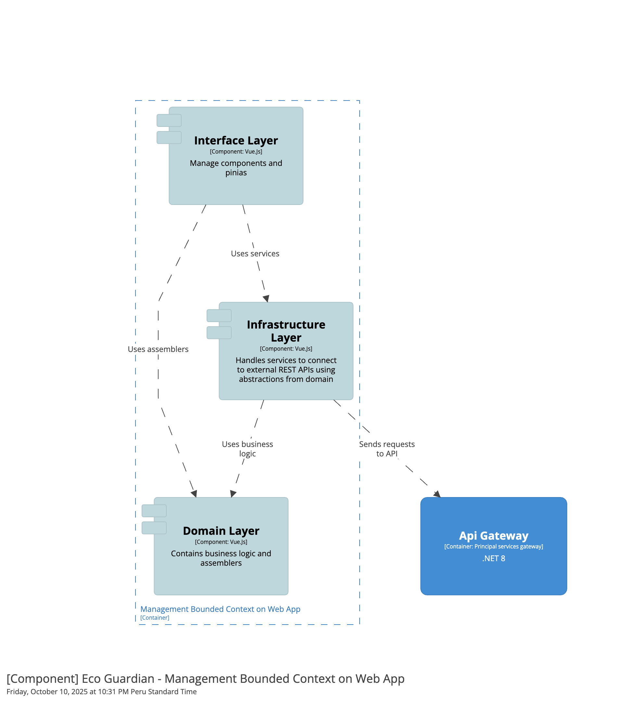

Backend:

Mobile:

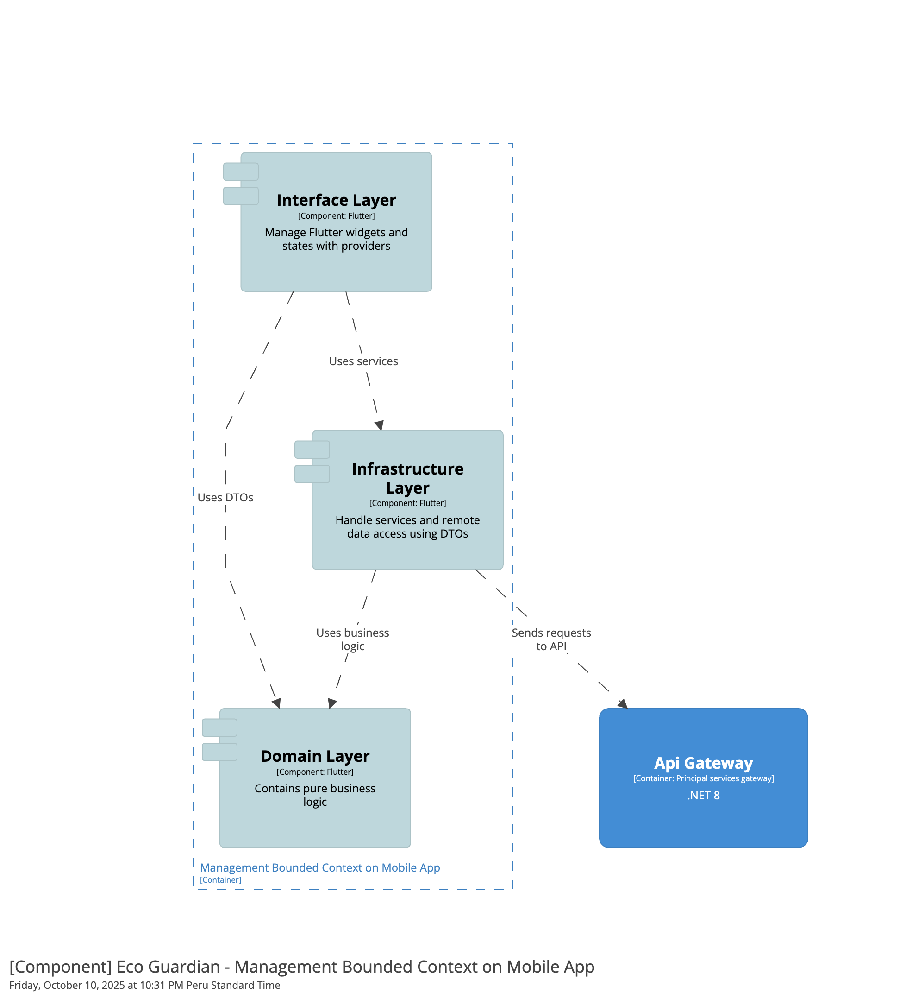

#### 4.2.1.6. Bounded Context Software Architecture Code Level Diagrams.

##### 4.2.1.6.1. Bounded Context Domain Layer Class Diagrams.

Web App:

Mobile App:

Backend:

Embedded App:

##### 4.2.1.6.2. Bounded Context Database Design Diagram.

### 4.2.2. Bounded Context: Analytics
#### 4.2.2.1. Domain Layer.

App Web:

- En esta capa se definen las clases relacionadas a la abstración de respuestas al servicio y también aquella que se encarga de gestionar las solicitudes.

### Assembler

**MetricAssembler**

| Método                   | Descripción                                        |
|--------------------------|----------------------------------------------------|
| toResponseAssembler | Crea una instancia de la clase MetricResponse   |

### Response

**MetricResponse**

Representa la clase que se encarga de abstraer las respuestas relacionadas a metricas

| Atributo              | Tipo     |
|-----------------------|----------|
| id                    | number      |
| plantId                    | number      |
| metricTypeId            | number |
| createdAt        | date |
| metricValue    | number |

Mobile:
- No aplica para este caso

Backend:

- En esta capa se describen las clases que representan el núcleo del dominio del contexto de Analytics. Se incluyen las entidades, objetos de valor, agregados, servicios de dominio bajo el patrón CQRS (Command Query Responsibility Segregation), y las interfaces de repositorio.

---

### Entity

**MetricType**

| Atributo    | Tipo                                            |
|------------|----------------------------------------------------------|
| Id    |  int              |
| Type    | string             |

---

#### Value Objects

**MetricTypes**

| Atributo    | Descripción                                              |
|------------|----------------------------------------------------------|
| Humidity    | Representa la metrica de humedad              |
| Illumination    | Representa la metrica de iluminacion             |
| Temperature    | Representa la metrica de temperatura     |

---

#### Aggregates

**Metric**

Representa una consult en la aplicación.

| Atributo              | Tipo     |
|-----------------------|----------|
| Id                    | Int      |
| PlantId                    | Int      |
| MetricTypeId            | Int |
| CreatedAt        | DateTime |
| MetricValue    | Double |

---

#### Commands

| Clase                        | Descripción                                                                                               |
|-----------------------------|-----------------------------------------------------------------------------------------------------------|
| SeedMetricTypeCommand      | Representa un comando que inicializa datos relacionados a los tipos de metricas dentro del dominio. |
| CreateMetricCommand  | Representa un comando que crea una nueva métrica.                  |
| UpdateMetricCommand  | Representa un comando que actualiza una métrica ya existente.                  |

#### Queries

| Clase                     | Descripción                                                                                             |
|--------------------------|---------------------------------------------------------------------------------------------------------|
| GetMetricByIdQuery      | Representa una consulta que recupera una métrica especifica por su id         |
| GetMetricsByMetricTypeQuery  | Representa una consulta que obtiene las métricas según un determinado tipo de metricas pre definido.        |

---

#### Domain Services (Interfaces)

**Command Services**

|  Interface                      | Descripción                                                                                     |
|--------------------------------|-------------------------------------------------------------------------------------------------|
| IMetricCommandService    | Define las operaciones que ejecutan cambios sobre el agregado Metric mediante comandos del dominio. |

**Query Services**

| Interface                        | Descripción                                                                                      |
|----------------------------------|--------------------------------------------------------------------------------------------------|
| IMetricQueryService        | Define las consultas que se ejecutan sobre el agregado Metric mediante consultas del dominio. |

---

#### Repositories (Interfaces)

| Interface                           | Descripción                                                                                     |
|------------------------------------|-------------------------------------------------------------------------------------------------|
| IAnalyticsRepository            | Define un contrato para el manejo de persistencia y consultas sobre la tabla AnalyticsReport.  |
| IAnalyticsReportTypeRepository        | Define un contrato para el manejo de persistencia y consultas sobre la tabla metric_types |

#### 4.2.2.2. Interface Layer.

App Web:

- En esta capa se definen los componentes reutilizables que se utilizan en distintas pantallas relacionadas a este *bounded context*.

## Components
**MetricItemComponent**
Componente reutilizable para mostrar la información individual de una métrica, como valores de sensores o indicadores clave.

**MetricListComponent**
Componente encargado de renderizar un conjunto de métricas.

## Pages

**MetricInformationPage**
Página que presenta información detallada de una métrica específica, incluyendo sus valores históricos, visualizaciones gráficas y metadatos asociados.

Mobile:
- No aplica para este caso

Backend:
- En esta capa se definen las clases que representan las solicitudes desde la web y las respuestas del servidor, también aquellas clases que se comunican a través de la web y reglas de negocio de la aplicación.

--- 

#### Resources

- Cada solicitud al servidor se representa mediante clases de recursos, que actúan como objetos de transferencia de datos. Estas clases permiten estructurar y controlar tanto las peticiones como las respuestas, asegurando una separación clara entre la capa de interface y la lógica del dominio.

| Clase            | Descripción                                      |
 |---------------------|--------------------------------------------------|
| CreateMetricResource        | Recibe datos para la creación de una nueva métrica.            |
| UpdateMetricResource        | Recibe datos para la actualización de una métrica existente.            |
| MetricResource  |  Devuelve datos de una métrica al usuario
---

#### Transforms/Assemblers
- Los transformadores se encargan de convertir los recursos de entrada en comandos y las entidades en recursos, utilizando el patrón Assembler para gestionar estas transformaciones de manera eficiente.

| Clase            | Descripción                                      |
 |---------------------|--------------------------------------------------|
| CreateMetricCommandFromResourceAssembler       | Transforma un recurso de entrada en un comando de creación de métricas.      |
| UpdateMetricCommandFromResourceAssembler  |  Transforma un recurso de entrada en un comando para actualizar una métrica existente.              |
| MetricResourceFromEntityAssembler        | Transforma una entidad de metric en un recurso que puede ser devuelto al cliente.       |

---

#### Controllers
- Cada aggregate root dentro de nuestro Bounded Context cuenta con un controlador REST que expone de forma pública las operaciones relacionadas, permitiendo la interacción externa con la aplicación a través de solicitudes http.

**MetricController**

| Ruta especifica             | Descripción                                      |
 |---------------------|--------------------------------------------------|
| /api/v1/metric       | Gestiona la creación y consulta de métricas  |

#### 4.2.2.3. Application Layer.

App Web:
- No aplica para este caso

Mobile:
- No aplica para este caso

Backend:

- La capa de aplicación se encarga de coordinar los casos de uso del sistema mediante la implementación de servicios que interactúan con los contratos definidos en la capa de dominio.
### CommandServices

| Clase              | Interfaz Implementada | Descripción                                                                                                         |
|--------------------|-----------------------|---------------------------------------------------------------------------------------------------------------------|
| `MetricCommandService` | `IMetricCommandService`   |  Implementación del servicio que maneja los comandos de métricas. |  

### QueryServices

| Clase              | Interfaz Implementada | Descripción                                                                                                         |
|--------------------|-----------------------|---------------------------------------------------------------------------------------------------------------------|
| `MetricQueryService`  | `IMetricQueryService`   |  Implementación del servicio que maneja los consultas de métricas. |        

### OutboundServices

| Interface                         | Descripción |
|------------------------------------|-------------|
| `IExternalPlantService`             | Contrato que maneja consultas sobre el servicio externo de plantas. |

| Clase                        | Descripción |
|------------------------------------|-------------|
| `ExternalPlantService`             | Implementación del contrato definido para la interacción con el servicio externo de plantas. |

#### 4.2.2.4. Infrastructure Layer.

App Web:

En esta capa se incluyen las clases que se encargan de comunicarse y persistir la información obtenida de servicios web.

### Service

**MetricService**

Representa la clase que se encargara de gestionar las solicitudes hacia el servicio.

| Método                   | Descripción                                        |
|--------------------------|----------------------------------------------------|
| getMetricById  | Devuelve una métrica en especifico por su id    |
| getMetricsByTypeId     | Devuelve un conjunto de métricas por su tipo     |

Mobile:
- No aplica para este caso

Backend:

### Implementación de las interfaces de los Repositories
| Clase                | Interfaz Implementada | Descripción                                                                    |
|-----------------------|-----------------------|--------------------------------------------------------------------------------|
| MetricRepository      | IMetricRepository      | Implementa los métodos de consulta y persistencia de las métricas de las plantas |

#### 4.2.2.5. Bounded Context Software Architecture Component Level Diagrams.
En esta sección se muestran los diagramas de componentes de los diferentes productos donde se hace uso de este bounded context, con el póposito de mostrar la interación interna del mismo.

Web App:

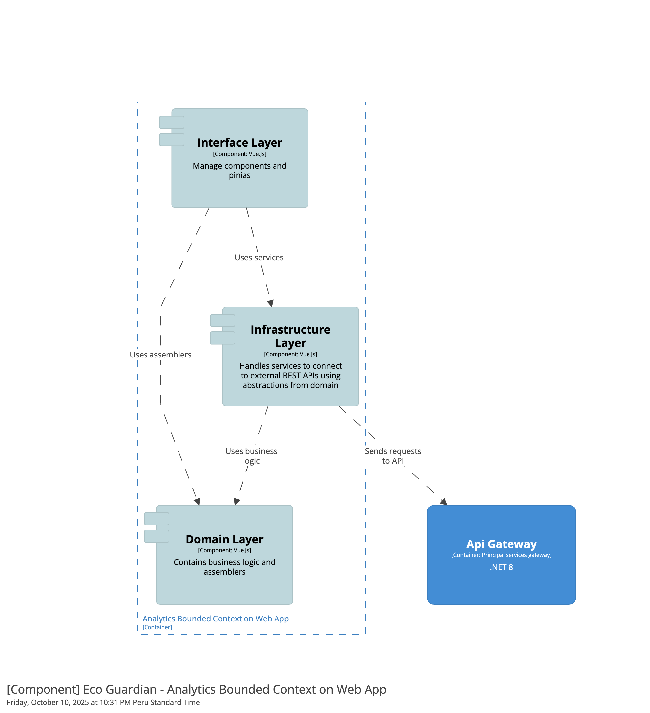

Backend:

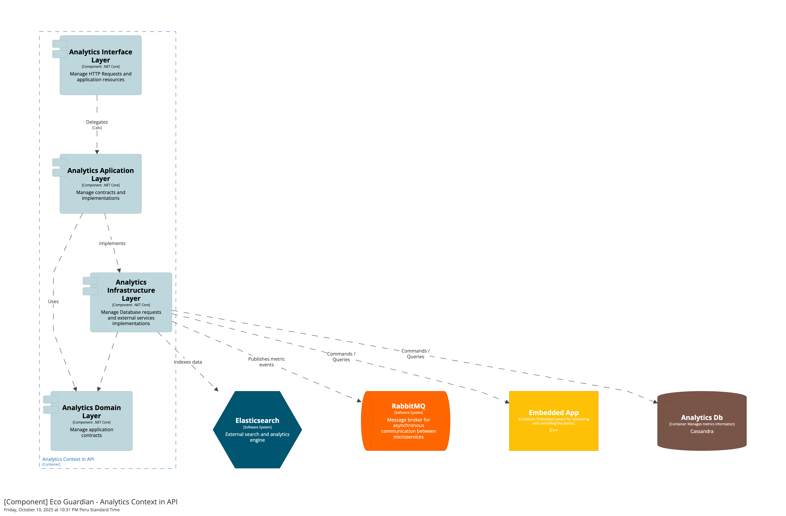

Mobile:

- No aplica para este caso

#### 4.2.2.6. Bounded Context Software Architecture Code Level Diagrams.

##### 4.2.2.6.1. Bounded Context Domain Layer Class Diagrams.

Web App:

Mobile App:
- No aplica para este caso

Backend:

Edge App:

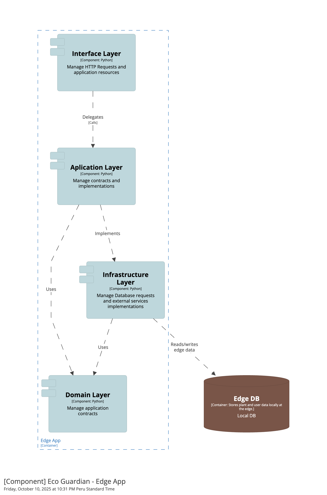

##### 4.2.2.6.2. Bounded Context Database Design Diagram.

### 4.2.3. Bounded Context: Consulting

#### 4.2.3.1. Domain Layer.

Web App:

En esta capa se describen las clases que representan las abstracciones del dominio. Se incluyen clases de serialización de respuestas y solicitudes asi como aquellas que se encargaran de realizar peticiones a nuestro servicio.

### Assembler

**QuestionAssembler**

| Método                   | Descripción                                        |
|--------------------------|----------------------------------------------------|
| toesponseAssembler     | Crea una instancia de la clase QuestionResponse     |

**QuestionPoolAssembler**

| Método                   | Descripción                                        |
|--------------------------|----------------------------------------------------|
| toResponseAssembler     | Crea una instancia de la clase QuestionPoolResponse     |

**AnswerAssembler**

| Método                   | Descripción                                        |
|--------------------------|----------------------------------------------------|
| toResponseAssembler     | Crea una instancia de la clase AnswerResponse     |

**QuestionResponse**

| Atributo              | Tipo     |
|-----------------------|----------|
| id                    | number      |
| content               | string   |
| userId                | number     |

**AnswerResponse**

| Atributo              | Tipo     |
|-----------------------|----------|
| id                    | number   |
| content               | string   |
| userId                | number   |
| questionsId           | number   |

**QuestionPoolResponse**

| Atributo              | Tipo     |
|-----------------------|----------|
| id                    | number   |
| type                  | string   |
| question_answer       | string   |

Mobile App:

En esta capa se describen las clases que representan las abstracciones del dominio. Se incluyen clases de serialización de respuestas y solicitudes asi como aquellas que se encargaran de realizar peticiones a nuestro servicio.

### DTO

**QuestionResponseDto**

| Atributo              | Tipo     |
|-----------------------|----------|
| id                    | int      |
| content               | string   |
| userId                | int      |

**AnswerResponseDTO**

| Atributo              | Tipo     |
|-----------------------|----------|
| id                    | int      |
| content               | string   |
| userId                | int      |
| questionsId           | int      |

**QuestionPoolResponseDTO**

| Atributo              | Tipo     |
|-----------------------|----------|
| id                    | int      |
| type                  | string   |
| question_answer       | string   |

**GetQuestionsByUserIdDto**

Representa la solicitud de consulta de preguntas por usuario.

| Atributo | Tipo   |
|----------|--------|
| userId     | int |

**GetAnswersByUserIdDto**

Representa la solicitud de consulta de respuestas por usuario.

| Atributo | Tipo   |
|----------|--------|
| content  | string |
| userId   | int    |

**GetPremadeQuestionsByUserIdDto**

Representa la solicitud de consulta de preguntas pre respondidas.

| Atributo | Tipo   |
|----------|--------|
| questionAnswer  | string |
| type   | string    |

**PostQuestionDto**

Representa la solicitud de envio de pregunta por usuario.

| Atributo | Tipo   |
|----------|--------|
| content  | string |
| userId   | int    |

**PostAnswerDto**

Representa la solicitud de envio de respuesta por usuario.

| Atributo   | Tipo   |
|------------|--------|
| userId     | int    |
| questionsId| int    |

Backend:

- En esta capa se describen las clases que representan el núcleo del dominio del contexto de Consulting. Se incluyen las entidades, objetos de valor, agregados, servicios de dominio bajo el patrón CQRS (Command Query Responsibility Segregation), y las interfaces de repositorio.

#### Entities

**QuestionTypes**

Representa el tipo de pregunta que tiene una pregunta pre hecha.

| Atributo | Tipo   |
|----------|--------|
| Id       | Int    |
| Type     | String |

---

#### Aggregates

**Question**

Representa una pregunta realizada por un usuario.

| Atributo              | Tipo     |
|-----------------------|----------|
| Id                    | Int      |
| Content               | String   |
| UserId                | Int      |

| Método                | Descripción                                          |
|-----------------------|------------------------------------------------------|
| GetQuestion | Devuelve los valores de la pregunta por medio de comandos    |

---

**Answer**

Representa una respuesta esta relacionada a una pregunta y al usuario que realiza la pregunta.

| Atributo              | Tipo     |
|-----------------------|----------|
| Id                    | Int      |
| Content               | String   |
| UserId                | Int      |
| QuestionsId           | Int      |

| Método                   | Descripción                                        |
|--------------------------|----------------------------------------------------|
| Get     | Devuelve los valores de la respuesta por medio de un comando   |

---

**PremadeQuestion**

Representa una pregunta realizada por un usuario.

| Atributo              | Tipo     |
|-----------------------|----------|
| Id                    | Int      |
| Type                  | String   |
| QuestionAnswer        |  String   |

| Método                | Descripción                                          |
|-----------------------|------------------------------------------------------|
| GetPremadeQuestion | Devuelve los valores de la pregunta pre hecha por medio de comandos    |

--

#### Commands

| Clase                   | Descripción                                                                                       |
|------------------------|---------------------------------------------------------------------------------------------------|
| CreateQuestionCommand      | Representa un comando para crear una nueva instancia del agregado Question.                        |
| CreateAnswerCommand      | Representa un comando para crear una nueva instancia del agregado Answer.                        |
| CreatePremadeQuestionCommand      | Representa un comando para crear una nueva instancia del agregado PremadeQuestion.                        |
| UpdatePremadeQuestionData |  Representa un comando para actualizar la data de una pregunta pre hecha.    |
| SeedQuestionTypesCommand       | Representa un comando para inicializar datos en la entidad QuestionTypes dentro del dominio. |
| SeedPremadeQuestionsCommand       | Representa un comando para inicializar datos del agregado PremadeQuestions. |

#### Queries

| Clase                         | Descripción                                                                                          |
|------------------------------|------------------------------------------------------------------------------------------------------|
| GetPremadeQuestionsByTypeQuery      | Representa una consulta que recupera las preguntas pre hechas asociadas a un tipo específico.                   |
| GetQuestionsByUserIdQuery      | Representa una consulta que obtiene todas las preguntas asociadas a un usuario determinado.            |
| GetAnswersByUserIdQuery      | Representa una consulta que obtiene todas las respuestas asociadas a un usuario determinado.            |
| GetQuestionsAndAnsersByUserIdQuery      | Representa una consulta que obtiene todas las preguntas y sus respuestas asociadas a un usuario determinado.            |
| IsAnswerExistsByQuestionIdQuery      | Representa una consulta que verifica si existe una respuesta con un identificador de pregunta específica.           |

---

### CommandServices

| Clase              | Interfaz Implementada | Descripción                                                                                                         |
 |--------------------|-----------------------|---------------------------------------------------------------------------------------------------------------------|
| `QuestionCommandService` | `IQuestionCommandService`   |  Implementación del servicio que maneja los comandos de preguntas. |
| `AnswerCommandService`    | `IAnswerCommandService`      | Implementción del servicio que maneja los comandos de respuestas de los especialistas a los usuarios.         
| `PremadeQuestionCommandService` | `IPremadeQuestionCommandService`   |  Implementación del servicio que maneja los comandos de preguntas pre respondidas. |
### QueryServices

| Clase              | Interfaz Implementada | Descripción                                                                                                         |
 |--------------------|-----------------------|---------------------------------------------------------------------------------------------------------------------|
| `QuestionQueryService`  | `IQuestionQueryService`   |  Implementación del servicio que maneja los consultas de preguntas. |
| `AnswerQueryService`    | `IAnswerQueryService`      | Implementación del servicio que maneja las consultas de las respuestas de los especialistas a los usuarios.         
| `PremadeQuestionQueryService` | `IPremadeQuestionQueryService`   |  Implementación del servicio que maneja las consultas de preguntas pre hechas. |

### OutboundServices
| Interface                         | Descripción |
 |------------------------------------|-------------|
| `IExternalUserService`             | Contrato que maneja consultas sobre el servicio externo de usuarios. |
| `ExternalUserService`             | Implementación del contrato definido para la interacción con el servicio externo de usuarios. |

#### 4.2.3.2. Interface Layer.

App Web:
- En esta capa se definen los componentes re utilizables en las diferentes pantallas relacionadas a este bounded context.

Mobile:
- En esta capa se definen los widgets re utilizables y aquellos que representan pantallas relacionadas a este bounded context.

Backend:
---
- En esta capa se definen las clases que representan las solicitudes desde la web y las respuestas del servidor, también aquellas clases que se comunican a través de la web y reglas de negocio de la aplicación.

#### Resources

---

- Cada solicitud al servidor se representa mediante clases de recursos, que actúan como objetos de transferencia de datos. Estas clases permiten estructurar y controlar tanto las peticiones como las respuestas, asegurando una separación clara entre la capa de interface y la lógica del dominio.

| Clase            | Descripción                                      |
 |---------------------|--------------------------------------------------|
| CreateQuestionResource        | Recibe datos para la creación de una nueva consulta.            |
| QuestionResource        | Devuelve datos de una consulta al usuario         |
| CreateAnswerResource      | Recibe datos para la creación de una nueva respuesta       |
| AnswerResource     | Devuelve datos de una respuesta

---

#### Transforms/Assemblers

- Los transformadores se encargan de convertir los recursos de entrada en comandos y las entidades en recursos, utilizando el patrón Assembler para gestionar estas transformaciones de manera eficiente.

| Clase            | Descripción                                      |
 |---------------------|--------------------------------------------------|
| CreateQuestionCommandFromResourceAssembler       | Transforma un recurso de entrada en un comando de creación de pregunta.      |
| QuestionResourceFromEntityAssembler        | Transforma una entidad de question en un recurso que puede ser devuelto al cliente.       |
| CreateAnswerCommandFromResourceAssembler    | Transforma un recurso de entrada en un comando de creación de respuesta.         |
| AnswerResourceFromEntityAssembler     | Transforma una entidad de answer en un recurso de salida para el cliente.

---

#### Controllers

- Cada aggregate root dentro de nuestro Bounded Context cuenta con un controlador REST que expone de forma pública las operaciones relacionadas, permitiendo la interacción externa con la aplicación a través de solicitudes http.

**QuestionController**

| Ruta especifica             | Descripción                                      |
 |---------------------|--------------------------------------------------|
| /api/v1/question       | Gestiona la creación y consulta de preguntas |

**AnswerController**

| Ruta especifica             | Descripción                                      |
 |---------------------|--------------------------------------------------|
| /api/v1/answer       | Gestiona la creación y consulta de respuestas  |

---

#### 4.2.3.3. Application Layer.

App Web:
- No aplica para este caso

Mobile:
- No aplica para este caso

Backend:
- La capa de aplicación se encarga de coordinar los casos de uso del sistema mediante la implementación de servicios que interactúan con los contratos definidos en la capa de dominio.
### CommandServices

| Clase              | Interfaz Implementada | Descripción                                                                                                         |
|--------------------|-----------------------|---------------------------------------------------------------------------------------------------------------------|
| `QuestionCommandService` | `IQuestionCommandService`   |  Implementación del servicio que maneja los comandos de preguntas. |
| `AnswerCommandService`    | `IAnswerCommandService`      | Implementción del servicio que maneja los comandos de respuestas de los especialistas a los usuarios.         

### QueryServices

| Clase              | Interfaz Implementada | Descripción                                                                                                         |
|--------------------|-----------------------|---------------------------------------------------------------------------------------------------------------------|
| `QuestionQueryService`  | `IQuestionQueryService`   |  Implementación del servicio que maneja los consultas de preguntas. |
| `AnswerQueryService`    | `IAnswerQueryService`      | Implementación del servicio que maneja las consultas de las respuestas de los especialistas a los usuarios.         

### OutboundServices

| Interface                         | Descripción |
|------------------------------------|-------------|
| `IExternalUserService`             | Contrato que maneja consultas sobre el servicio externo de usuarios. |

| Clase                        | Descripción |
|------------------------------------|-------------|
| `ExternalUserService`             | Implementación del contrato definido para la interacción con el servicio externo de usuarios. |

#### 4.2.3.4. Infrastructure Layer.

App Web:

## Service

En esta capa se incluyen las clases que se encargan de comunicarse y persistir la información obtenida de servicios web.

**ConsultsService**

Representa la clase que se encargara de gestionar las solicitudes hacia el servicio.

| Método                   | Descripción                                        |
|--------------------------|----------------------------------------------------|
| getQuestionsByUserId       | Devuelve las preguntas por un determinado usuario       |
| getAnswersByUserId       | Devuelve las respuestas por un determinado usuario       |
| getPremadeQuestions  | Devuelve las preguntas pre-respondidas por un determinado usuario     |
| postQuestion  | Envia una pregunta hecha por un determinado usuario     |
| postAnswer  | Envia una respuesta especificamente hecha por un determinado usuario especialista    |

Mobile:

## Service

En esta capa se incluyen las clases que se encargan de comunicarse y persistir la información obtenida de servicios web.

**ConsultsService**

Representa la clase que se encargara de gestionar las solicitudes hacia el servicio.

| Método                   | Descripción                                        |
|--------------------------|----------------------------------------------------|
| getQuestionsByUserId       | Devuelve las preguntas por un determinado usuario       |
| getAnswersByUserId       | Devuelve las respuestas por un determinado usuario       |
| getPremadeQuestions  | Devuelve las preguntas pre-respondidas por un determinado usuario     |
| postQuestion  | Envia una pregunta hecha por un determinado usuario     |
| postAnswer  | Envia una respuesta especificamente hecha por un determinado usuario especialista    |

Backend:

### Implementación de las interfaces de los Repositories
| Clase              | Interfaz Implementada | Descripción                                                                                                         |
|--------------------|-----------------------|---------------------------------------------------------------------------------------------------------------------|
| QuestionRepository | IQuestionRepository   | Implementa los métodos de consulta y persistencia de las consultas de los usuarios domésticos  a los especialistas. |
| AnswerRepository   | IAnswerRepository     | Implementa los métodos de consulta y persistencia de las respuestas de los especialistas a los usuarios.            |

#### 4.2.3.5. Bounded Context Software Architecture Component Level Diagrams.

En esta sección se muestran los diagramas de componentes de los diferentes productos donde se hace uso de este bounded context, con el póposito de mostrar la interación interna del mismo.

Web App:

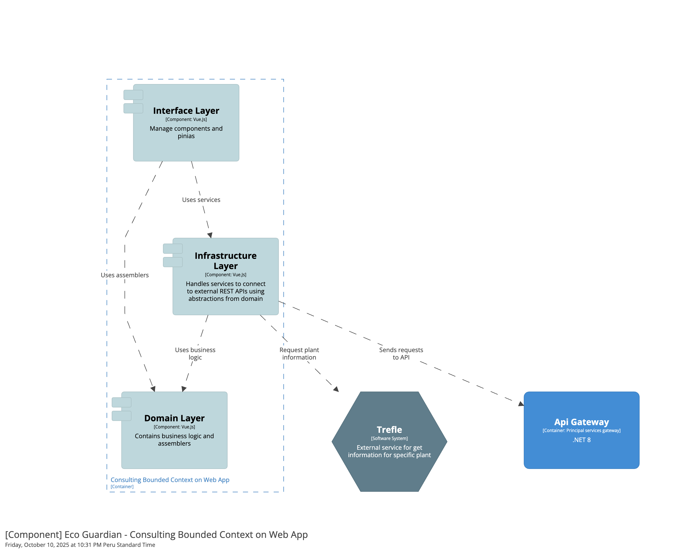

Backend:

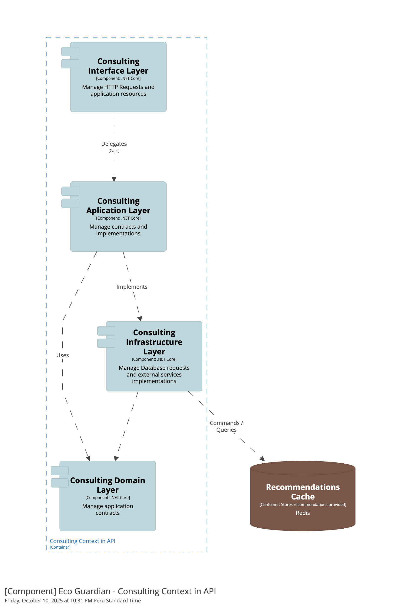

Mobile:

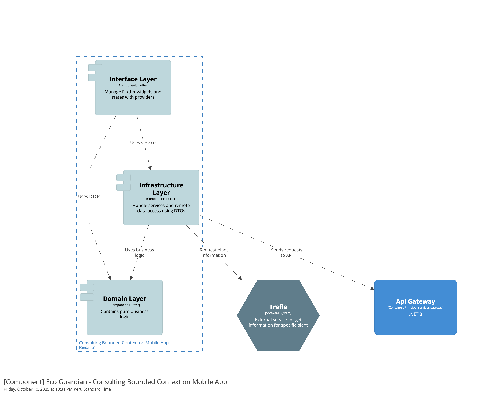

#### 4.2.3.6. Bounded Context Software Architecture Code Level Diagrams.

##### 4.2.3.6.1. Bounded Context Domain Layer Class Diagrams.

Web App:

Backend:

Mobile App:

##### 4.2.3.6.2. Bounded Context Database Design Diagram.

### 4.2.4. Bounded Context: Subscriptions And Payments

Web App:
- En esta capa se describen las clases que representan las abstracciones del dominio. Se incluyen clases de serialización de respuestas y solicitudes así como aquellas que se encargan de realizar peticiones a nuestro servicio.

#### State

Para gestionar el flujo de cambio de estados de una suscripción, se utiliza el patrón state para manejar los estados de manera dinámica.

**State**
Interfaz que define el método que se ejecutará en las clases que manejan los estados de una suscripción.

| Método | Descripción     |
|-----------------------|----------|
| completeSubscription | Ejecuta un cambio de estado dinámico de acuerdo a la referencia de estado |

**CompleteSubscriptionPaymentState**

Esta clase permite manejar los cambios de estado para el flujo de pago de suscripción

| Atributo              | Tipo     |
|-----------------------|----------|
| subscription          | Subscription   |

| Método | Descripción     |
|-----------------------|----------|
| completeSubscription | Ejecuta un cambio de estado dinámico de acuerdo a la referencia de estado |

#### Request

**SubscriptionRequest**

| Atributo              | Tipo     |
|-----------------------|----------|
| subscriptionTypeId   |  number        |
| subscriptionStateId |  number        |
| userId               |  number        |

**UpdateSubscriptionStateRequest**

| Atributo | Tipo   |
|----------|--------|
| id       | number |
| subscriptionStateId| number |

#### Response

**SubscriptionResponse**

| Atributo              | Tipo     |
|-----------------------|----------|
| id                    | number   |
| expirationDate       | string      |
| subscriptionTypeId   |  number        |
| subscriptionStateId |  number        |
| userId               |  number        |
| createdAt            |  string     |

#### Assembler

**SubscriptionAssembler**

| Método             | Descripción     |
|-----------------------|----------|
| toRequestAssembler                    | Devuelve una instancia de SubscriptionRequest   |
| toRequestAssembler                | Devuelve una instancia de UpdateSubscriptionStatusRequest |
| toResponseAssembler               | Devuelve una instancia de SubscriptionResponse   |

Mobile App:
- En esta capa se describen las clases que representan las abstracciones del dominio. Se incluyen clases de serialización de respuestas y solicitudes así como aquellas que se encargan de realizar peticiones a nuestro servicio.

#### State

Para gestionar el flujo de cambio de estados de una suscripción, se utiliza el patrón state para manejar los estados de manera dinámica.

**State**
Interfaz que define el método que se ejecutará en las clases que manejan los estados de una suscripción.

| Método | Descripción     |
|-----------------------|----------|
| completeSubscription | Ejecuta un cambio de estado dinámico de acuerdo a la referencia de estado |

**CompleteSubscriptionPaymentState**

Esta clase permite manejar los cambios de estado para el flujo de pago de suscripción

| Atributo              | Tipo     |
|-----------------------|----------|
| subscription          | Subscription   |

| Método | Descripción     |
|-----------------------|----------|
| completeSubscription | Ejecuta un cambio de estado dinámico de acuerdo a la referencia de estado |

#### DTO

**SubscriptionDto**

| Atributo              | Tipo     |
|-----------------------|----------|
| id                    | int   |
| expirationDate       | string      |
| subscriptionTypeId   |  int        |
| subscriptionStateId |  int        |
| userId               |  int        |
| createdAt            |  string     |

| Contructor             | Descripción     |
|-----------------------|----------|
| fromJson              | Crea una instancia de la clase SubscriptionDto en base a una respuesta del servidor    |
| toRequest                    | Crea un objeto con los atributos de la clase SubscriptionDto para realizar una solicitud    |

Backend:

#### 4.2.4.1. Domain Layer.
- En esta capa se describen las clases que representan el núcleo del dominio del contexto de Payment. Se incluyen las entidades, objetos de valor, agregados, servicios de dominio bajo el patrón CQRS (Command Query Responsibility Segregation), y las interfaces de repositorio.

---

#### Entities

**SubscriptionType**

| Atributo | Tipo   |
|----------|--------|
| Id       | Int    |
| Type     | String |

**SubcriptionState**

Representa los estados de una suscripción (por ejemplo: Activa, Inactiva)
| Atributo | Tipo   |
|----------|--------|
| Id       | Int    |
| Type     | String |

---

#### Value Objects

**SubscriptionTypes**

| Atributo    | Descripción                                              |
|------------|----------------------------------------------------------|
| Basic    | Representa un tipo de suscripción básica              |
| Domestic    | Representa un tipo de suscripción enfocados para usuarios domésticos              |
| Business    | Representa un tipo de suscripción enfocados para usuarios de negocios     |

**SubscriptionStates**

| Atributo    | Descripción                                              |
|------------|----------------------------------------------------------|
| Active  | Representa el estado de una suscripción activa             |
| Inactive    | Representa el estado de una suscripción inactiva             |

---

#### Aggregates

**Subscription**

Representa una suscripción disponible en la aplicación.

| Atributo              | Tipo     |
|-----------------------|----------|
| Id                    | int      |
| CreatedAt             | DateTime |
| ExpirationDate        | DateTime |
| SubscriptionTypeId    | int      |
| SubscriptionStateId  |  int     |
| UserId                |  int     |

| Método                        | Descripción                                                                                               |
|-----------------------------|-----------------------------------------------------------------------------------------------------------|
| UpdateState      | Representa un método para actualizar el estado de una suscripción.              |

---

#### Commands

| Clase                        | Descripción                                                                                               |
|-----------------------------|-----------------------------------------------------------------------------------------------------------|
| CreateSubscriptionCommand     | Representa un comando para la creación de una nueva suscripción                 |
| UpdateSubscriptionStateCommand      | Representa un comando para la actualización de estado de una suscripción                 |
| SeedSubscriptionTypesCommand  | Representa un comando para la inicialización de datos para los tipos de suscripción               |
| SeedSubscriptionStatesCommand  | Representa un comando para la inicialización de datos para los tipos de estados de una suscripción       |

#### Queries

| Clase                        | Descripción                                                                                               |
|-----------------------------|-----------------------------------------------------------------------------------------------------------|
| GetSubscriptionByUserIdQuery     | Representa una clase de consulta para obtener información relacionada a la suscripción de un usuario                 |

---

#### Domain Services (Interfaces)

**Command Services**

|  Interface                      | Descripción                                                                                     |
|--------------------------------|-------------------------------------------------------------------------------------------------|
| ISubscriptionCommandService    | Define las operaciones que ejecutan cambios sobre el agregado Subscription mediante comandos del dominio. |
| ISubscriptionTypeCommandService | Define las operaciones que ejecutan cambios sobre la entidad SubscriptionType mediante comandos del dominio. |
| ISubscriptionStateCommandService | Define las operaciones que ejecutan cambios sobre la entidad SubscriptionState mediante comandos del dominio. |

#### Repositories (Interfaces)

| Interface                           | Descripción                                                                                     |
|------------------------------------|-------------------------------------------------------------------------------------------------|
| ISubscriptionRepository            | Define un contrato para el manejo de persistencia y consultas sobre la tabla subscriptions.  |
| ISubscriptionTypeRepository        | Define un contrato para el manejo de persistencia y consultas sobre la tabla subscription_types |
| ISubscriptionStateRepository        | Define un contrato para el manejo de persistencia y consultas sobre la tabla subscription_states |

#### 4.2.4.2. Interface Layer.

Web App:
- En esta capa se definen los componentes re utilizables en las diferentes pantallas relacionadas a este contexto de negocio.

#### Pages

**CheckoutPaymentView**

Representa una vista que redirige al servicio de stripe para culminar un pago en la aplicación.

#### Components

**SubcriptionSummary**

Representa un componente para la visualización de información resumida sobre los beneficios de una suscripción

**SubscriptionDetails**

Representa un componente para la visualización detallada de la suscripción

Mobile App:

#### Screens

**CheckoutPaymentScreen**

Representa una pantalla que redirige al servicio de stripe para culminar un pago en la aplicación.

#### Widgets

**SubcriptionSummary**

Representa un widget para la visualización de información resumida sobre los beneficios de una suscripción

**SubscriptionDetails**

Representa un widget para la visualización detallada de la suscripción

Backend:

---

- En esta capa se definen las clases que representan las solicitudes desde la web y las respuestas del servidor, también aquellas clases que se comunican a través de la web y reglas de negocio de la aplicación.

  ---

#### Resources

- Cada solicitud al servidor se representa mediante clases de recursos, que actúan como objetos de transferencia de datos. Estas clases permiten estructurar y controlar tanto las peticiones como las respuestas, asegurando una separación clara entre la capa de interface y la lógica del dominio.

| Clase            | Descripción                                      |
  |---------------------|--------------------------------------------------|
| CreateSubscriptionResource        | Abstracción para representar la solicitud de creación de una suscripción.            |
| SubscriptionResource        | Abstracción para representar los datos que devuelve el servidor relacionados a la clase Subscription           |
| UpdateSubscriptionStateResource | Abstracción para representar la solicitud de actualización de estado de una suscripción |

---

#### Transforms/Assemblers
- Los transformadores se encargan de convertir los recursos de entrada en comandos y las entidades en recursos, utilizando el patrón Assembler para gestionar estas transformaciones de manera eficiente.

| Clase            | Descripción                                      |
  |---------------------|--------------------------------------------------|
| CreateSubscriptionCommandFromResourceAssembler       | Transforma un recurso de entrada en un comando de creación de una suscripción.      |
| UpdateSubscriptionStateCommandFromResourceAssembler       | Transforma un recurso de entrada en un comando de actualización de estado de una suscripción.      |
| SubscriptionResourceFromEntityAssembler       | Transforma una entidad de entrada en un recurso que devuelve datos de la entidad subscription .      |

---

#### Controllers

- Cada aggregate root dentro de nuestro Bounded Context cuenta con un controlador REST que expone de forma pública las operaciones relacionadas, permitiendo la interacción externa con la aplicación a través de solicitudes http.

**SubscriptionController**

| Ruta especifica             | Descripción                                      |
  |---------------------|--------------------------------------------------|
| /api/v1/subscriptions     | Gestiona la creación y la consulta de suscripciones |

---

#### 4.2.4.3. Application Layer.

Web App:
- No aplica para este caso

Mobile App:
- No aplica para este caso

Backend:

- La capa de aplicación se encarga de coordinar los casos de uso del sistema mediante la implementación de servicios que interactúan con los contratos definidos en la capa de dominio.

### CommandServices

| Clase              |  Interfaz Implementada |Descripción                                                                                  |
|--------------------|-----------------------------------|----------------------------------------------------------------------------------|
| `SubscriptionCommandService` |  `ISubscriptionCommandService`   |  Implementación del servicio que maneja los comandos de suscripciones. |

### OutboundServices

| Interface                         | Descripción |
|------------------------------------|-------------|
| `IExternalCustomerService`             | Contrato que maneja consultas sobre el servicio externo de usuarios. |
| `IExternalSensorService`             | Contrato que maneja consultas sobre el servicio externo de sensores. |
| `IExternalActuatorService`             | Contrato que maneja consultas sobre el servicio externo de actuadores. |

| Clase                        | Descripción |
|------------------------------------|-------------|
| `ExternalCustomerService`             | Implementación del contrato definido para la interacción con el servicio externo de usuarios. |
| `ExternalSensorService`             | Implementación del contrato definido para la interacción con el servicio externo de sensores. |
| `ExternalActuatorService`             | Implementación del contrato definido para la interacción con el servicio externo de actuadores. |

-
#### 4.2.4.4. Infrastructure Layer.

Web App:

En esta capa se incluyen las clases que se encargan de comunicarse con servicios web.

#### Service

**SubscriptionService**

| Metodo           | Descripción                                      |
  |---------------------|--------------------------------------------------|
| createSubscription     | Método para la creación de una nueva suscripción      |
| updateSubscriptionState     | Método para la actualización del estado de una suscripción      |

Mobile App:

En esta capa se incluyen las clases que se encargan de comunicarse con servicios web.

#### Service

**SubscriptionService**

| Metodo           | Descripción                                      |
  |---------------------|--------------------------------------------------|
| createSubscription     | Método para la creación de una nueva suscripción      |
| updateSubscriptionState     | Método para la actualización del estado de una suscripción      |

Backend:

### Implementación de las interfaces de los Repositories
| Clase                  | Interfaz Implementada   | Descripción                                                                             |
|------------------------|-------------------------|-----------------------------------------------------------------------------------------|
| SubscriptionRepository | ISubscriptionRepository | Implementa los métodos de consulta y persistencia de las suscripciones de los usuarios. |

#### 4.2.4.5. Bounded Context Software Architecture Component Level Diagrams.

En esta sección se muestran los diagramas de componentes de los diferentes productos donde se hace uso de este bounded context, con el propósito de mostrar la interacción interna del mismo.

Web App:

Backend:

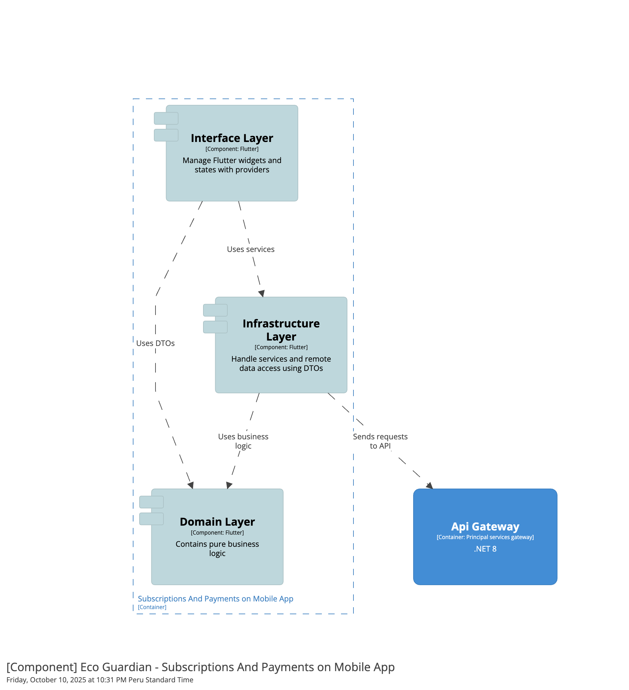

 
Mobile:

#### 4.2.4.6. Bounded Context Software Architecture Code Level Diagrams.

##### 4.2.4.6.1. Bounded Context Domain Layer Class Diagrams.

Web App:

Mobile App:

Backend:

##### 4.2.5.6.2. Bounded Context Database Design Diagram.

### 4.2.5. Bounded Context: Identity and Access Management (IAM)

#### 4.2.5.1. Domain Layer.

Edge App:
- En esta capa se describen las clases que describen el núcleo del dominio y manejan los contratos para la comunicación entre capas de mayor nivel

**Entities**

Esta clase se encarga de definir el nucleo del dominio y manejar estados a través de las capas de nivel superior

| Atributo       |
|----------------|
| device_id        |
| api_key       |
| created_at        |

**Services**

Esta clase se encarga de la comunicacion hacia capas de nivel superior

Mobile App:

- En esta capa se definen las clases que abstraen las solicitudes y respuestas al servidor y aquellas que gestionan las consultas al servidor.

#### DTO

**SignInRequestDto**

Representa una abstracción para la petición de inicio de sesión.

| Atributo       | Tipo   |
|----------------|--------|
| email        | string |
| password       | string |

| Método                        | Descripción                                                                                               |
|-----------------------------|-----------------------------------------------------------------------------------------------------------|
| toRequest                |  Crea una nuevo objeto con los parametros de la instancia de la clase                                       |

**SignUpRequestDto**

Representa una abstracción para la petición de registro de usuario.

| Atributo       | Tipo   |
|----------------|--------|
| email        | string |
| password       | string |
| roleId         |int     |

| Método                        | Descripción                                                                                               |
|-----------------------------|-----------------------------------------------------------------------------------------------------------|
| toRequest                |  Crea una nuevo objeto con los parametros de la instancia de la clase                                       |

**UserAuthenticatedResponseDto**

Representa una abstracción para la respuesta de un usuario autenticado.

| Atributo       | Tipo   |
|----------------|--------|
| id             | int   |
| email        | string |
| token     | string |
| roleId    | int |

| Método                        | Descripción                                                                                               |
|-----------------------------|-----------------------------------------------------------------------------------------------------------|
| fromJson                |  Devuelve una nueva instancia de la clase en base a la información proveniente de una respuesta del servidor                          |

Web App:

- En esta capa se definen las clases que abstraen las solicitudes y respuestas al servidor y aquellas que gestionan las consultas al servidor.

### Request

#### SignInRequest

Representa una abstracción para la petición de inicio de sesión realizada.

| Atributo       | Tipo   |
|----------------|--------|
| email        | string |
| password       | string |

#### SignUpRequest

Representa una abstracción para la petición de registro de usuario.

| Atributo       | Tipo   |
|----------------|--------|
| email        | string |
| password       | string |
| RoleId         | number    |

### Response

#### UserAuthenticatedResponse

Representa una abstracción para la respuesta que contiene la información de un usuario autenticado.

| Atributo       | Tipo   |
|----------------|--------|
| id             | number   |
| email        | string |
| token     | string |
| roleId    | number |

### Assembler

**AuthAssembler**

| Método                        | Descripción                                                                                               |
|-----------------------------|-----------------------------------------------------------------------------------------------------------|
| toRequest                |  Crea una nueva instancia de la clase SignInRequest                                                   |
| toRequest                | Crea una nueva instancia de la clase SignUpRequest                                                     |
| toResponse                | Crea una nueva instancia de la clase UserAuthenticatedResponse                                         |

Backend:
- En esta capa se describen las clases que representan el núcleo del dominio del contexto de Identity and Access Management. Se incluyen las entidades, objetos de valor, agregados, servicios de dominio bajo el patrón CQRS (Command Query Responsibility Segregation), y las interfaces de repositorio.

 ---
#### Value Objects
**Roles**

Representa los tipos de roles disponibles para la asignación al usuario.

| Atributo   | Descripción                                  |
|------------|----------------------------------------------|
| Domestic   | Representa el rol de un usuario doméstico.   |
| Business   | Representa el rol de un usuario de negocios. |
| Specialist | Representa el rol de un especialista.        |

---
#### Entities

**Role**

Representa un rol disponible en el sistema

| Atributo       | Tipo   |
|----------------|--------|
| Id             | int    |
| Type          | string |

 ---

#### Aggregates
**User**
Representa un usuario del sistema.

| Atributo       | Tipo   |
|----------------|--------|
| Id             | int    |
| Email          | string |
| Password       | string |
| RoleId         | int    |

 ---
#### Commands
| Clase                        | Descripción                                                                                               |
|-----------------------------|-----------------------------------------------------------------------------------------------------------|
| SignInCommand                | Representa un comando que inicia sesión en el sistema.                                                     |
| SignUpCommand                | Representa un comando que registra un nuevo usuario en el sistema.                                         |
| SeedRolesCommand             | Representa un comando que inicializa los roles disponibles en el sistema.                                  |

 ---
#### Domain Services (Interfaces)
**Command Services**

| Interface                      | Descripción                                                                                     |
|--------------------------------|-------------------------------------------------------------------------------------------------|
| IUserCommandService           | Define las operaciones que ejecutan cambios sobre el agregado User mediante comandos del dominio. |
| IRoleCommandService           | Define las operaciones que ejecutan cambios sobre la entidad Role mediante comandos del dominio. |

 ---
#### Repositories (Interfaces)
| Interface                           | Descripción                                                                                     |
|------------------------------------|-------------------------------------------------------------------------------------------------|
| IUserRepository                    | Define un contrato para el manejo de persistencia y consultas sobre la tabla users.             |
| IRoleRepository                    | Define un contrato para el manejo de persistencia y consultas sobre la tabla roles.             |

 ---

#### 4.2.5.2. Interface Layer.

Edge App:

- En esta capa se define el metodo que va a permitir la interacción hacia este bounded context

  | Método          | Descripción                                      |
    |---------------------|--------------------------------------------------|
  | authenticate_request        | Valida una solicitud de autenticación           |

Mobile App:

- En esta capa se definen los widgets que permiten la visualización de información

#### Widgets

**SignInScreen**

Este widget representa una vista para el inicio de sesión del usuario

**SignUpScreen**

Este widget representa una vista para el registro de usuarios

Web App:

- En esta capa se definen los componentes que permiten la visualización de información

#### Pages

**SignInPage**

Este componente representa una vista para el inicio de sesión del usuario

**SignUpPage**

Este componente representa una vista para el registro de usuarios

Backend:
- En esta capa se definen las clases que representan las solicitudes desde la web y las respuestas del servidor, también aquellas clases que se comunican a través de la web y reglas de negocio de la aplicación.

 ---

#### Resources

- Cada solicitud al servidor se representa mediante clases de recursos, que actúan como objetos de transferencia de datos. Estas clases permiten estructurar y controlar tanto las peticiones como las respuestas, asegurando una separación clara entre la capa de interface y la lógica del dominio.

| Clase            | Descripción                                      |
  |---------------------|--------------------------------------------------|
| SignInResource        | Recibe datos para el inicio de sesión.            |
| SignUpResource  |  Recibe datos para el registro de usuarios.             |
| UserAuthenticatedResource |  Recibe datos para devolver los datos de inicio de sesión.     |
 ---

#### Transforms/Assemblers
- Los transformadores se encargan de convertir los recursos de entrada en comandos y las entidades en recursos, utilizando el patrón Assembler para gestionar estas transformaciones de manera eficiente.

| Clase            | Descripción                                      |
  |---------------------|--------------------------------------------------|
|SignInCommandFromResourceAssembler       | Transforma un recurso de entrada en un comando de inicio de sesión.      |
| SignUpCommandFromResourceAssembler  |  Transforma un recurso de entrada en un comando para el registro de usuarios.              |
  AuthenticatedUserResourceFromEntityAssembler        | Transforma los datos de la entidad user y el token en un recurso.       |
 
---

#### Facade

| Interfaz            | Descripción                                      |
  |---------------------|--------------------------------------------------|
| IUserServiceFacade        | Maneja las consultas de dominio que seran expuestas a otros bounded context.            |

| Clase            | Descripción                                      |
  |---------------------|--------------------------------------------------|
| UserServiceFacade        | Implementación del contrato IUserServiceFacade.            |

#### Controllers

- Cada aggregate root dentro de nuestro Bounded Context cuenta con un controlador REST que expone de forma pública las operaciones relacionadas, permitiendo la interacción externa con la aplicación a través de solicitudes http.

**AuthController**

| Ruta especifica             | Descripción                                      |
  |---------------------|--------------------------------------------------|
| /api/v1/auth      | Gestiona el inicio de sesión y registro de usuarios  |

 
---

#### 4.2.5.3. Application Layer.

Edge App:

- Esta capa se encarga de manejar la implementación de los contratos definidos en la capa de dominio

**Services**

| Método          | Descripción                                      |
  |---------------------|--------------------------------------------------|
| authenticate        | Valida una solicitud de autenticación           |
| get_or_create_test_device        | Realiza la creación de un nuevo dispositivo en la base de datos           |
| get_device_by_id_and_api_key     | Verifica un disposiitvo por su id y su api key |

Mobile App:

- No aplica para este caso.

Web App:

- No aplica para este caso.

Backend:

### CommandServices
| Clase                               | Descripción |
|-------------------------------------|-------------|
| `IUserCommandService`              | Maneja comandos para gestionar usuarios. Utiliza la *entidad* `User`. |
| `IRoleCommandService`              | Maneja comandos para gestionar roles. Utiliza la *entidad* `Role`. |
| `UserCommandService`               | Implementación del servicio que maneja los comandos relacionados con usuarios. |
| `RoleCommandService`               | Implementación del servicio que maneja los comandos relacionados con roles. |

#### 4.2.5.4. Infrastructure Layer.

Edge App:

- En esta capa se definen las clases que manejan las reglas de persistencia en una base de datos.

**Models**

En esta clase se definen las clases que van a ser mapeadas a la base de datos.

**Repositories**

En esta clase se definen los metodos que permitiran realizare consultas hacia la base de datos.

Mobile App:

- En esta capa se incluyen las clases que se encargan de comunicarse con servicios web.

### Service

**AuthService**

| Método                           | Descripción |
|-------------------------------------|-------------|
| signIn               | Permite autenticar un usuario con sus credenciales. |
| signUp                 | Permite registrar un nuevo usuario |

Web App:

- En esta capa se incluyen las clases que se encargan de comunicarse con servicios web.

### Service

**AuthService**

| Método                           | Descripción |
|-------------------------------------|-------------|
|  signIn               | Permite autenticar un usuario con sus credenciales. |
| signUp                 | Permite registrar un nuevo usuario |

Backend:

### Implementación de las interfaces de los Repositories
| Clase          | Interfaz Implementada | Descripción                                                                    |
|----------------|-----------------------|--------------------------------------------------------------------------------|
| UserRepository | IUserRepository       | Implementa los métodos de consulta y persistencia de los usuarios del sistema. |

#### 4.2.5.5. Bounded Context Software Architecture Component Level Diagrams.

En esta sección se muestran los diagramas de componentes de los diferentes productos donde se hace uso de este bounded context, con el póposito de mostrar la interación interna del mismo.

Web App:

Backend:

Mobile:

Edge App:

#### 4.2.5.6. Bounded Context Software Architecture Code Level Diagrams.

##### 4.2.5.6.1. Bounded Context Domain Layer Class Diagrams.

Web App:

Mobile App:

Backend:

Edge App:

##### 4.2.5.6.2. Bounded Context Database Design Diagram.

### 4.2.6. Bounded Context: Profiles and Preferences

#### 4.2.6.1. Domain Layer.

Mobile App:

- En esta capa se definen las clases que abstraen las solicitudes y respuestas al servidor y aquellas que gestionan las consultas al servidor.

#### DTO

**ProfileDto**

Representa una abstracción para representar un perfil en la aplicación

| Atributo       | Tipo   |
|----------------|--------|
| id           | int    |
| email        | string |
| username       | string |
| avatarUrl       | string |
| name       | string |
| address       | string |
| subscriptionId | int   |
| userId         |  int  |

| Constructor Nombrado                       | Descripción                                                                                               |
|-----------------------------|-----------------------------------------------------------------------------------------------------------|
| fromJson                |  Crea una nueva instancia de la clase ProfileDto en base de una respuesta del servidor                               |

| Método                        | Descripción                                                                                               |
|-----------------------------|-----------------------------------------------------------------------------------------------------------|
| toRequest                |  Crea una nuevo objeto con los parametros de la instancia de la clase ProfileDto                                      |

**NotificationDto**

Representa una abstracción para la creación de notificaciones.

| Atributo       | Tipo   |
|----------------|--------|
| title        | string |
| subject       | string |

| Método                        | Descripción                                                                                               |
|-----------------------------|-----------------------------------------------------------------------------------------------------------|
| toRequest                |  Crea una nuevo objeto con los parametros de la instancia de la clase NotificationDto                                      |                          |

Web App:

- En esta capa se definen las clases que abstraen las solicitudes y respuestas al servidor y aquellas que gestionan las consultas al servidor.

### Request

#### ProfileRequest

Representa una abstracción para una solicitud relacionada al registro de un perfil.

| Atributo       | Tipo   |
|----------------|--------|
| email        | string |
| name       | string |
| username       | string |
| avatarUrl       | string |
| address       | string |
| subscriptionId | number   |
| userId         |  number  |

### Response

#### ProfileResponse

Representa una abstracción para una respuesta del servidor relacionada a perfiles

| Atributo       | Tipo   |
|----------------|--------|
| id        | number |
| email        | string |
| name       | string |
| username       | string |
| avatarUrl       | string |
| address       | string |
| subscriptionId | number   |
| userId         |  int  |

#### NotificationResponse

Representa una abstracción para una respuesta del servidor relacionada a notificación

| Atributo       | Tipo   |
|----------------|--------|
| id        | number |
| title        | string |
| subject       | string |
|createdAt      | string  |
| profileId         |  int  |

#### Assembler

**ProfileAssembler**

| Método                        | Descripción                                                                                               |
|-----------------------------|-----------------------------------------------------------------------------------------------------------|
| toRequest                |  Crea una nueva instancia de la clase ProfileRequest                 |
| toResponse     |  Crea una nueva instancia de la clase ProfileResponse              |                        

**NotificationAssembler**

| Método                        | Descripción                                                                                               |
|-----------------------------|-----------------------------------------------------------------------------------------------------------|
| toResponse     |  Crea una nueva instancia de la clase NotificationResponse              |      

Backend:
- En esta capa se describen las clases que representan el núcleo del dominio del contexto de Profile and preferences. Se incluyen las entidades, objetos de valor, agregados, servicios de dominio bajo el patrón CQRS (Command Query Responsibility Segregation), y las interfaces de repositorio.

 ---

#### Aggregates
**Pofile**
Representa un usuario del sistema.

| Atributo       | Tipo   |
|----------------|--------|
| Id             | int    |
| Email          | string |
| Name           | string |
| username       | string |
| avatarUrl       | string |
| Address        | string |
|  UserId         | int    |
| SubscriptionId | int    |

**Notification**
Representa un notificación configurada por un perfil.

| Atributo       | Tipo   |
|----------------|--------|
| Id             | int    |
| Title          | string |
| Subject        | string |
| CreatedAt       | DateTime |
|  ProfileId      | int    |

 ---
#### Commands
| Clase                        | Descripción                                                                                               |
|-----------------------------|-----------------------------------------------------------------------------------------------------------|
| CreateProfileCommand                | Representa un comando para la creación de un nuevo perfil.                                                     |
| UpdateProfileCommand                | Representa un comando para actualizar un perfil existente.                                                     |
| CreateNotificationCommand                | Representa un comando para la creación de una nueva notificación.                                         |

#### Queries
| Clase                     | Descripción                                                                                             |
|--------------------------|---------------------------------------------------------------------------------------------------------|
| GetProfileByEmailQuery          |Representa una consulta que obtiene un usuario específico mediante su correo electrónico.           |
| GetNotificationsByProfileIdQuery       | Representa una consulta que obtiene todas las notificaciones por un perfil especifico.         |

 ---
#### Domain Services (Interfaces)
**Command Services**

| Interface                      | Descripción                                                                                     |
|--------------------------------|-------------------------------------------------------------------------------------------------|
| IProfileCommandService           | Define las operaciones que ejecutan cambios sobre el agregado Profile mediante comandos del dominio. |
| INotificationCommandService           | Define las operaciones que ejecutan cambios sobre el agregado Notification mediante comandos del dominio. |

**Query Services**

| Interface                        | Descripción                                                                                      |
|----------------------------------|--------------------------------------------------------------------------------------------------|
| IProfileQueryService              | Define las consultas que se ejecutan sobre el agregado Profile mediante consultas del dominio. |
| INotificationQueryService              | Define las consultas que se ejecutan sobre el agregado Notification mediante consultas del dominio. |

 ---
#### Repositories (Interfaces)
| Interface                           | Descripción                                                                                     |
|------------------------------------|-------------------------------------------------------------------------------------------------|
| IProfileRepository                    | Define un contrato para el manejo de persistencia y consultas sobre la tabla profiles.             |
| INotificationRepository                    | Define un contrato para el manejo de persistencia y consultas sobre la tabla notifications.             |

 ---

#### 4.2.5.2. Interface Layer.

Mobile App:

- En esta capa se definen los widgets que permiten la visualización de información

#### Widgets

**ProfileSummary**

Este widget representa una visualización de información del perfil

#### Screen

**AccountInformationScreen**

Este widget representa una vista para la visualización de información del perfil

Web App:

- En esta capa se definen los componentes que permiten la visualización de información

#### Components

**ProfileSummary**

Este widget representa una visualización de información del perfil

**NotificationCard**

Este widget representa una visualización de una notificación configurada a un perfil

#### Pages

**AccountInformationPage**

Este widget representa una vista para la visualización de información del perfil

Backend:
- En esta capa se definen las clases que representan las solicitudes desde la web y las respuestas del servidor, también aquellas clases que se comunican a través de la web y reglas de negocio de la aplicación.

 ---

#### Resources

- Cada solicitud al servidor se representa mediante clases de recursos, que actúan como objetos de transferencia de datos. Estas clases permiten estructurar y controlar tanto las peticiones como las respuestas, asegurando una separación clara entre la capa de interface y la lógica del dominio.

| Clase            | Descripción                                      |
  |---------------------|--------------------------------------------------|
|  NotificationResource        | Recibe datos para devolver una notificacion desde el servidor.            |
|  ProfileResource  |  Recibe datos para devolver un perfil desde el servidor. |
| CreateProfileResource |  Recibe datos para la creación de un nuevo perfil.     |
| UpdateProfileResource |  Recibe datos para actualizar un perfil existente.     |
 ---

#### Transforms/Assemblers
- Los transformadores se encargan de convertir los recursos de entrada en comandos y las entidades en recursos, utilizando el patrón Assembler para gestionar estas transformaciones de manera eficiente.

| Clase            | Descripción                                      |
  |---------------------|--------------------------------------------------|
| CreateProfileCommandFromResourceAssembler  |  Transforma un recurso de entrada en un comando de creación de un perfil.              |
| UpdateProfileCommandFromResourceAssembler  |  Transforma un recurso de entrada en un comando de actualización de un perfil.              |
|  NotificationResourceFromEntityAssembler        | Transforma los datos de la entidad notificación en un recurso.       |
|  ProfileResourceFromEntityAssembler        | Transforma los datos de la entidad perfil en un recurso.       |
 
---

#### Controllers

- Cada aggregate root dentro de nuestro Bounded Context cuenta con un controlador REST que expone de forma pública las operaciones relacionadas, permitiendo la interacción externa con la aplicación a través de solicitudes http.

**AuthController**

| Ruta especifica             | Descripción                                      |
  |---------------------|--------------------------------------------------|
| /api/v1/profile      | Gestiona las consultas relacionadas a los perfiles  |
| /api/v1/notification      | Gestiona las consultas relacionadas a las notificaciones  |

 
---

#### 4.2.5.3. Application Layer.

Mobile App:

- No aplica para este caso.

Web App:

- No aplica para este caso.

Backend:

### CommandServices
| Clase                               | Descripción |
|-------------------------------------|-------------|
| `ProfileCommandService`               | Implementación del servicio que maneja los comandos relacionados con perfiles. |
| `NotificationCommandService`               | Implementación del servicio que maneja los comandos relacionados con notificaciones. |

### QueryServices

| Clase                               | Descripción |
|-------------------------------------|-------------|
| `ProfileQueryService`                 | Implementación del servicio que maneja las consultas sobre perfiles. |
| `NotificationQueryService`                | Implementación del servicio que maneja las consultas sobre notificaciones. |

### OutBoundService

| Interfaz                               | Descripción |
|-------------------------------------|-------------|
| `IExternalUserService`                 | Contrato que permite manejar consultas hacia el servicio externo de usuarios. |

| Clase                               | Descripción |
|-------------------------------------|-------------|
| `ExternalUserService`                 | Implementación del contrato para manejar consultas del bounded context externo de usuarios. |

#### 4.2.5.4. Infrastructure Layer.

Mobile App:

- En esta capa se incluyen las clases que se encargan de comunicarse con servicios web.

### Service

**ProfileService**

| Método                           | Descripción |
|-------------------------------------|-------------|
|  getProfileByEmail               | Devuelve un perfil por su email. |
|  createProfile                 | Permite la creación de un nuevo perfil |

Web App:

- En esta capa se incluyen las clases que se encargan de comunicarse con servicios web.

### Service

**ProfileService**

| Método                           | Descripción |
|-------------------------------------|-------------|
|  getProfileByEmail               | Devuelve un perfil por su email. |
|  createProfile                 | Permite la creación de un nuevo perfil |

**NotificationService**

| Método                           | Descripción |
|-------------------------------------|-------------|
|  getNotificationsByProfileId               | Devuelve todas las notificaciones relacionadas a un usuario. |

Backend:

### Implementación de las interfaces de los Repositories
| Clase          | Interfaz Implementada | Descripción                                                                    |
|----------------|-----------------------|--------------------------------------------------------------------------------|
| NotificationRepository | INotificationRepository       | Implementa los métodos de consulta y persistencia de las noificaciones del sistema. |
| ProfileRepository | IProfileRepository       | Implementa los métodos de consulta y persistencia de los perfiles del sistema. |

#### 4.2.6.5. Bounded Context Software Architecture Component Level Diagrams.

En esta sección se muestran los diagramas de componentes de los diferentes productos donde se hace uso de este bounded context, con el póposito de mostrar la interación interna del mismo.

Web App:

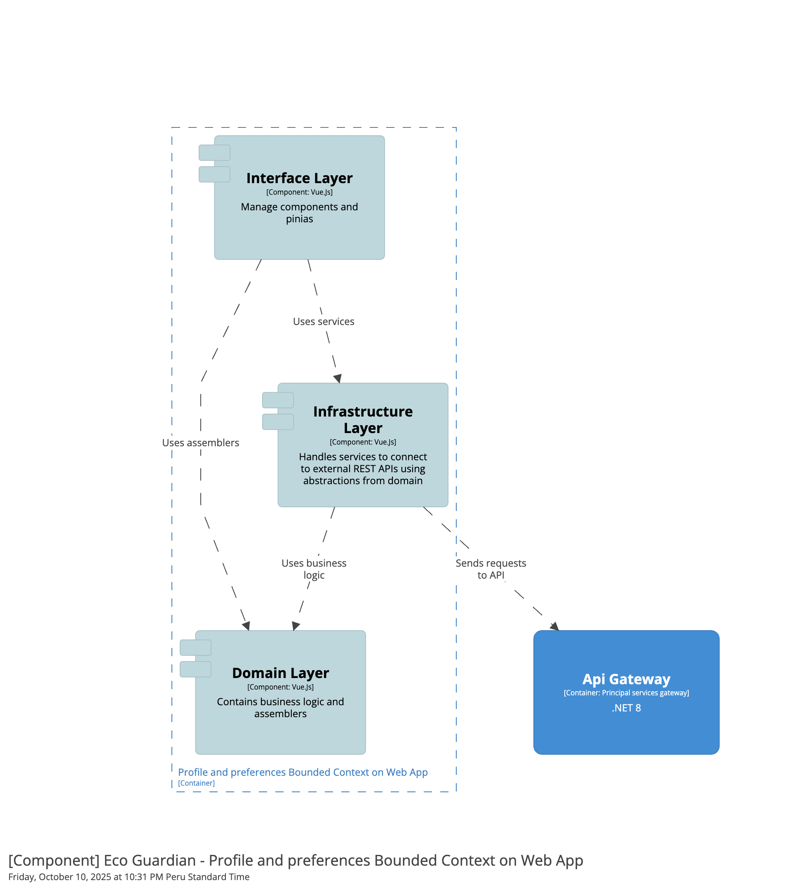

Backend:

Mobile:

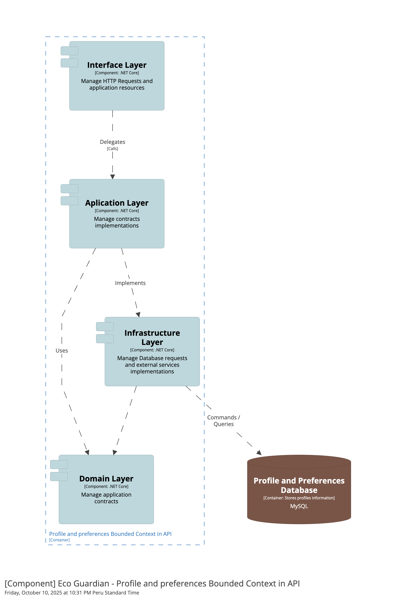

#### 4.2.6.6. Bounded Context Software Architecture Code Level Diagrams.

##### 4.2.6.6.1. Bounded Context Domain Layer Class Diagrams.

Web App:

Mobile App:

Backend:

##### 4.2.6.6.2. Bounded Context Database Design Diagram.

### 4.2.7. Bounded Context: Assets and Resources

#### 4.2.7.1. Domain Layer

Web App:

En esta capa se describen las clases que representan las abstracciones del dominio. Se incluyen clases de serialización de respuestas y solicitudes asi como aquellas que se encargaran de realizar peticiones a nuestro servicio.

### Assembler

**SensorAssembler**

| Método                   | Descripción                                        |
|--------------------------|----------------------------------------------------|
| toRequestAssembler       |   Crea una instancia de la clase SensorRequest |
| toResponseAssembler     |Crea una instancia de la clase SensorResponse      |

**ActuatorAssembler**

| Método                   | Descripción                                        |
|--------------------------|----------------------------------------------------|
| toRequestAssembler       |   Crea una instancia de la clase ActuatorRequest |
| toResponseAssembler     |Crea una instancia de la clase ActuatorResponse      |

### Response

**SensorResponse**

| Atributo              | Tipo     |
|-----------------------|----------|
| id                    | int      |
| supplier              | string   |
| voltage               | int     |
| sensorTypeId          | int     |
| plantId               | int     |
| statusId              | int     |
| installedAt           | date     |
| activatedAt           |  date    |
| lastUpdated           |  date |

**ActuatorResponse**

| Atributo              | Tipo     |
|-----------------------|----------|
| id                    | int      |
| supplier              | string   |
| voltage               | int     |
| sensorTypeId          | int     |
| plantId               | int     |
| statusId              | int     |
| installedAt           | date     |
| activatedAt           | date    |
| lastUpdated           |  date |

### Request

**SensorRequest**

| Atributo              | Tipo     |
|-----------------------|----------|
| id                    | int      |
| supplier              | string   |
| voltage               | int     |
| sensorTypeId          | int     |
| plantId               | int     |
| stateId              | int     |
| installedAt           | date     |
| activatedAt           |  date    |
| lastUpdated           |  date |

**ActuatorRequest**

| Atributo              | Tipo     |
|-----------------------|----------|
| id                    | int      |
| supplier              | string   |
| voltage               | int     |
| sensorTypeId          | int     |
| plantId               | int     |
| stateId              | int     |
| installedAt           | date     |
| activatedAt           | date    |
| lastUpdated           |  date |

Mobile App:

En esta capa se describen las clases que representan las abstracciones del dominio. Se incluyen clases de serialización de respuestas y solicitudes asi como aquellas que se encargaran de realizar peticiones a nuestro servicio.

### DTO

**SensorDto**

| Atributo              | Tipo     |
|-----------------------|----------|
| id                    | int      |
| supplier              | string   |
| voltage               | int     |
| sensorTypeId          | int     |
| plantId               | int     |
| stateId              | int     |
| installedAt           | date     |
| activatedAt           |  date    |
| lastUpdated           |  date |

| Constructor nombrado                | Descripción                                          |
|-----------------------|------------------------------------------------------|
| fromJson | Crea una instancia de un objeto en base a los atributos de la clase    |

| Método                | Descripción                                          |
|-----------------------|------------------------------------------------------|
| toJson | Crea una instancia de un objeto en base a los atributos de la clase    |

**ActuatorDto**

| Atributo              | Tipo     |
|-----------------------|----------|
| id                    | int      |
| supplier              | string   |
| voltage               | int     |
| sensorTypeId          | int     |
| plantId               | int     |
| stateId              | int     |
| installedAt           | date     |
| activatedAt           | date    |
| lastUpdated           |  date |

| Constructor nombrado                | Descripción                                          |
|-----------------------|------------------------------------------------------|
| fromJson | Crea una instancia de un objeto en base a los atributos de la clase    |

| Método                | Descripción                                          |
|-----------------------|------------------------------------------------------|
| toJson | Crea una instancia de un objeto en base a los atributos de la clase    |

**GetSensorsByPlantIdDto**

Representa la solicitud de consulta de sensores instalados por planta

| Atributo | Tipo   |
|----------|--------|
| plantId    | int |

**GetActuatorsByPlantIdDto**

Representa la solicitud de consulta de actuadores instalados por planta

| Atributo | Tipo   |
|----------|--------|
| plantId    | int |

Backend:

En esta capa se describen las clases que representan el núcleo del dominio del contexto de Management. Se incluyen las entidades, objetos de valor, agregados, servicios de dominio bajo el patrón CQRS (Command Query Responsibility Segregation), y las interfaces de repositorio.

---

#### Entities

**DeviceState**

Representa el estado actual de un sensor o un actuador (por ejemplo: Activado, Pendiente a instalación, deshabilitado).

| Atributo | Tipo   |
|----------|--------|
| Id       | Int    |
| Type     | String |

**SensorType**

Representa los diferentes tipos de sensores disponibles (por ejemplo: humedad, temperatura, luz).

| Atributo | Tipo   | Descripción                                 |
|----------|--------|---------------------------------------------|
| Id       | Int    | Identificador único del tipo de sensor      |
| Type     | Text   | Nombre del tipo de sensor (ej. "Humedad")   |

---

#### Value Objects

**WelnessStates**

| Atributo    | Descripción                                              |
|------------|----------------------------------------------------------|
| Healthy    | Representa el estado de una planta saludable              |
| UnHealthy    | Representa el estado de una planta no saludable              |
| Warning    | Representa el estado de una planta en riesgo       |

**DeviceStates**

| Atributo    | Descripción                                              |
|------------|----------------------------------------------------------|
|  Active   | Representa el estado de un sensor activo             |
| Inactive    | Representa el estado de un sensor inactivo             |
| ToActive    | Representa el estado de un sensor por activar       |

---

#### Aggregates

**Sensor**
Representa un sensor físico que ha sido asignado a una planta

| Atributo              | Tipo     |
|-----------------------|----------|
| Id                    | int      |
| Supplier              | string   |
| Voltage               | int     |
| SensorTypeId          | int     |
| PlantId               | int     |
| DeviceStateId              | int     |
| InstalledAt           | DateTime     |
| ActivatedAt           |  DateTime    |
| LastUpdated           |  DateTime |

| Método                   | Descripción                                        |
|--------------------------|----------------------------------------------------|
|   UpdateStatus   | Método que permite actualizar el estado de un sensor     |
|   Update   | Método que permite actualizar la información registrada de un sensor     |

---

**Actuator**

Representa un actuador físico asignado a una determinada maceta

| Atributo              | Tipo     |
|-----------------------|----------|
| Id                    | int      |
| Supplier              | string   |
| Voltage               | int     |
| PlantId               | int     |
| DeviceStateId              | int     |
| InstalledAt           | DateTime     |
| ActivatedAt           |  DateTime    |
| LastUpdated           |  DateTime |

| Método                   | Descripción                                        |
|--------------------------|----------------------------------------------------|
|   UpdateStatus   | Método que permite actualizar el estado de un actuador  |
|   Update   | Método que permite actualizar la información registrada de un actuador     |

---

#### Commands

| Clase                   | Descripción                                                                                       |
|------------------------|---------------------------------------------------------------------------------------------------|
| SeedSensorTypesCommand   | Representa un comando para inicializar datos en la entidad SensorType dentro del dominio. |
| SeedDeviceStateCommand   | Representa un comando para inicializar datos en la entidad DeviceState dentro del dominio. |
| CreateSensorCommand      | Comando para registrar un nuevo sensor con sus detalles técnicos.           |
| ActivateSensorCommand | Representa un comando para activar un sensor asignado a una planta. |
| InactiveSensorCommand | Representa un comando para deshabilitar el estado de activación de un sensor activado previamente |
| CreateActuatorCommand      | Comando para registrar un nuevo actuador con sus detalles técnicos.           |
| UpdateSensorCommand | Representa un comando para actualizar la información registrada de un sensor |
| ActivateActuatorCommand | Representa un comando para activar un actuador asignado a una planta. |
| InactiveActuatorCommand | Representa un comando para deshabilitar el estado de activación de un actuador activado previamente |
| UpdateActuatorCommand | Representa un comando para actualizar la información registrada de un actuador |

#### Queries

| Clase                         | Descripción                                                                                          |
|------------------------------|------------------------------------------------------------------------------------------------------|
| GetSensorsByPlantIdQuery | Representa una consulta que obtiene los datos de sensores asignados a una determinada planta |
| GetActuatorsByPlantIdQuery | Representa un consulta que obtiene los datos de los actuadores asignados a una determinada planta |

---

#### Domain Services (Interfaces)

**Command Services**

|  Interface            | Descripción                                                                |
|---------------------------|------------------------------------------------------------------------|
| IWellnessStateCommandService |  Define las operaciones que ejecutan cambios sobre el entity WellnessState mediante comandos del dominio. |
| IDeviceStateCommandService | Define las operaciones que ejecutan cambios sobre el entity DeviceState mediante comandos del dominio |
| ISensorTypeCommandService | Define las operaciones que ejecutan cambios sobre el entity SensorType mediante comandos del dominio |
| ISensorCommandService | Define las operaciones que ejecutan cambios sobre el agregado Sensor mediante comandos del dominio |
| IActuatorCommandService | Define las operaciones que ejecutan cambios sobre el agregado Actuator mediante comandos del dominio |

**Query Services**

| Interface                 | Descripción                                                                |
|---------------------------|------------------------------------------------------------------------|
| ISensorQueryServoce | Define las consultas que se ejecutan sobre el agregado Sensor mediante consultas del dominio |
| IActuatorQueryService | Define las consultas que se ejecutan sobre el agregado Actuator mediante consultas del dominio |

---

#### Repositories (Interfaces)

| Interface                         | Descripción                            |
|--------------------------------|----------------------------------------|
| IWellnessStateRepository    | Define un contrato para el manejo de persistencia y consultas sobre la tabla de welness_states |
| IDeviceStateRepository    | Define un contrato para el manejo de persistencia y consultas sobre la tabla de device_states |
| ISensorTypeRepository    | Define un contrato para el manejo de persistencia y consultas sobre la tabla de sensor_types |
| ISensorRepoository    | Define un contrato para el manejo de persistencia y consultas sobre la tabla de sensors |
| IActuatorRepository    | Define un contrato para el manejo de persistencia y consultas sobre la tabla de actuators |

#### 4.2.7.2. Interface Layer.

Web App:

- No aplica

Mobile:

- No aplica

Backend:

- En esta capa se definen las clases que representan las solicitudes desde la web y las respuestas del servidor, también aquellas clases que se comunican a través de la web y reglas de negocio de la aplicación.

---

#### Resources

- Cada solicitud al servidor se representa mediante clases de recursos, que actúan como objetos de transferencia de datos. Estas clases permiten estructurar y controlar tanto las peticiones como las respuestas, asegurando una separación clara entre la capa de interface y la lógica del dominio.

| Clase            | Descripción                                      |
|---------------------|--------------------------------------------------|
| SensorResource | Devuelve datos de un sensor al usuario                |
| ActuatorResource | Devuelve datos de un actuador al usuario            |
| CreateSensorResource | Representa un recurso de solicitud de creación de sensores                |
| ActivateSensorResource | Representa un recurso de solicitud de activación de sensores            |
| UpdateSensorResource | Representa un recurso de solicitud de actualización de sensores                |
| InactivateSensorResource | Representa un recurso de solicitud de inactivación de sensores            |
| CreateActuatorResource | Representa un recurso de solicitud de creación de actuadores               |
| ActivateActuatorResource | Representa un recurso de solicitud de activación de actuadores            |
| UpdateActuatorResource | Representa un recurso de solicitud de actualización de actuadors                |
| InactivateActuatorResource | Representa un recurso de solicitud de inactivación de actuadores            |

---

#### Transforms/Assemblers
- Los transformadores se encargan de convertir los recursos de entrada en comandos y las entidades en recursos, utilizando el patrón Assembler para gestionar estas transformaciones de manera eficiente.

| Clase            | Descripción                                      |
|---------------------|--------------------------------------------------|
| SensorResourceFromEntityAssembler     | Transforma una entidad de sensor en un recurso de salida para el cliente.
| ActuatorResourceFromEntityAssembler     | Transforma una entidad de actuator en un recurso de salida para el cliente.
| CreateSensorCommandFromResourceAssembler       | Transforma un recurso de entrada en un comando de creación de sensor.      |
| ActivateSensorCommandFromResourceAssembler       | Transforma un recurso de entrada en un comando de activacion de un sensor.      |
| InactivateSensorCommandFromResourceAssembler       | Transforma un recurso de entrada en un comando de inactivacion de un sensor.      |
| UpdateSensorCommandFromResourceAssembler  |  Transforma un recurso de entrada en un comando para actualizar un sensor existente.    
| CreateActuatorCommandFromResourceAssembler       | Transforma un recurso de entrada en un comando de creación de actuator.      |
| ActivateActuatorCommandFromResourceAssembler       | Transforma un recurso de entrada en un comando de activacion de un actuador.      |
| InactivateActuatorCommandFromResourceAssembler       | Transforma un recurso de entrada en un comando de inactivacion de un actuador.      |
| UpdateActuatorCommandFromResourceAssembler  |  Transforma un recurso de entrada en un comando para actualizar un actuator existente. 

---

#### Facades

- Las fachadas definen un contrato que actúa como un puente de conexión hacia otro Bounded Context, protegiendo nuestro contexto de influencia externa mediante el principio de Anti Corruption Layer (ACL), evitando que conceptos o lógicas externas afecten nuestro dominio.

| Clase            | Descripción                                      |
|---------------------|--------------------------------------------------|
| ISensorServiceFacade        | Define un contrato para los servicios de dominio relacionados con sensores, que deben ser expuestos a servicios externos.            |
| SensorServiceFacade  |    Implementación concreta del contrato, proporcionando la interacción entre los servicios de dominio y los servicios externos.  |
| IActuatorServiceFacade        | Define un contrato para los servicios de dominio relacionados con actuadores, que deben ser expuestos a servicios externos.            |
| ActuatorServiceFacade  |    Implementación concreta del contrato, proporcionando la interacción entre los servicios de dominio y los servicios externos.  |

---

#### Controllers

- Cada aggregate root dentro de nuestro Bounded Context cuenta con un controlador REST que expone de forma pública las operaciones relacionadas, permitiendo la interacción externa con la aplicación a través de solicitudes http.

**SensorController**

| Ruta especifica             | Descripción                                      |
|---------------------|--------------------------------------------------|
| /api/v1/sensors      | Gestiona la creación y consulta de sensores  |

**ActuatorController**

| Ruta especifica             | Descripción                                      |
|---------------------|--------------------------------------------------|
| /api/v1/actuators       | Gestiona la creación y consulta de actuadores  |

#### 4.2.7.3. Application Layer.

Web App:

- No aplica para este caso

Mobile:
- No aplica para este caso

Backend:

### CommandServices

| Clase            | Descripción                                      |
|---------------------|--------------------------------------------------|
| `SensorCommandService`           | Implementación del servicio que maneja los comandos relacionados con los sensores. |
| `ActuatorCommandService`           | Implementación del servicio que maneja los comandos relacionados con los actuadores. |
| `WellnessStateCommandService`                | Implementación del servicio que maneja los comandos relacionados con los estados de una planta. |
| `DeviceStateCommandService`                | Implementación del servicio que maneja los comandos relacionados con los estados de una planta. |

### QueryServices

| Clase                                | Descripción |
|--------------------------------------|-------------|
| `SensorQueryService`                  | Implementación del servicio que maneja lasconsultas relacionadas con los sensores |
| `ActuatorQueryService`                  | Implementación del servicio que maneja lasconsultas relacionadas con los actuadores |

#### 4.2.7.4. Infrastructure Layer.

Web App:

En esta capa se incluyen las clases que se encargan de comunicarse y persistir la información obtenida de servicios web.

## Service

**SensorService**

Representa la clase que se encarga de gestionar las solicitudes hacia los endpoints relacionados a la ruta de sensors

| Método                   | Descripción                                        |
|--------------------------|----------------------------------------------------|
| getSensorsByPlantId     | Devuelve los sensores asignados a una determinada planta     |

**ActuatorService**

Representa la clase que se encarga de gestionar las solicitudes hacia los endpoints relacionados a la ruta de actuators

| Método                   | Descripción                                        |
|--------------------------|----------------------------------------------------|
| getActuatorsByPlantId     | Devuelve los actuadores asignados a una determinada planta     |

Mobile:

En esta capa se incluyen las clases que se encargan de comunicarse y persistir la información obtenida de servicios web.

**SensorService**

Representa la clase que se encarga de gestionar las solicitudes hacia los endpoints relacionados a la ruta de sensors

| Método                   | Descripción                                        |
|--------------------------|----------------------------------------------------|
| getSensorsByPlantId     | Devuelve los sensores asignados a una determinada planta     |

**ActuatorService**

Representa la clase que se encarga de gestionar las solicitudes hacia los endpoints relacionados a la ruta de actuators

| Método                   | Descripción                                        |
|--------------------------|----------------------------------------------------|
| getActuatorsByPlantId     | Devuelve los actuadores asignados a una determinada planta     |

Backend:

### Implementación de las interfaces de los Repositories

| Clase | Interfaz Implementada | Descripción|
|------|--------------|------------------|
| SensorRepository | ISensorRepository |Implementa los métodos de consulta y persistencia de los sensores |
| ActuatorRepository | IActuatorRepository |Implementa los métodos de consulta y persistencia de los actuadores |

#### 4.2.1.5. Bounded Context Software Architecture Component Level Diagrams.

En esta sección se muestran los diagramas de componentes de los diferentes productos donde se hace uso de este bounded context, con el póposito de mostrar la interación interna del mismo.

Web App:

Backend:

Mobile:

#### 4.2.1.6. Bounded Context Software Architecture Code Level Diagrams.

##### 4.2.1.6.1. Bounded Context Domain Layer Class Diagrams.

Web App:

Mobile App:

Backend:

##### 4.2.1.6.2. Bounded Context Database Design Diagram.

# 4.2.8. Service Design and Planning Bounded Context

## 4.2.8.1. Descripción General

Este bounded context gestiona la entidad Order, encargada de la planificación y diseño de servicios solicitados por los usuarios. La entidad Order ha sido extraída del contexto de Subscriptions and Payments para centralizar la lógica de planeamiento y diseño de servicios.

## 4.2.8.2. Implementación de las interfaces de los Repositories

| Clase            | Interfaz Implementada | Descripción                                                                 |
|------------------|----------------------|-----------------------------------------------------------------------------|
| OrderRepository  | IOrderRepository     | Implementa los métodos de consulta y persistencia de las órdenes de servicio.|

## 4.2.8.3. Bounded Context Software Architecture Component Level Diagrams

Web App:

Backend:

Mobile:

## 4.2.8.4. Bounded Context Software Architecture Code Level Diagrams

### 4.2.8.4.1. Bounded Context Domain Layer Class Diagrams

Web App:

Mobile App:

Backend:

### 4.2.8.4.2. Bounded Context Database Design Diagram

---

## 4.2.8.5. Domain Layer

### Entities

**Order**

| Atributo              | Tipo     |
|-----------------------|----------|
| Id                    | int      |
| Action                | string   |
| UserId                | int      |
| SensorId              | int      |
| ActuatorId            | int      |
| CreatedAt             | DateTime |
| CompletedAt           | DateTime |
| StateId               | int      |
| SubscriptionId        | int      |

| Método                | Descripción                                               |
|-----------------------|-----------------------------------------------------------|
| UpdateOrderState      | Actualiza el estado de una orden.                         |

### Value Objects

**OrderStates**

| Atributo    | Descripción                                  |
|-------------|----------------------------------------------|
| ToComplete  | Representa el estado de una orden por completar|
| Completed   | Representa el estado de una orden completada  |

### Commands

| Clase                   | Descripción                                         |
|-------------------------|-----------------------------------------------------|
| CreateOrderCommand      | Comando para la creación de una nueva orden         |
| UpdateOrderStateCommand | Comando para la actualización de estado de una orden|
| SeedOrderStatesCommand  | Inicialización de datos para los estados de orden   |

### Queries

| Clase                  | Descripción                                         |
|------------------------|-----------------------------------------------------|
| GetOrdersByUserIdQuery | Consulta para obtener todas las órdenes de un usuario|

### Domain Services (Interfaces)

| Interface                | Descripción                                        |
|--------------------------|----------------------------------------------------|
| IOrderCommandService     | Operaciones que ejecutan cambios sobre Order        |
| IOrderStateCommandService| Operaciones sobre los estados de la orden          |

### Repositories (Interfaces)

| Interface           | Descripción                                            |
|---------------------|-------------------------------------------------------|
| IOrderRepository    | Contrato para persistencia y consultas sobre órdenes   |
| IOrderStateRepository| Contrato para persistencia y consultas sobre estados  |

---

## 4.2.8.6. Interface Layer

### Backend

#### Resources

| Clase                  | Descripción                                         |
|------------------------|-----------------------------------------------------|
| CreateOrderResource    | Solicitud de creación de una orden                  |
| OrderResource          | Datos de la entidad Order devueltos al cliente      |
| UpdateOrderStateResource| Solicitud de actualización de estado de una orden  |

#### Transforms/Assemblers

| Clase                                 | Descripción                                         |
|---------------------------------------|-----------------------------------------------------|
| CreateOrderCommandFromResourceAssembler| Transforma recurso en comando de creación de orden   |
| UpdateOrderStateCommandFromResourceAssembler| Transforma recurso en comando de actualización de estado |
| OrderResourceFromEntityAssembler      | Transforma entidad Order en recurso para el cliente  |

#### Controllers

**OrderController**

| Ruta especifica   | Descripción                                      |
|-------------------|--------------------------------------------------|
| /api/v1/orders    | Gestiona la creación y consulta de órdenes        |

---

## 4.2.8.7. Application Layer

### Backend

| Clase                | Interfaz Implementada   | Descripción                                 |
|----------------------|------------------------|---------------------------------------------|
| OrderCommandService  | IOrderCommandService   | Servicio que maneja los comandos de órdenes |

---

## 4.2.8.8. Infrastructure Layer

### Backend

| Clase            | Interfaz Implementada | Descripción                                         |
|------------------|----------------------|-----------------------------------------------------|
| OrderRepository  | IOrderRepository     | Implementa los métodos de consulta y persistencia    |

